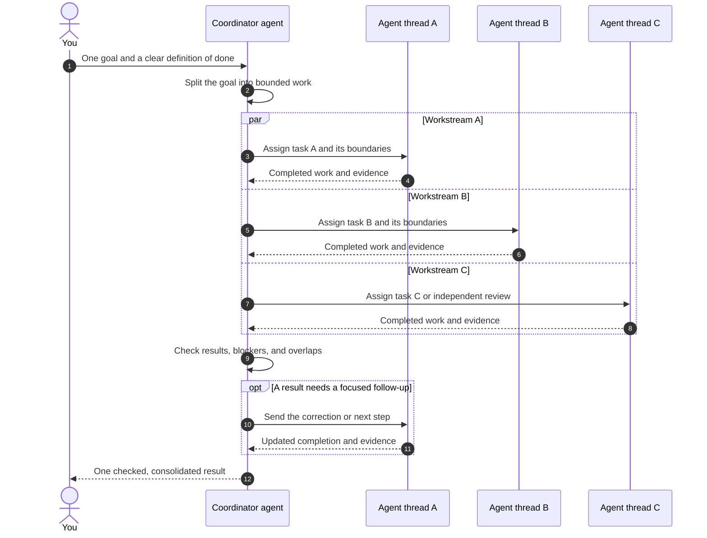

<p align="center">
  <a href="https://eyeinthesky6.github.io/codex-coordinator/">
    
  </a>
</p>

<h1 align="center">Codex Coordinator</h1>

<p align="center"><strong>Run several Codex tasks without becoming their full-time project manager.</strong></p>

<p align="center">
  <a href="https://eyeinthesky6.github.io/codex-coordinator/"><strong>Website</strong></a>
  · <a href="#quick-start">Quick start</a>
  · <a href="https://github.com/eyeinthesky6/codex-coordinator/discussions/categories/q-a">Q&amp;A</a>
  · <a href="https://github.com/eyeinthesky6/codex-coordinator/releases/latest">Latest release</a>
</p>

<p align="center">
  <a href="https://github.com/eyeinthesky6/codex-coordinator/actions/workflows/ci.yml"></a>
  <a href="https://github.com/eyeinthesky6/codex-coordinator/releases/latest"></a>
  <a href="https://github.com/eyeinthesky6/codex-coordinator/stargazers"></a>
  <a href="https://github.com/eyeinthesky6/codex-coordinator/forks"></a>
  <a href="https://github.com/eyeinthesky6/codex-coordinator/discussions"></a>
  <a href="LICENSE"></a>
</p>

Running several agents sounds useful until two of them solve the same problem, one changes a file another still depends on, and a paused task forgets where the handoff was. Then you become the person checking every window, relaying every update, and deciding whether the project is actually finished.

Codex Coordinator takes that project wrangling off your plate. Give it one outcome. It divides the work into a few clear jobs, keeps each job with one owner, remembers what happened when tasks pause or restart, and brings everything back into one understandable update.

It works with the Codex tasks and Git setup you already use. There is no coordination server, separate dashboard, database, or lock manager to operate.

> **Independent project:** Codex Coordinator is a third-party plugin for OpenAI Codex. It is not affiliated with, endorsed by, or maintained by OpenAI. Codex and related OpenAI product names belong to OpenAI.

## How the communication flow works

```text
Use $codex-coordinator to create the tasks needed and coordinate this goal:
<describe the repository outcome you want>
```



You speak to the Coordinator agent. It creates the agent threads, gives each one a bounded part of the goal, and receives their completed work. The Coordinator checks the pieces together, sends focused follow-up work when needed, and returns one understandable result to you. Agent threads do not need to command each other—or use you as the message bus.

## The problems it solves

Codex Coordinator helps when:

- two agents might investigate the same problem or propose competing fixes;
- one agent could edit files another agent is still using;
- a task may pause, compact, or restart before the whole job is finished;
- you are opening every task window just to understand current status;
- useful findings are getting lost between “done,” “blocked,” and “someone else should handle this.”

You probably do not need it when one agent can safely finish the job, when you only need a quick answer, or when short-lived helpers can report directly back to one parent task. It is also not a cross-machine project manager.

## Multi-agent work without Ultra

Codex Coordinator lets you explicitly ask for multiple Codex agents for one large goal. Ultra can decide on its own when delegation may help, but you do not need Ultra to ask Coordinator to split a real job.

The plugin does not bypass Codex plan availability, usage, token, or concurrency limits. Parallel agents usually consume more usage than a comparable single-agent run. See the official [Codex subagent guidance](https://learn.chatgpt.com/docs/agent-configuration/subagents).

Subagents remain supported as helpers inside a registered task. The parent keeps their scope, validation, and result; independent Codex tasks use the app's native task messenger.

## Quick start

### Requirements

- Codex with plugin and hook support;
- Git;
- Python 3.10 or newer available as `python` on Windows and `python3` on macOS or Linux.

### Install the latest stable release

1. Add the tagged repository as a marketplace:

   ```powershell
   codex plugin marketplace add eyeinthesky6/codex-coordinator@v0.3.0
   ```

2. Open Codex Plugins and install **Codex Coordinator** from the `codex-coordinator` marketplace.
3. Review and trust the SessionStart hook when Codex asks. It reads local coordination records, makes no network calls, and never writes project state. In the CLI, use `/hooks`; an untrusted hook is skipped.
4. Start a new Codex task and use the prompt at the top of this README.

For an offline or development checkout, clone or download the repository and add its local directory instead:

```powershell
codex plugin marketplace add <path-to-this-directory>
```

### What first success feels like

You give Codex one outcome and receive a short explanation of who is handling each part. You can ask what is active or blocked without opening every task. If work restarts later, the useful handoff is still there.

Under the hood, the repository gains a small trackable `.codex/coordination/project.yaml` marker plus local, Git-ignored working state. The startup hook restores context; it never grants an agent new permission.

Useful follow-ups:

```text
Show who is working on what and what is blocked.
Reconcile the current coordination state.
Hand off <task> to <registered task name>.
```

To opt a repository out, say `Turn Codex Coordinator off for this repository.`

### Optional Mission Control

Mission Control gives you one local, read-only view of current Codex tasks, queued work, completed work, concrete overlap warnings, and Doctor findings. It runs on `127.0.0.1`, has no login or telemetry, and never becomes a second coordination authority.

Mission Control is a source-installed companion, not a web app hidden inside the plugin cache. Clone the same stable tag and run it from that checkout:

```powershell
git clone --branch v0.3.0 --depth 1 https://github.com/eyeinthesky6/codex-coordinator.git
cd codex-coordinator
python -m apps.mission_control
```

On Windows, `./apps/mission_control/start-background.ps1 -Open` starts or reuses one hidden local process without opening duplicate browser tabs. See the [Mission Control guide](apps/mission_control/README.md) for project selection, settings, Doctor behavior, token use, and stopping the background process.

## What it takes off your plate—and what stays yours

| Coordinator helps with | You and existing tools still decide |
|---|---|
| Turning one outcome into a few clear jobs | What outcome you actually want |
| Keeping agents from claiming the same work | Whether code and results are good enough |
| Remembering handoffs when tasks restart | Git commits, branches, worktrees, and history |
| Bringing progress, blockers, and results into one update | Publishing, deployment, database, and other important approvals |

The optional local Mission Control observes the same native tasks and canonical records. It is an observer, not another coordination authority.

## What happens when several tasks are moving

### Fewer, durable worker tasks

One agent stays with each substantial, coherent part of the job through investigation, changes, tests, documentation, and follow-up. A new visible task is for work that benefits from durable independent context: a multi-step quality lane, one feature or path group, a broad audit, or review of a stable result. Coordinator normally targets one to three active workers and treats five as the default ceiling.

Short standard work stays inside its owning task. That task may use parent-owned subagents for one lint or test run, a narrow inspection, or a low-risk one-or-two-file fix, then validate and report the result itself. Those helpers do not become new project tasks or sidebar windows.

A terminal task with nothing left to do stays closed. Review waits until there is one stable result to inspect. Coordinator does not quietly turn an old worker into the owner of an unrelated job, but the user may deliberately repurpose the task they are directly addressing after live ownership is checked.

### Quiet, document-first coordination

You should not have to act as the message bus. Agents keep ordinary findings and progress with their own work. Coordinator gathers what changed, carries forward anything unfinished, and stays quiet when nothing changed.

The operating guide is split by action, so an agent loads only the execution, reconciliation, or messaging rules it needs. A small local hash checkpoint lets the active Coordinator skip inbox records it has already reconciled. It stores no task content and never caches codebase reads or Codex task history; Codex remains responsible for those native reads and cursors.

Task registration, acceptance, ownership, and “you may continue” confirmations stay in the private project records instead of appearing as new chat messages. A visible task message is reserved for a real pause, stop, resume, or urgent scope correction that requires the receiving agent to act.

Before it ends any coordinating turn, Coordinator checks what is completed, still active, waiting, blocked, or needs your decision. If anything remains, it verifies that its one quiet heartbeat really exists; merely intending to monitor is not enough. If the host cannot provide that return path, Coordinator keeps the work non-terminal and tells you plainly instead of leaving it unattended. Its final update is the single project view: completed, active, queued, blocked, and decisions needed.

### Native identity, without handshake chatter

New agents receive the real job in their first prompt. There is no empty “are you ready?” turn and no ritual where workers repeat their ID, availability, or status before useful work can begin.

If a recorded owner or Coordinator was archived, Coordinator verifies that native state immediately when your request first encounters it and restores the unfinished boundary to a replacement. You do not have to ping the archived task, repeat a prescribed sentence, or confirm the same action twice.

### User authority stays above coordination

Agents still cannot overrule you. A message from Coordinator cannot silently replace an earlier instruction from the user. Important changes in direction need a later, direct user decision.

### Doctor: quiet project health checks

The optional Doctor checks and safely repairs the installed global Coordinator skill, state helper, and exact SessionStart hook. It also scans enabled projects for concrete coordination defects, including a completed Coordinator turn that still has proven non-terminal work but no verified heartbeat return path, and writes deduplicated findings to each project's private inbox. It does not test Mission Control, run repository release checks, change project ownership, wake old tasks, inspect application code, or treat an idle project as broken simply because time passed. Mission Control's own behavior is covered by the repository test suite and browser UAT.

## Model and reasoning choices

An exact user choice wins when the destination supports it, without rewriting global or project configuration. Otherwise, generated tasks inherit the user's configured model and use Low for deterministic, reversible work or Medium for normal work. High needs a recorded task-specific reason; Extra High and Ultra need managed policy or explicit user permission.

## What the plugin creates

- `.codex/coordination/project.yaml`: committed discovery marker and stable project identity;
- `.codex/coordination/CURRENT.md`: local current ownership and handoff state;
- `.codex/coordination/inbox/`: local append-only notices, reconciliation records, resume requests, and Doctor findings;
- `.codex/coordination/cache/`: optional disposable hashes for inbox records already reconciled by the exact current Coordinator;
- `.codex/coordination/feedback.json`: optional ignored receipt that prevents the first field-report request from repeating;
- task and suggestion records only when real work requires them;
- one small discovery block in the root `AGENTS.md`;
- narrow ignore rules that keep mutable coordination state local.

The plugin does not copy its operating manual into user projects and does not change model configuration by default.

## Package map

- [`plugins/codex-coordinator/skills/codex-coordinator/`](plugins/codex-coordinator/skills/codex-coordinator/): coordination behavior, action-specific operating lanes, capability contract, and deterministic state helper;
- [`plugins/codex-coordinator/hooks/hooks.json`](plugins/codex-coordinator/hooks/hooks.json): SessionStart registration;
- [`plugins/codex-coordinator/scripts/codex_coordinator_session_start.py`](plugins/codex-coordinator/scripts/codex_coordinator_session_start.py): bounded, read-only restart context;
- [`plugins/codex-coordinator/scripts/codex_coordinator_doctor.py`](plugins/codex-coordinator/scripts/codex_coordinator_doctor.py): installed-package repair and validation;
- [`apps/mission_control/`](apps/mission_control/): optional source-installed localhost dashboard and its standard-library collector;
- [`.agents/plugins/marketplace.json`](.agents/plugins/marketplace.json): marketplace entry.

For contributors, start with the [architecture](docs/codebase/ARCHITECTURE.md), [structure](docs/codebase/STRUCTURE.md), [testing](docs/codebase/TESTING.md), and [known concerns](docs/codebase/CONCERNS.md).

## Update

Tagged marketplaces stay pinned to the version you added. To move to a newer stable tag, replace the pinned marketplace and reinstall the plugin:

```powershell
codex plugin remove codex-coordinator@codex-coordinator
codex plugin marketplace remove codex-coordinator
codex plugin marketplace add eyeinthesky6/codex-coordinator@v0.3.0
codex plugin add codex-coordinator@codex-coordinator
```

An update replaces only plugin-managed files. It does not rewrite project coordination state. Review and trust the changed hook, then start a new Codex task so the updated skill is loaded. If you need to roll back, repeat the same sequence with the previous known-good tag, such as `v0.2.1`. When migrating from a manual install, verify the plugin first, then remove the legacy copy so both hooks do not run.

## Community and trust

- Ask usage questions in [Q&A](https://github.com/eyeinthesky6/codex-coordinator/discussions/categories/q-a).
- Share early requests in [Ideas](https://github.com/eyeinthesky6/codex-coordinator/discussions/categories/ideas).
- After the first completed coordinated goal, one optional field-report link may appear. Nothing is sent automatically, and the request does not repeat in that project.
- Use Issues only for a reproducible bug or accepted, scoped work.
- Read [CONTRIBUTING.md](CONTRIBUTING.md) before proposing code.
- Follow [SECURITY.md](SECURITY.md) for private vulnerability reports.
- See [SUPPORT.md](SUPPORT.md) for the full request route and [GOVERNANCE.md](GOVERNANCE.md) for project decisions.

Never paste credentials, private task messages, personal paths, or a project's live coordination state into a public report.

## Development

The runtime is dependency-free. Run the full test suite from the repository root:

```powershell
python -m unittest discover -s tests -p "test_*.py" -v
```

For the optional local secret check:

```powershell
python -m pip install pre-commit
pre-commit install
pre-commit run --all-files
```

## License

[MIT](LICENSE) © 2026 Six Ideas.
