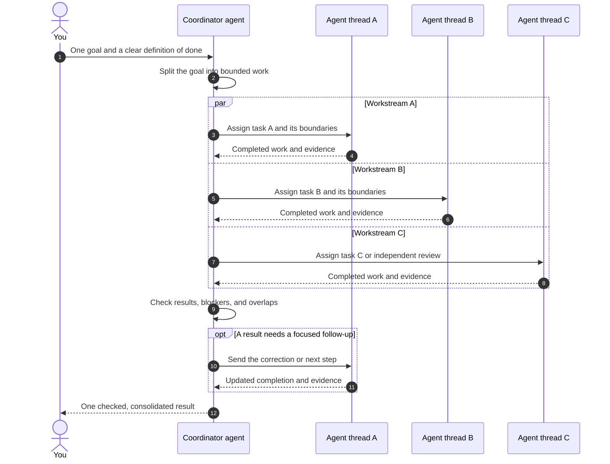

<p align="center">
  <a href="https://eyeinthesky6.github.io/codex-coordinator/">
    
  </a>
</p>

<h1 align="center">Codex Coordinator</h1>

<p align="center"><strong>Coordinate parallel OpenAI Codex tasks without becoming their full-time project manager.</strong></p>

<p align="center">
  <a href="https://eyeinthesky6.github.io/codex-coordinator/"><strong>Website</strong></a>
  · <a href="#quick-start">Quick start</a>
  · <a href="https://t.me/+ra4BQ7-_5uM2MDY1">Telegram community</a>
  · <a href="https://github.com/eyeinthesky6/codex-coordinator/discussions/categories/q-a">Q&amp;A</a>
  · <a href="https://github.com/eyeinthesky6/codex-coordinator/releases/latest">Latest release</a>
</p>

<p align="center">
  <a href="https://github.com/eyeinthesky6/codex-coordinator/actions/workflows/ci.yml"></a>
  <a href="https://github.com/eyeinthesky6/codex-coordinator/releases/latest"></a>
  <a href="https://github.com/eyeinthesky6/codex-coordinator/stargazers"></a>
  <a href="https://github.com/eyeinthesky6/codex-coordinator/forks"></a>
  <a href="https://github.com/eyeinthesky6/codex-coordinator/discussions"></a>
  <a href="LICENSE"></a>
</p>

## What is Codex Coordinator?

Codex Coordinator is a free, open-source plugin for coordinating multiple OpenAI Codex tasks in the same Git repository. It helps prevent duplicated work and overlapping ownership, preserves useful handoffs after pauses or restarts, and returns one checked project update.

Running several agents sounds useful until two of them solve the same problem, one changes a file another still depends on, and a paused task forgets where the handoff was. Then you become the person checking every window, relaying every update, and deciding whether the project is actually finished. Give Coordinator one repository outcome; it divides the work into a few clear jobs and keeps each job with one owner.

It works with the Codex tasks and Git setup you already use. There is no coordination server, database, or lock manager to operate. Mission Control is an optional local dashboard; the core Coordinator works without it.

> **Independent project:** Codex Coordinator is a third-party plugin for OpenAI Codex. It is not affiliated with, endorsed by, or maintained by OpenAI. Codex and related OpenAI product names belong to OpenAI.

## How the communication flow works

```text
Use $codex-coordinator to create the tasks needed and coordinate this goal:
<describe the repository outcome you want>
```



You speak to the Coordinator agent. It creates the agent threads, gives each one a bounded part of the goal, and receives their completed work. The Coordinator checks the pieces together, sends focused follow-up work when needed, and returns one understandable result to you. Agent threads do not need to command each other—or use you as the message bus.

## The problems it solves

Codex Coordinator helps when:

- two agents might investigate the same problem or propose competing fixes;
- one agent could edit files another agent is still using;
- a task may pause, compact, or restart before the whole job is finished;
- you are opening every task window just to understand current status;
- useful findings are getting lost between “done,” “blocked,” and “someone else should handle this.”

You probably do not need it when one agent can safely finish the job, when you only need a quick answer, or when short-lived helpers can report directly back to one parent task. It is also not a cross-machine project manager.

## Codex Coordinator vs worktrees, subagents, and project managers

These tools solve different parts of parallel development:

| Approach | Best fit | What it does not solve by itself |
|---|---|---|
| One Codex task | One coherent goal that one agent can finish safely | No parallel ownership is needed |
| Parent-owned subagents | Short, bounded parallel help inside one task | The parent still owns durable status, validation, and the final result |
| Git branches or worktrees | Isolating file changes and Git history | Who owns each job, what is blocked, and how handoffs survive restarts |
| Separate Codex tasks with Coordinator | Several durable tasks working toward one repository outcome | Git integration, product judgment, and important approvals remain yours |
| Hosted project-management system | Cross-team and cross-machine planning | It adds a separate service and does not understand Codex task ownership automatically |

Coordinator complements native Codex tasks and Git; it does not replace either. See the [full fit and comparison guide](docs/DISCOVERY.md) for recommended and non-recommended cases.

## Multi-agent work without Ultra

Codex Coordinator lets you explicitly ask for multiple Codex agents for one large goal. Ultra can decide on its own when delegation may help, but you do not need Ultra to ask Coordinator to split a real job.

The plugin does not bypass Codex plan availability, usage, token, or concurrency limits. Parallel agents usually consume more usage than a comparable single-agent run. See the official [Codex subagent guidance](https://learn.chatgpt.com/docs/agent-configuration/subagents).

Subagents remain supported as helpers inside a registered task. The parent keeps their scope, validation, and result; independent Codex tasks use the app's native task messenger.

## Quick start

### Requirements

- Codex with plugin and hook support;
- Git;
- Python 3.10 or newer. The startup launcher reuses a compatible system or Codex-bundled Python when available. If none is found, it tells you before attempting installation.

### Install the latest stable release

1. Add the tagged repository as a marketplace:

   ```powershell
   codex plugin marketplace add eyeinthesky6/codex-coordinator@v0.3.0
   ```

2. Install **Codex Coordinator** from the new marketplace:

   ```shell
   codex plugin add codex-coordinator@codex-coordinator
   ```
3. Review and trust the SessionStart hook when Codex asks. It reads local coordination records, never writes project state, and starts the bundled localhost Mission Control after the first valid Coordinator session. Before it runs, an OS-native launcher checks PATH, registered and standard Python locations, and Codex runtime folders for Python 3.10+. If none is compatible, it informs you and tries an available user-scoped installer; it never silently uses `sudo` or changes PATH. Its only lifecycle preference is kept in local application data. In the CLI, use `/hooks`; an untrusted hook is skipped.

No Codex app restart or Coordinator service is required. Open a new Codex task after installation so it can load the plugin, then describe the result you want. The first Coordinator-enabled session starts Mission Control automatically; shut it down from its Settings panel or ask Codex to `Stop Mission Control` if you do not want it running.
4. Start a new Codex task and use the prompt at the top of this README.

For an offline or development checkout, clone or download the repository and add its local directory instead:

```powershell
codex plugin marketplace add <path-to-this-directory>
```

### What first success feels like

You give Codex one outcome and receive a short explanation of who is handling each part. You can ask what is active or blocked without opening every task. If work restarts later, the useful handoff is still there.

Under the hood, the repository gains a small trackable `.codex/coordination/project.yaml` marker plus local, Git-ignored working state. The startup hook restores context; it never grants an agent new permission.

Useful follow-ups:

```text
Show who is working on what and what is blocked.
Reconcile the current coordination state.
Hand off <task> to <registered task name>.
```

To opt a repository out, say `Turn Codex Coordinator off for this repository.`

### Optional Mission Control

Mission Control gives you one local, read-only view of current Codex tasks, queued work, completed work, concrete overlap warnings, and Doctor findings. It runs on `127.0.0.1`, has no login or telemetry, and never becomes a second coordination authority.

Mission Control is bundled with the plugin. After the hook is trusted, the first session in any Coordinator-enabled repository starts it and opens the dashboard once. Later sessions reuse the same local process without opening duplicate tabs.

From chat, ask `Start Mission Control` to enable and open it or `Stop Mission Control` to disable automatic startup and shut it down. The Settings panel has the same shutdown control. The source-development command remains:

```powershell
python -m apps.mission_control
```

On Windows, `./apps/mission_control/start-background.ps1 -Open` starts or reuses one hidden local process without opening duplicate browser tabs. See the [Mission Control guide](apps/mission_control/README.md) for project selection, settings, Doctor behavior, token use, and stopping the background process.

### Deactivate or uninstall safely

Turning Coordinator off for one repository is reversible. Ask Codex:

```text
Turn Codex Coordinator off for this repository.
```

Coordinator first reconciles active work, shows a dry-run receipt, removes only that repository's heartbeat and pinned Coordinator at a safe boundary, disables the marker, and removes the exact discovery block. It preserves `.codex/coordination/`, task history, ignore rules, project configuration, Codex tasks, and Mission Control data so reactivation can recover the project.

For a developer dry run from a trusted source checkout:

```powershell
python plugins\codex-coordinator\scripts\codex_coordinator_uninstall.py `
  project deactivate --project-root C:\Projects\example
```

Add `--apply` only after the listed native task and heartbeat actions have verified receipts. Use `project reactivate` to reverse the project-file changes. `project purge` is a separate destructive command and requires `--confirm-project-id <exact-id>`.

Global uninstall never scans a drive. It plans from explicitly supplied roots and a small non-authoritative index, revalidates every repository marker, deactivates verified projects independently, stops Mission Control, removes only proven Coordinator heartbeats, and then uses:

```powershell
codex plugin remove codex-coordinator@codex-coordinator
```

Project history and local Mission Control receipts remain by default. See the [full preservation and test contract](docs/codebase/UNINSTALL_AND_DEACTIVATION.md).

Not sure whether you need Coordinator, Mission Control, Doctor, tests, or a fresh-machine check? Use
the [operating guide](docs/OPERATING_GUIDE.md) to choose the smallest tool that proves the outcome.

## What it takes off your plate—and what stays yours

| Coordinator helps with | You and existing tools still decide |
|---|---|
| Turning one outcome into a few clear jobs | What outcome you actually want |
| Keeping agents from claiming the same work | Whether code and results are good enough |
| Remembering handoffs and choosing a bounded worktree when isolation helps | Git and Codex still create branches, worktrees, commits, and history through their normal tools |
| Bringing progress, blockers, and results into one update | Publishing, deployment, database, and other important approvals |

The optional local Mission Control observes the same native tasks and canonical records. It is an observer, not another coordination authority.

### Zero third-party runtime dependencies

The shipped plugin stays small by design. Beyond Codex, Git, and Python 3.10+, there is no orchestration framework, coordination daemon, database, queue, pip package, or npm package to install. The launcher can reuse Codex's bundled Python, but treats its location as a best-effort fallback rather than a stable public path. If Python is missing, Windows uses `winget` for a user-scoped install when available; macOS or Linux uses an existing user-scoped package tool, or a system package manager only when Codex is already running as root. Otherwise it reports what you need to install. The optional Mission Control also uses only Python's standard library and runs while its local lifecycle preference is enabled.

## What happens when several tasks are moving

### Fewer, durable worker tasks

One agent stays with each substantial, coherent part of the job through investigation, changes, tests, documentation, and follow-up. Coordinator records a reuse-first decision: reuse the same-area owner; keep only a microtask or tightly coupled integration step locally; delegate substantial independent work; or create a new task only for a substantial unrelated area with no reusable owner. It normally targets one to three active workers and treats five as the default ceiling.

Short standard work stays inside its owning task. That task may use parent-owned subagents for one lint or test run, a narrow inspection, or a low-risk one-or-two-file fix, then validate and report the result itself. Those helpers do not become new project tasks or sidebar windows.

A terminal task with nothing left to do stays closed. Review waits until there is one stable result to inspect. Coordinator does not quietly turn an old worker into the owner of an unrelated job, but the user may deliberately repurpose the task they are directly addressing after live ownership is checked. Generated generic titles may be renamed once to a short, stable work-area name after scope is known; meaningful user-written titles are preserved.

### Quiet, document-first coordination

You should not have to act as the message bus. Agents keep ordinary findings and progress with their own work. Coordinator gathers what changed, carries forward anything unfinished, and stays quiet when nothing changed.

Coordinator also reconciles the outside surfaces that can change the delivery result. When access is available, it reads goal-related GitHub pull requests, checks, reviews, merge state, unresolved conversations, and relevant issues at goal start, after material Git changes, and before closure. It inventories project-related automations, heartbeats, changed run results, and repository schedules at the same safe boundaries. Unrelated or paused scheduled work stays untouched. Read-only monitoring does not need repeated approval; exact current permission is required before a provider write or a major schedule, purpose, scope, target, permission, external-write, or ownership change.

After Coordinator is enabled for a repository, one pinned Coordinator remains active and every task in that repository is managed by default. Only you can exclude a specific task. You can also pause management: Coordinator then stays in report-only mode, continues to observe and summarize, and performs no assignment, redirection, wake, stop, resume, or ownership action. Every Coordinator update and Mission Control project view shows the current mode and exclusions. Installing the plugin globally does not enable this behavior in unmarked repositories.

The operating guide is split by action, so an agent loads only the execution, reconciliation, or messaging rules it needs. A small local hash checkpoint lets the active Coordinator skip inbox records it has already reconciled. It stores no task content and never caches codebase reads or Codex task history; Codex remains responsible for those native reads and cursors.

Task registration, acceptance, ownership, and “you may continue” confirmations stay in the private project records instead of appearing as new chat messages. A visible task message is reserved for a real pause, stop, resume, or urgent scope correction that requires the receiving agent to act.

Before every user-visible final update, Coordinator reconciles the complete goal ledger, changed task turns, local handoffs, ownership, acceptance evidence, GitHub state, scheduled work, and retained decisions. It verifies that its one quiet repository heartbeat exists, then reports done work, pending work, blockers or decisions, next actions, and the full-goal verdict, using `None` for an empty section. If the host cannot provide that return path, Coordinator marks the project as needing attention and tells you plainly. A heartbeat with no material change stays quiet and preserves pending work instead of treating silence as completion. Its final update is the single project view: mode, exclusions, completed, active, queued, blocked, and decisions needed.

### Scheduled follow-up across native Codex tasks

Enabling Coordinator for a repository authorises one native heartbeat for its pinned Coordinator. It uses the cadence you request, or 15 minutes by default. Each check reads only same-repository tasks whose native turn changed plus new local handoff records; it reconciles completed work, blockers, ownership, exclusions, capacity, and decisions. When nothing material changed, it produces no user update and sends no task message. Goal completion leaves the Coordinator registered and the heartbeat in place for the next task; disabling Coordinator for that repository removes it without touching automations you created yourself.

This is a return path, not a separate Coordinator daemon or polling database. If native heartbeats are unavailable, Coordinator must say automatic continuation is not active and may use only one result-or-blocker wake from an eligible worker. Scheduled continuations remain subject to normal Codex plan, token, and concurrency limits.

### Native identity, without handshake chatter

New agents receive the real job in their first prompt. There is no empty “are you ready?” turn and no ritual where workers repeat their ID, availability, or status before useful work can begin.

Internally, every logical job is bound to the exact native Codex thread ID that owns it. The current Coordinator is also registered by its exact native thread, and the coordination epoch identifies the current generation of ownership. A task instruction is accepted only when its repository, current epoch, sender, recipient, and registered ownership all match. That is how an outdated message from a replaced Coordinator—or a message meant for another repository—fails closed instead of reaching the wrong task. These IDs remain private project bookkeeping rather than chat noise.

If a recorded owner or Coordinator was archived, Coordinator verifies that native state immediately when your request first encounters it and restores the unfinished boundary to a replacement. You do not have to ping the archived task, repeat a prescribed sentence, or confirm the same action twice.

### User authority stays above coordination

Agents still cannot overrule you. A message from Coordinator cannot silently replace an earlier instruction from the user. Important changes in direction need a later, direct user decision.

### Doctor: quiet project health checks

The optional Doctor has two deliberately separate review paths:

| Review | How it starts | AI use | What it may do |
|---|---|---|---|
| Regular Doctor | A Mission Control click or a user-approved recurring Codex automation | Zero model calls and zero model tokens | Validate and safely repair the trusted installed Coordinator files; scan enabled-project coordination records; write one deduplicated private finding for a verified mismatch |
| AI Deep Review | A separate explicit click in Mission Control; never scheduled and never included in Regular Doctor | Your configured Codex model at Low reasoning | Review whether a worker looks too small for a durable task or its title no longer matches its goal; return schema-validated suggestions only |

Regular Doctor checks the installed Coordinator skill, state helper, capability contract, and exact SessionStart hook against the package's immutable managed-file receipt. For a manual or legacy package, the caller must also supply the exact package version and receipt SHA-256 from separately published release metadata. Doctor checks that external pin before reading an installation target, so replacing managed files and regenerating the co-located receipt does not create a trusted package. Its JSON separates integrity from recovery, including healthy, local modification detected, trusted manual repair available, marketplace reinstall required, failed repair with last-good restored, and manual action required. Marketplace cache files remain owned by Codex's plugin manager and are never repaired in place; use the supported plugin update or reinstall path. Supported legacy/manual repair replaces only declared managed files and preserves unexpected files plus all project state. The project scan reads validated Coordinator state, bounded active task headers, native completion metadata, inbox checkpoints, and heartbeat definitions. It does not read application code or parse chat bodies, and it does not change ownership, wake tasks, or treat an idle project as broken merely because time passed. A scheduled run is still a user-approved Codex automation over previously disclosed project roots; Doctor does not install its own scheduler or silently add newly discovered projects.

AI Deep Review receives at most 12 active worker summaries and 12 KB total. The packet includes bounded task titles, goals, execution modes, and write-path counts while withholding literal project and task IDs, roots, paths, URLs, transcripts, application code, configuration, environment data, skills, and memories. Mission Control shows the actual token receipt and any truncation. Deep Review cannot write a Doctor finding, edit coordination state, message or wake a task, or grant repair authority.

## Model and reasoning choices

An exact user choice wins when the destination supports it, without rewriting global or project configuration. Otherwise, generated tasks inherit the user's configured model and use Low for deterministic, reversible work or Medium for normal work. High needs a recorded task-specific reason; Extra High and Ultra need managed policy or explicit user permission.

## What the plugin creates

- `.codex/coordination/project.yaml`: committed discovery marker and stable project identity;
- `.codex/coordination/CURRENT.md`: local current ownership and handoff state;
- `.codex/coordination/inbox/`: local append-only notices, reconciliation records, resume requests, and Doctor findings;
- `.codex/coordination/cache/`: optional disposable hashes for inbox records already reconciled by the exact current Coordinator;
- `.codex/coordination/feedback.json`: optional ignored receipt that prevents the first field-report request from repeating;
- task and suggestion records only when real work requires them;
- one small discovery block in the root `AGENTS.md`;
- narrow ignore rules that keep mutable coordination state local.

The plugin does not copy its operating manual into user projects and does not change model configuration by default.

## Package map

- [`plugins/codex-coordinator/skills/codex-coordinator/`](plugins/codex-coordinator/skills/codex-coordinator/): coordination behavior, action-specific operating lanes, capability contract, and deterministic state helper;
- [`plugins/codex-coordinator/hooks/hooks.json`](plugins/codex-coordinator/hooks/hooks.json): SessionStart registration;
- [`plugins/codex-coordinator/scripts/codex_coordinator_session_start.py`](plugins/codex-coordinator/scripts/codex_coordinator_session_start.py): bounded restart context and Mission Control lifecycle dispatch;
- [`plugins/codex-coordinator/scripts/codex_coordinator_doctor.py`](plugins/codex-coordinator/scripts/codex_coordinator_doctor.py): installed-package repair and validation;
- [`plugins/codex-coordinator/release-receipt.json`](plugins/codex-coordinator/release-receipt.json): development receipt for every Doctor-managed skill and hook file; a real release publishes its exact SHA-256 separately from the package;
- [`plugins/codex-coordinator/scripts/codex_coordinator_uninstall.py`](plugins/codex-coordinator/scripts/codex_coordinator_uninstall.py): dry-run-first project deactivation, reactivation, verified global planning, and separately confirmed purge;
- [`plugins/codex-coordinator/mission_control/`](plugins/codex-coordinator/mission_control/): bundled localhost dashboard and standard-library collector;
- [`apps/mission_control/`](apps/mission_control/): source-checkout compatibility launchers and guide;
- [`.agents/plugins/marketplace.json`](.agents/plugins/marketplace.json): marketplace entry.

For contributors, start with the [architecture](docs/codebase/ARCHITECTURE.md), [structure](docs/codebase/STRUCTURE.md), [testing](docs/codebase/TESTING.md), and [known concerns](docs/codebase/CONCERNS.md).

## Update

Tagged marketplaces stay pinned to the version you added. To move to a newer stable tag, replace the pinned marketplace and reinstall the plugin:

```powershell
codex plugin remove codex-coordinator@codex-coordinator
codex plugin marketplace remove codex-coordinator
codex plugin marketplace add eyeinthesky6/codex-coordinator@v0.3.0
codex plugin add codex-coordinator@codex-coordinator
```

An update replaces only plugin-managed files. It does not rewrite project coordination state. Doctor reports marketplace drift as reinstall-required and never rewrites the managed cache. Review and trust the changed hook, then start a new Codex task so the updated skill is loaded. Existing tasks keep their current titles; the one-time generic-title cleanup applies when Coordinator next creates or deliberately continues a generated task for the same coherent area. If you need to roll back, repeat the same sequence with the previous known-good tag, such as `v0.2.1`. When migrating from a manual install, verify the plugin first, then remove the legacy copy so both hooks do not run.

The provider-consent, complete delivery-summary, scheduled-task reconciliation, and externally pinned Doctor upgrade is currently unreleased source work. The pinned `v0.3.0` marketplace does not contain it. The manifest keeps `0.3.0` as the last public marketplace baseline, while package state `development` and the receipt version `0.0.0-unreleased` identify these source bytes truthfully and prevent Doctor from using them as a manual repair source. A separately authorised release preparation chooses the next real version, changes the package state to `release`, gives the manifest and receipt that same version, regenerates the receipt, and publishes the version plus receipt SHA-256 outside the archive. Tagging, releasing, marketplace publication, installation, and update remain separate actions. Existing users then follow the same marketplace replacement and plugin reinstall steps above. No project marker or local coordination-state migration is required because these are global behavior and Doctor-contract changes.

## Frequently asked questions

### How do I coordinate multiple Codex agents in one repository?

Install Coordinator, give it one repository outcome, and let it assign a few durable work areas. It records ownership and handoffs while Codex tasks and Git continue to own execution and source history.

### Does Codex Coordinator replace Git worktrees?

No. Worktrees isolate branches and files. Coordinator may choose a bounded worktree for an independent writer when that avoids an unnecessary wait, but Codex and Git still create and maintain it. Coordinator tracks the owner, integration path, status, handoff, recovery, and final consolidated result.

### Do I need Ultra to delegate work?

No. You can explicitly ask Coordinator to create and coordinate several Codex tasks. The plugin does not bypass your Codex plan, model availability, usage, token, or concurrency limits.

### Does it send my repository to a coordination server?

No separate coordination service is added. Coordinator uses native Codex tasks plus small local project records. Its SessionStart helper reads local handoff state, makes no network calls, and never writes project state.

### When should I avoid using it?

Use one Codex task for a small or tightly coupled change. Use parent-owned subagents for short, bounded help. Coordinator is for several durable tasks where ownership, recovery, and one project-level result matter.

## Community and trust

- Join the [Telegram community](https://t.me/+ra4BQ7-_5uM2MDY1) for quick conversation and early feedback. Links, promotions, solicitations, and secrets are not allowed there.
- Ask usage questions in [Q&A](https://github.com/eyeinthesky6/codex-coordinator/discussions/categories/q-a).
- Share early requests in [Ideas](https://github.com/eyeinthesky6/codex-coordinator/discussions/categories/ideas).
- After the first completed coordinated goal, one optional field-report link may appear. Nothing is sent automatically, and the request does not repeat in that project.
- Use Issues only for a reproducible bug or accepted, scoped work.
- Read [CONTRIBUTING.md](CONTRIBUTING.md) before proposing code.
- Follow [SECURITY.md](SECURITY.md) for private vulnerability reports.
- See [SUPPORT.md](SUPPORT.md) for the full request route and [GOVERNANCE.md](GOVERNANCE.md) for project decisions.

Never paste credentials, private task messages, personal paths, or a project's live coordination state into a public report.

## Development

The runtime is dependency-free. Run the full test suite from the repository root:

```powershell
python -m unittest discover -s tests -p "test_*.py" -v
```

For the optional local secret check:

```powershell
python -m pip install pre-commit
pre-commit install
pre-commit run --all-files
```

## License

[MIT](LICENSE) © 2026 Six Ideas.
