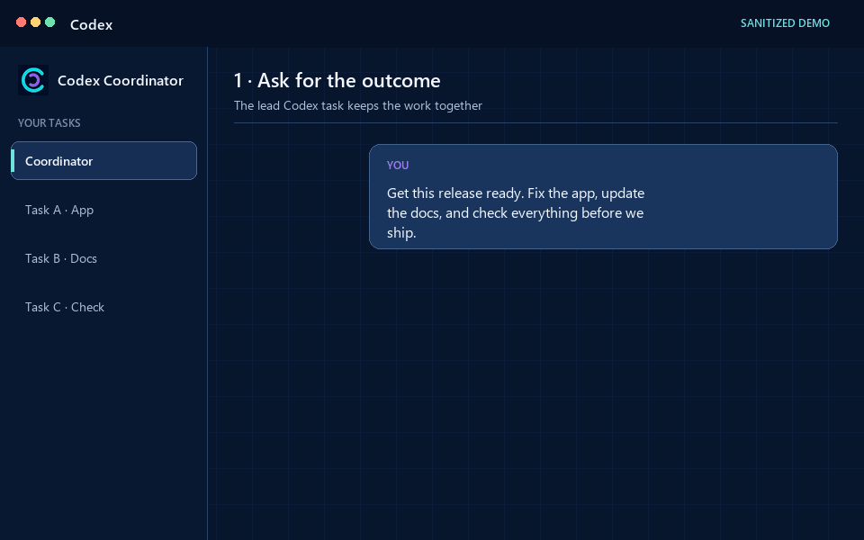
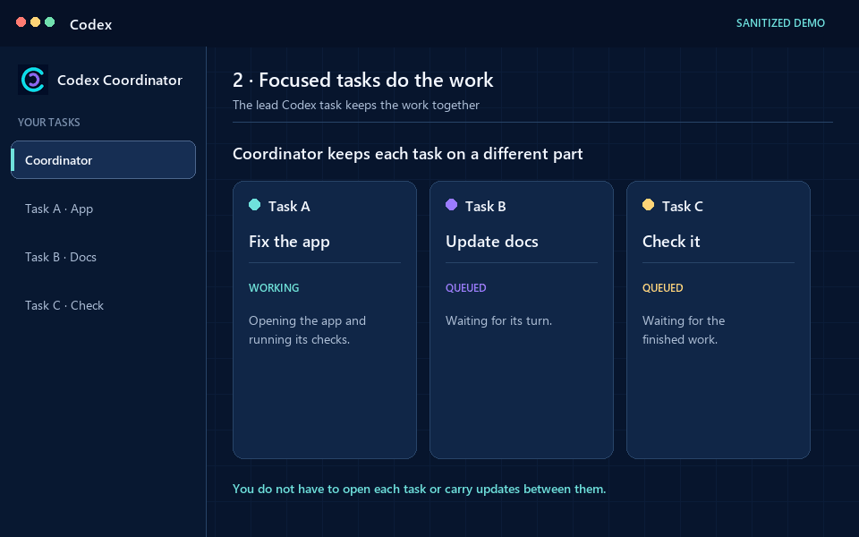
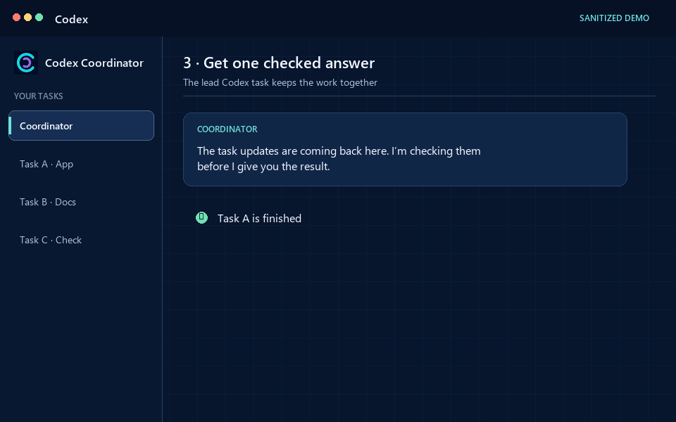

<h1 align="center">Codex Coordinator</h1>

<p align="center"><strong>Give one goal to a few Codex tasks without losing track of the work.</strong></p>

<p align="center">
  <a href="https://github.com/eyeinthesky6/codex-coordinator/actions/workflows/ci.yml"></a>
  <a href="https://github.com/eyeinthesky6/codex-coordinator/releases/tag/v0.4.0"></a>
  <a href="LICENSE"></a>
</p>

Codex Coordinator lets you reuse related tasks, give each task a clear job, and see when two tasks may work on the same thing.

You stop checking every window, repeating the same updates, and fixing duplicate work. Codex still does the work; Coordinator keeps the jobs clear.

**[Website](https://eyeinthesky6.github.io/codex-coordinator/)** · **[Install](#install)** · **[FAQ](https://eyeinthesky6.github.io/codex-coordinator/faq.html)** · **[Ask a question](https://github.com/eyeinthesky6/codex-coordinator/discussions/categories/q-a)**

## What it lets you do

- Give one project goal to two or three Codex tasks.
- Reuse a related task that already knows the work instead of opening another window.
- Give every task one complete, clear job.
- See who is doing what without checking every task yourself.
- Catch crossed work before it becomes rework.

Codex still does the work. Git still keeps the history. You still decide what gets changed or published.

## How it works

1. **Tell it the result you want.** Start with one project goal, not separate instructions for every task.
2. **Let it choose the right tasks.** Coordinator reuses a useful related task first and opens another only when the work truly benefits from it.
3. **Ask who is doing what.** See each task's job and where work may cross whenever you need the current picture.

| Ask | Work | Review |
|---|---|---|
|  |  |  |

## When it helps

Use Codex Coordinator when one project genuinely needs two or three Codex tasks at the same time and you would otherwise spend time checking windows or untangling duplicate work.

Keep your workflow simpler when:

- one task can finish the job safely;
- you only need a quick answer or small edit;
- a short-lived helper can report directly back to the task you are already using;
- separate branches or worktrees already give you all the isolation you need.

## Install

Requirements: OpenAI Codex with plugin support, Git, and Python 3.10 or newer.

Add the current stable release and install it:

```powershell
codex plugin marketplace add eyeinthesky6/codex-coordinator --ref v0.4.0
codex plugin add codex-coordinator@codex-coordinator
```

Then open your project in Codex and ask:

```text
Use $codex-coordinator for this project goal:
<describe the outcome you want>
```

Installation does not turn Coordinator on for every project. You choose where to use it.

You can also find it in the [ChatGPT Plugins directory](https://chatgpt.com/plugins/plugins_6a5c8cb6a5648191a43a76e6a1e637d8) and on [skills.sh](https://skills.sh/eyeinthesky6/codex-coordinator/codex-coordinator).

## What it does not add

- No background monitoring or constant status checks.
- No copied prompts, chats, reasoning, or tool output.
- No automatic extra project copies or branches.
- No forced review process.
- No separate dashboard, database, account, or cloud service.
- No permission to deploy, publish, change environments, or override your decisions.

## Privacy and control

Task conversations remain in Codex. Coordinator keeps only a small amount of local project information needed to show the active job and planned work for each task.

It does not upload source code, prompts, chats, reasoning, or tool output. The project has no product telemetry and no coordination server.

Read the full [privacy policy](PRIVACY.md), [security policy](SECURITY.md), and [technical design](https://eyeinthesky6.github.io/codex-coordinator/developers.html).

## For developers and maintainers

The user-facing story stays deliberately simple. Implementation details, lifecycle rules, validation, migration, and architecture history live here:

- [Developer guide](https://eyeinthesky6.github.io/codex-coordinator/developers.html)
- [Operating guide](docs/OPERATING_GUIDE.md)
- [Architecture](docs/codebase/ARCHITECTURE.md)
- [Testing](docs/codebase/TESTING.md)
- [Design history and simplification decision](docs/codebase/2026-07-21_boundary-board-simplification_architectural_review.md)
- [Shared-checkout correction](docs/codebase/2026-07-23_cooperative-shared-checkout_architectural_review.md)
- [Changelog](CHANGELOG.md)

Run the complete test suite from the repository root:

```powershell
python -m unittest discover -s tests -p "test_*.py" -v
```

## Community

- Ask usage questions in [Q&A](https://github.com/eyeinthesky6/codex-coordinator/discussions/categories/q-a).
- Share real workloads and early requests in [Ideas](https://github.com/eyeinthesky6/codex-coordinator/discussions/categories/ideas).
- Report reproducible bugs through [Issues](https://github.com/eyeinthesky6/codex-coordinator/issues).
- Read [CONTRIBUTING.md](CONTRIBUTING.md) before proposing code.
- Use [SECURITY.md](SECURITY.md) for private vulnerability reports.

Never post credentials, private task messages, personal paths, or live project state in a public issue or discussion.

## License

[MIT](LICENSE) © 2026 Six Ideas.

Codex Coordinator is an independent third-party project and is not affiliated with or endorsed by OpenAI.
