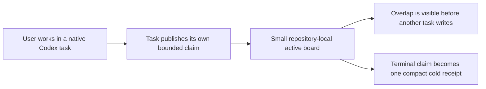

<p align="center">
  <a href="https://eyeinthesky6.github.io/codex-coordinator/">
    
  </a>
</p>

<h1 align="center">Codex Coordinator</h1>

<p align="center"><strong>A small task-boundary board for native Codex tasks.</strong></p>

> [!IMPORTANT]
> Version `0.4.0` is the current schema-2 release candidate on `main`; it is not tagged or published yet. The latest public stable release uses the retired orchestration design and is not the schema-2 product. The current repository marker remains disabled by design, and installing the plugin never enables a project automatically.

## What it is

Codex Coordinator helps with coordinating multiple OpenAI Codex tasks in the same Git repository and primary checkout. One normal task may act as an explicitly requested, goal-scoped Coordinator, but nothing runs as a permanent manager.

Native Codex remains responsible for task windows, messages, execution, status, and transcripts. Coordinator adds one small local board. Each active writer publishes only:

- its exact native task ID;
- a short title and bounded goal;
- repository-relative paths where it plans to work and exact exclusive actions it owns;
- real dependencies and current active or blocked status;
- timestamps and a revision number.

It does not store prompts, reasoning, chat transcripts, tool calls, tool output, source code, provider responses, or full-turn logs.



There is no always-on/resident monitoring Coordinator, automatically created Coordinator task, heartbeat, polling loop, inbox ledger, task ledger, required pull request, or automatic observer process.

## Why the product changed

The original problem was real: parallel tasks need shared ownership visibility. Later fixes added a permanent lead, heartbeats, per-turn reconciliation, provider and schedule checks, installation repair, and a dashboard lifecycle. Each feature addressed a real defect, but together they made coordination slower than the text-only work being coordinated.

The accepted rule is now: preserve the safety invariant, remove the always-on mechanism.

| Keep | Remove from the core |
|---|---|
| Exact native task identity | Permanent Coordinator task |
| Visible planned paths and narrow exclusive-action ownership | Heartbeat and polling |
| Case-insensitive ancestor overlap warnings | Full-goal and per-turn ledgers |
| One-task default, three-task normal cap, twelve-task hard cap | Automatic task-window creation |
| Revision-safe, task-owned records | Status and acknowledgement chatter |
| One bounded Coordinator assignment plus sparse peer notices | Provider, schedule, PR, and release monitoring |
| Immediate user stop and exact external-write consent | Mandatory PR workflow |
| Evidence-based stale-claim recovery | Doctor repair and project scanning |
| Native Codex as transcript authority | Transcript or rollout mirroring |

The complete simplification history is in the [boundary-board architectural review](docs/codebase/2026-07-21_boundary-board-simplification_architectural_review.md). The later evidence that broad claims and one durable Git owner still stopped useful work, plus the cooperative correction, is in the [shared-checkout architectural review](docs/codebase/2026-07-23_cooperative-shared-checkout_architectural_review.md).

## When to use it

Use the board when two or three durable Codex tasks may write in the same repository and planned overlap would be costly.

Use a simpler path when:

- one task can finish the goal safely;
- the work is read-only or one small edit;
- a short parent-owned subagent can report back in the same task;
- separate Git branches and a human-owned handoff are already enough.

Coordinator is not a cross-machine project manager, workflow engine, scheduler, permission system, filesystem lock, or replacement for Git.

## Codex Coordinator vs worktrees, subagents, and project managers

| Approach | Best fit | Boundary |
|---|---|---|
| One Codex task | One coherent outcome | No parallel ownership needed |
| Parent-owned subagents | Short independent checks inside one task | Parent remains the durable owner |
| Git branches or worktrees | File and history isolation | Do not describe task ownership by themselves |
| Boundary board | Two or three durable native tasks in one shared checkout | Advisory ownership metadata only |
| Project manager | Teams, machines, schedules, reporting | Separate service and authority model |

## Core operating model

### One task first

Investigation, implementation, tests, docs, and follow-up fixes for one coherent goal normally stay in one native task. When the user explicitly asks for coordination, a goal-scoped Coordinator may assign two or three substantial verticals. Each vertical receives one complete goal covering its bounded investigation, implementation, focused tests, and documentation.

Before it creates a task, the Coordinator looks for a suitable related local task in the same repository and checkout. It reuses that context with one bounded assignment when the task is not busy with unrelated work or waiting on a user decision. A new local task is the fallback, not the default.

The normal maximum is three active durable tasks. More than three requires a direct user decision recorded on the new claim. Twelve is a hard board limit.

The Coordinator claims the exclusive `goal-coordination` action. Its bounded claim goal is the shared goal. It stays available when the user invokes it again and ends when that goal ends; it does not poll, run a heartbeat, demand progress reports, or wake automatically when another task finishes. There is no automatic fan-in promise. Short dependent checks may still use parent-owned subagents.

Every coordinated task uses the same primary checkout, current worktree, and current branch. This preserves untracked settings, offline runners, and machine-specific runtime context. Coordinated tasks do not create or switch branches or worktrees.

### Claim before substantial writes

Schema 2 keeps one JSON file per active task under `.codex/coordination/active/`. The state helper serializes metadata writes with a tiny OS file lock, checks expected revisions, returns path overlap warnings, rejects only exact exclusive-action conflicts, and rechecks before returning.

Tasks update only their own bounded claim at natural boundaries: start, real scope change, blocked-state change, and completion or stop. Claims are not progress diaries. Generated schema-2 `CURRENT.md` is a non-authoritative, active-only human view that is rebuilt from those claims after state mutations.

Two paths overlap when they are equal or one is an ancestor of the other. Matching is case-insensitive. That overlap is visibility, not a task stop. Agents re-read shared files and pause only when the same hunk or writer command actually collides. `.` means the whole repository and should be rare.

Coordinated tasks stay on one branch established before parallel work. There is no durable Git owner. Each task may commit only the exact files it reviewed: never broad-stage, never include foreign staged work, and never switch branches, rebase, clean, or force-push around other writers. Shared generated maps, schemas, lockfiles, and full gates have no durable owner; only their actual writer command is serialized. Pull requests are optional and remain repository or user policy.

### Keep communication sparse

The board is the normal visibility path. A direct peer notice is limited to a real `COLLISION`, `DEPENDENCY`, or `RELEASED` event and is non-executable. The only assignment exception is one bounded `GOAL_ASSIGNMENT` from the exact active goal Coordinator to a suitable related task in the same repository. It grants no external or destructive authority and creates no acknowledgement chain.

### Finish cold

Completion, stop, supersession, or proven stale ownership moves the active claim to one compact archive receipt. Archives are not read during ordinary work. Native task history remains in Codex and is never copied into Coordinator state.

A five-second Stop guard catches the common failure that caused a false active task here: the task reaches its final answer but forgets to release its own claim. It reads only that exact claim and requests one housekeeping continuation. It never reads a transcript or scans other tasks, and Codex's `stop_hook_active` signal makes the continuation one-shot.

## Project marker

Coordinator is opt-in per repository:

```yaml
schema_version: 2
coordination_enabled: false
project_id: example
project_name: Example
task_prefix: EX
canonical_paths:
  active: .codex/coordination/active
  archive: .codex/coordination/archive
access:
  cross_project_task_access: false
  cross_project_state_changes: false
```

Only the marker is committed. Mutable state remains local:

```gitignore
.codex/coordination/*
!.codex/coordination/project.yaml
```

The current repository intentionally remains `coordination_enabled: false`. No install, update, migration, Doctor check, task discovery, or optional tool may enable a project automatically.

## State helper

List active claims:

```powershell
python plugins/codex-coordinator/skills/codex-coordinator/scripts/coordination_state.py list `
  --project-root C:\Projects\example
```

Create the current task's first claim:

```powershell
python plugins/codex-coordinator/skills/codex-coordinator/scripts/coordination_state.py claim `
  --project-root C:\Projects\example `
  --thread-id <exact-native-thread-uuid> `
  --title "Bounded task" `
  --goal "Change one coherent area" `
  --path src/area `
  --expected-revision 0
```

Release it:

```powershell
python plugins/codex-coordinator/skills/codex-coordinator/scripts/coordination_state.py release `
  --project-root C:\Projects\example `
  --thread-id <exact-native-thread-uuid> `
  --expected-revision 1 `
  --status completed
```

Do not use a display title as identity. The claim filename and `threadId` must match the exact native Codex thread ID.

## SessionStart

The hook is marker-only. For an enabled schema-2 repository it emits a short reminder to load the skill and list claims. It does not:

- read active claims or archives;
- scan native task history or private Codex databases;
- launch a child process or browser;
- start an optional observer;
- install Python or change `PATH`;
- create a task, heartbeat, schedule, or message.

The hook timeout is five seconds. A disabled or absent marker produces no output.

## Stop guard

The Stop hook is a bounded lifecycle guard, not a Coordinator loop. For an enabled schema-2 repository it:

- validates the marker and exact native `session_id`;
- resolves the primary worktree, including a linked-worktree task;
- reads at most one 4 KB claim named by that exact ID;
- stays silent when no claim exists, the project is disabled, or the claim is already blocked;
- requests one continuation when the exact claim remains active, asking the same task to release finished work or explicitly retain unfinished ownership;
- fails open on hook or state errors so it cannot wedge the task.

It does not read `transcript_path`, assistant text, reasoning, tool output, archives, other claims, native history, or private Codex databases. It writes no state and creates no task or message.

Codex has no app-archive lifecycle event. Abruptly archiving an unfinished task can therefore still leave its claim behind; recover that exact owner only when a later overlap needs it and native evidence proves the task archived or unusable. This residual gap does not justify a resident watcher.

## Doctor

Doctor is a manual, read-only package compatibility check:

```powershell
python plugins/codex-coordinator/scripts/codex_coordinator_doctor.py --check
```

It checks the manifest, capability contract, skill links, Python syntax, project-lifecycle helper, and exact SessionStart/Stop registration. It does not scan projects or repair files. A broken result says to update or reinstall through the normal plugin manager. Legacy `--apply` is rejected without writing.

## Optional observer status

No observer is shipped in the schema-2 base package. The retired runtime, UI, launchers, and lifecycle helper remain available only in dated architecture records and Git history.

If real usage later justifies an observer, it must be a new separate optional installation, start manually, read only the supported active-board contract, and have no task, Doctor, model-review, provider, schedule, or write authority.

## Initialise, deactivate, migrate, and uninstall

New projects use the same dry-run-first lifecycle helper. The plan changes nothing:

```powershell
python plugins/codex-coordinator/scripts/codex_coordinator_project.py `
  project init --project-root C:\Projects\example `
  --project-id example --project-name "Example" --task-prefix EX
```

After reviewing the exact file plan, repeat with `--apply`. Initialisation creates only the schema-2 marker, empty active/archive directories, and exact `AGENTS.md` and `.gitignore` blocks. It creates no Codex task, process, heartbeat, schedule, message, or transcript copy.

Deactivation is reversible: it sets the marker to false and removes only the exact discovery block. It preserves claims, receipts, legacy state, native tasks, transcripts, Git history, application files, and configuration.

The lifecycle helper is dry-run-first:

```powershell
python plugins/codex-coordinator/scripts/codex_coordinator_project.py `
  project deactivate --project-root C:\Projects\example
```

Schema 2 requires no task, pin, heartbeat, schedule, or observer cleanup. Legacy schema-1 deactivation may report exact old lifecycle actions. The migration helper then inventories and preserves old state, writes an exact marker backup, creates an empty schema-2 board, and keeps the project disabled; it never guesses old task records into active claims. Purge remains a separate destructive action requiring the exact project ID.

## Zero third-party runtime dependencies

The core requires Codex, Git, and an existing Python 3.10+ interpreter. It uses only the Python standard library. It does not install Python, invoke an OS package manager, operate a daemon, or require a database, queue, orchestration framework, pip package, or npm package.

## Development and validation

Run the complete suite:

```powershell
python -m unittest discover -s tests -p "test_*.py" -v
```

The acceptance tests cover:

- one-task default and active-task caps;
- concurrent overlapping and disjoint claims;
- exact identity, revision checks, path safety, and record-size bounds;
- no transcript or full-ledger fields;
- compact cold receipts and archive-free hot reads;
- marker-only SessionStart with no process launcher;
- read-only Doctor and reinstall-only failure posture;
- legacy deactivation without schema-2 lifecycle creation;
- optional-tool isolation from the base runtime.

## Evaluate the schema-2 release candidate

There is no public `v0.4.0` tag yet. To review the candidate before release, clone a reviewed commit, then add that local checkout as the marketplace source:

```powershell
codex plugin marketplace add .
codex plugin add codex-coordinator@codex-coordinator
```

Installation alone manages no repository. Enable or migrate one project deliberately after reviewing its current tasks and local state. Dated decision records, the changelog, tags, and Git history preserve the retired orchestration design and its rationale.

## Frequently asked questions

### How do I coordinate multiple Codex agents in one repository?

Start with one native task. If you explicitly ask it to coordinate, it can claim `goal-coordination` and assign two or three complete verticals in the same checkout. Each writer publishes its own narrow claim. Return to the Coordinator when you want the current state or combined result; it does not monitor the tasks in the background.

### Does Codex Coordinator replace Git worktrees?

No. Worktrees isolate files and Git history, but this coordination mode intentionally keeps all tasks in the same primary checkout and current branch so they share local settings and offline runners. The board shows planned paths and truly exclusive actions without turning directories into locks.

### Do I need a pull request workflow?

No. Direct commits and non-force pushes remain the default. Each task commits only its reviewed files on the shared branch. Use a PR only when you or repository policy want remote review or an immutable comparison.

### Does it store full chats or model reasoning?

No. Native Codex is the only transcript authority. Schema 2 rejects unknown claim fields and caps every record at 4 KB.

### Does it keep watching while I am away?

No. There is no Coordinator heartbeat or background monitor. If you explicitly create a separate native automation for some other goal, that automation remains outside the board and keeps its own authority boundary.

## Project map

- [Skill contract](plugins/codex-coordinator/skills/codex-coordinator/SKILL.md)
- [State helper](plugins/codex-coordinator/skills/codex-coordinator/scripts/coordination_state.py)
- [SessionStart hook](plugins/codex-coordinator/scripts/codex_coordinator_session_start.py)
- [Read-only Doctor](plugins/codex-coordinator/scripts/codex_coordinator_doctor.py)
- [Operating guide](docs/OPERATING_GUIDE.md)
- [Architecture](docs/codebase/ARCHITECTURE.md)
- [Decision history](docs/codebase/2026-07-21_boundary-board-simplification_architectural_review.md)
- [Security policy](SECURITY.md)
- [Privacy](PRIVACY.md)
- [Terms](TERMS.md)

Codex Coordinator is an independent third-party project and is not affiliated with or endorsed by OpenAI.
