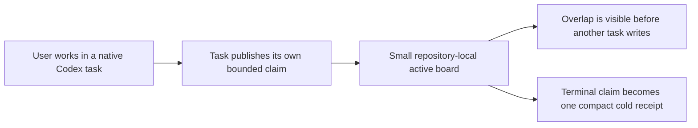

<p align="center">
  <a href="https://eyeinthesky6.github.io/codex-coordinator/">
    
  </a>
</p>

<h1 align="center">Codex Coordinator</h1>

<p align="center"><strong>A small task-boundary board for native Codex tasks.</strong></p>

> [!IMPORTANT]
> The boundary-board realignment is implemented in source but is not released or enabled yet. The current repository marker remains disabled. The latest stable tag, `v0.3.0`, contains the older orchestration design; do not enable that release if your goal is the simplified behavior described here.

## What it is

Codex Coordinator helps with coordinating multiple OpenAI Codex tasks in the same Git repository without putting one permanent task in charge of all the others.

Native Codex remains responsible for task windows, messages, execution, status, and transcripts. Coordinator adds one small local board. Each active writer publishes only:

- its exact native task ID;
- a short title and bounded goal;
- repository-relative paths and exclusive actions it owns;
- real dependencies and current active or blocked status;
- timestamps and a revision number.

It does not store prompts, reasoning, chat transcripts, tool calls, tool output, source code, provider responses, or full-turn logs.



There is no resident Coordinator task, heartbeat, polling loop, inbox ledger, automatic task creation, required pull request, or automatic Mission Control process.

## Why the product changed

The original problem was real: parallel tasks need shared ownership visibility. Later fixes added a permanent lead, heartbeats, per-turn reconciliation, provider and schedule checks, installation repair, and a dashboard lifecycle. Each feature addressed a real defect, but together they made coordination slower than the text-only work being coordinated.

The accepted rule is now: preserve the safety invariant, remove the always-on mechanism.

| Keep | Remove from the core |
|---|---|
| Exact native task identity | Permanent Coordinator task |
| Narrow path and exclusive-action ownership | Heartbeat and polling |
| Case-insensitive ancestor overlap checks | Full-goal and per-turn ledgers |
| One-task default, three-task normal cap, twelve-task hard cap | Automatic task-window creation |
| Revision-safe, task-owned records | Status and acknowledgement chatter |
| Sparse non-executable collision/dependency notices | Provider, schedule, PR, and release monitoring |
| Immediate user stop and exact external-write consent | Mandatory PR workflow |
| Evidence-based stale-claim recovery | Doctor repair and project scanning |
| Native Codex as transcript authority | Transcript or rollout mirroring |

The complete history, capability-by-capability reasoning, failure modes, rollback plan, and retained protections are in the [boundary-board architectural review](docs/codebase/2026-07-21_boundary-board-simplification_architectural_review.md).

## When to use it

Use the board when two or three durable Codex tasks may write in the same repository and planned overlap would be costly.

Use a simpler path when:

- one task can finish the goal safely;
- the work is read-only or one small edit;
- a short parent-owned subagent can report back in the same task;
- separate Git branches and a human-owned handoff are already enough.

Coordinator is not a cross-machine project manager, workflow engine, scheduler, permission system, filesystem lock, or replacement for Git.

## Codex Coordinator vs worktrees, subagents, and project managers

| Approach | Best fit | Boundary |
|---|---|---|
| One Codex task | One coherent outcome | No parallel ownership needed |
| Parent-owned subagents | Short independent checks inside one task | Parent remains the durable owner |
| Git branches or worktrees | File and history isolation | Do not describe task ownership by themselves |
| Boundary board | Two or three durable native tasks in one repository | Advisory ownership metadata only |
| Project manager | Teams, machines, schedules, reporting | Separate service and authority model |

## Core operating model

### One task first

Investigation, implementation, tests, docs, and follow-up fixes for one coherent goal stay in one native task. A second or third durable task is justified only when its outcome is substantial, independently useful, and safely parallel.

The normal maximum is three active durable tasks. More than three requires a direct user decision recorded on the new claim. Twelve is a hard board limit.

A temporary lead may split or combine work only when the user explicitly asks for decomposition or a consolidated result. It is not pinned, retained, or given a heartbeat.

### Claim before substantial writes

Schema 2 keeps one JSON file per active task under `.codex/coordination/active/`. The state helper serializes writes with a tiny OS file lock, checks expected revisions, rejects overlapping paths or exclusive actions, and rechecks before returning.

Two paths overlap when they are equal or one is an ancestor of the other. Matching is case-insensitive. `.` means the whole repository and should be rare.

When more than one writer exists, one task owns the `git-integration` action. Direct commits and pushes are the normal path for a single owner. Pull requests are optional and remain repository or user policy.

### Keep communication sparse

The board is the normal visibility path. A direct peer notice is limited to a real `COLLISION`, `DEPENDENCY`, or `RELEASED` event. It is non-executable: it cannot assign work, relay user authority, demand status, or create an acknowledgement chain.

### Finish cold

Completion, stop, supersession, or proven stale ownership moves the active claim to one compact archive receipt. Archives are not read during ordinary work. Native task history remains in Codex and is never copied into Coordinator state.

## Project marker

Coordinator is opt-in per repository:

```yaml
schema_version: 2
coordination_enabled: false
project_id: example
project_name: Example
task_prefix: EX
canonical_paths:
  active: .codex/coordination/active
  archive: .codex/coordination/archive
access:
  cross_project_task_access: false
  cross_project_state_changes: false
```

Only the marker is committed. Mutable state remains local:

```gitignore
.codex/coordination/*
!.codex/coordination/project.yaml
```

The current repository intentionally remains `coordination_enabled: false`. No install, update, migration, Doctor check, task discovery, or optional tool may enable a project automatically.

## State helper

List active claims:

```powershell
python plugins/codex-coordinator/skills/codex-coordinator/scripts/coordination_state.py list `
  --project-root C:\Projects\example
```

Create the current task's first claim:

```powershell
python plugins/codex-coordinator/skills/codex-coordinator/scripts/coordination_state.py claim `
  --project-root C:\Projects\example `
  --thread-id <exact-native-thread-uuid> `
  --title "Bounded task" `
  --goal "Change one coherent area" `
  --path src/area `
  --expected-revision 0
```

Release it:

```powershell
python plugins/codex-coordinator/skills/codex-coordinator/scripts/coordination_state.py release `
  --project-root C:\Projects\example `
  --thread-id <exact-native-thread-uuid> `
  --expected-revision 1 `
  --status completed
```

Do not use a display title as identity. The claim filename and `threadId` must match the exact native Codex thread ID.

## SessionStart

The hook is marker-only. For an enabled schema-2 repository it emits a short reminder to load the skill and list claims. It does not:

- read active claims or archives;
- scan native task history or private Codex databases;
- launch a child process or browser;
- start Mission Control;
- install Python or change `PATH`;
- create a task, heartbeat, schedule, or message.

The hook timeout is five seconds. A disabled or absent marker produces no output.

## Doctor

Doctor is a manual, read-only package compatibility check:

```powershell
python plugins/codex-coordinator/scripts/codex_coordinator_doctor.py --check
```

It checks the manifest, capability contract, skill links, Python syntax, and direct hook registration. It does not scan projects or repair files. A broken result says to update or reinstall through the normal plugin manager. Legacy `--apply` is rejected without writing.

## Mission Control status

Mission Control is not part of the schema-2 core and is never started by SessionStart. The old bundled observer source is retained temporarily as migration history, but it still targets schema 1 and is not a supported schema-2 tool. Do not run it against a schema-2 project.

If a future observer is retained, it must be a separate optional installation, start manually, read only the supported active-board contract, and have no task, Doctor, model-review, provider, schedule, or write authority.

## Deactivate, migrate, and uninstall

Deactivation is reversible: it sets the marker to false and removes only the exact discovery block. It preserves claims, receipts, legacy state, native tasks, transcripts, Git history, application files, and configuration.

The lifecycle helper is dry-run-first:

```powershell
python plugins/codex-coordinator/scripts/codex_coordinator_uninstall.py `
  project deactivate --project-root C:\Projects\example
```

Schema 2 requires no task, pin, heartbeat, schedule, or Mission Control cleanup. Legacy schema-1 deactivation may report exact old lifecycle actions; schema 1 cannot be reactivated until it is deliberately migrated. Purge remains a separate destructive action requiring the exact project ID.

## Zero third-party runtime dependencies

The core requires Codex, Git, and an existing Python 3.10+ interpreter. It uses only the Python standard library. It does not install Python, invoke an OS package manager, operate a daemon, or require a database, queue, orchestration framework, pip package, or npm package.

## Development and validation

Run the complete suite:

```powershell
python -m unittest discover -s tests -p "test_*.py" -v
```

The acceptance tests cover:

- one-task default and active-task caps;
- concurrent overlapping and disjoint claims;
- exact identity, revision checks, path safety, and record-size bounds;
- no transcript or full-ledger fields;
- compact cold receipts and archive-free hot reads;
- marker-only SessionStart with no process launcher;
- read-only Doctor and reinstall-only failure posture;
- legacy deactivation without schema-2 lifecycle creation;
- optional-tool isolation from the base runtime.

## Release status

The source realignment is unreleased. The current public stable release is `v0.3.0`:

```powershell
codex plugin marketplace add eyeinthesky6/codex-coordinator@v0.3.0
```

That tag is preserved as rollback evidence and contains the older orchestration design. A new tag must not be published until schema-2 migration, optional-tool separation, performance evidence, documentation, and explicit user approval are complete.

## Frequently asked questions

### How do I coordinate multiple Codex agents in one repository?

Start with one native task. Add another durable task only for substantial independent work, then let each writer publish its own narrow claim. The board detects planned overlap; it does not manage the tasks.

### Does Codex Coordinator replace Git worktrees?

No. Worktrees isolate files and Git history. The board records who plans to own which paths or exclusive actions. Use both when both forms of separation add value.

### Do I need a pull request workflow?

No. Direct commits and pushes remain the default for one integration owner. Use a PR only when you or repository policy want remote review or an immutable comparison.

### Does it store full chats or model reasoning?

No. Native Codex is the only transcript authority. Schema 2 rejects unknown claim fields and caps every record at 4 KB.

### Does it keep watching while I am away?

No. There is no Coordinator heartbeat or background monitor. If you explicitly create a separate native automation for some other goal, that automation remains outside the board and keeps its own authority boundary.

## Project map

- [Skill contract](plugins/codex-coordinator/skills/codex-coordinator/SKILL.md)
- [State helper](plugins/codex-coordinator/skills/codex-coordinator/scripts/coordination_state.py)
- [SessionStart hook](plugins/codex-coordinator/scripts/codex_coordinator_session_start.py)
- [Read-only Doctor](plugins/codex-coordinator/scripts/codex_coordinator_doctor.py)
- [Operating guide](docs/OPERATING_GUIDE.md)
- [Architecture](docs/codebase/ARCHITECTURE.md)
- [Decision history](docs/codebase/2026-07-21_boundary-board-simplification_architectural_review.md)
- [Security policy](SECURITY.md)
- [Privacy](PRIVACY.md)
- [Terms](TERMS.md)

Codex Coordinator is an independent third-party project and is not affiliated with or endorsed by OpenAI.
