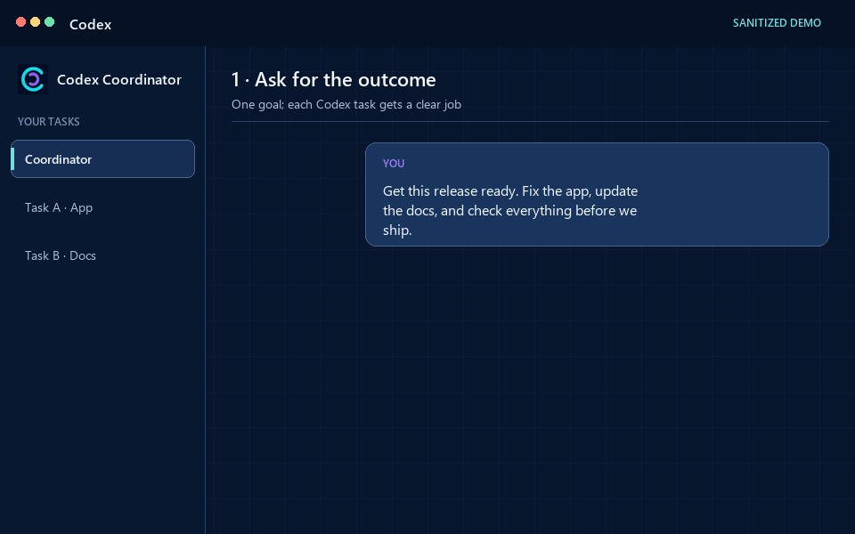
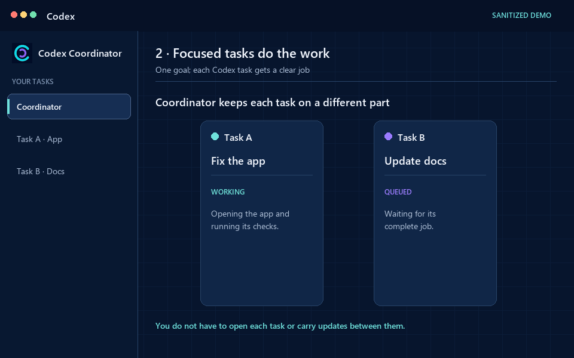
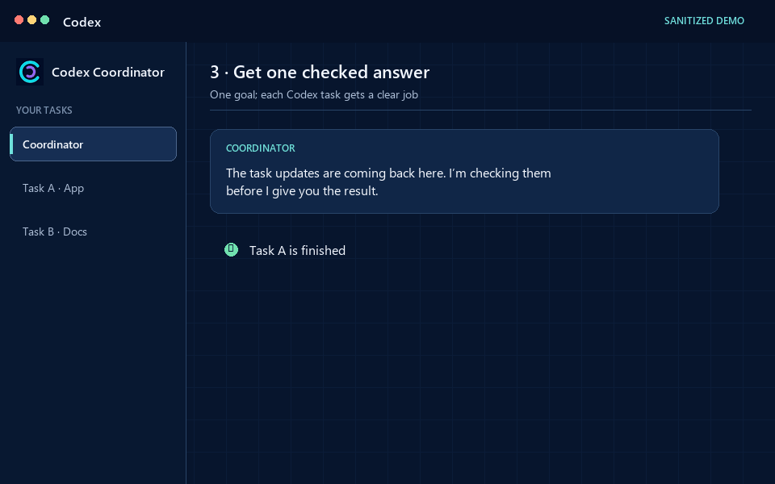

<h1 align="center">Codex Coordinator</h1>

<p align="center"><strong>Coordinate Codex tasks without losing track or duplicating work.</strong></p>

<p align="center">
  <a href="https://github.com/eyeinthesky6/codex-coordinator/actions/workflows/ci.yml"></a>
  <a href="https://github.com/eyeinthesky6/codex-coordinator/releases/tag/v0.5.0"></a>
  <a href="LICENSE"></a>
</p>

When one repository genuinely benefits from multiple Codex tasks, Codex Coordinator lets you reuse
related tasks, give each one a clear job, and see where work may cross.

You spend less time checking every window, repeating the same updates, and untangling duplicate
changes. Codex still does the work; Coordinator keeps the jobs clear.

**[Website](https://eyeinthesky6.github.io/codex-coordinator/)** · **[Quick start](#quick-start)** · **[FAQ](https://eyeinthesky6.github.io/codex-coordinator/faq.html)** · **[Ask a question](https://github.com/eyeinthesky6/codex-coordinator/discussions/categories/q-a)**

## What it lets you do

- Give one project goal to as many as five active Codex tasks by default, including the goal owner.
- Approve a specific temporary increase, or change the project's normal ceiling, when more complete work lanes will genuinely help.
- Reuse a related task that already knows the work instead of opening another window.
- Give every task one complete, clear job.
- Keep the task owning the goal pinned where you can find it; you decide when to unpin it.
- Get completed work and real blockers back to one goal owner without checking every task yourself.
- Catch crossed work before it becomes rework.
- Open optional Mission Control when you want one read-only view of active tasks and conflicts.
- Stop a goal before it runs when the task is attached to a different project than the assignment names.
- Check a broken or outdated installation with the included manual, read-only Doctor.

Codex still does the work. Git still keeps the history. You still decide what gets changed or published.

## How it works

1. **Tell it the result you want.** Start with one project goal, not separate instructions for every task.
2. **Keep the goal owner in reach.** The appointed Coordinator pins itself, reuses a useful related task first, and opens another only when the work truly benefits from it.
3. **Get the work back when it is ready.** Each assigned task returns once when it finishes, so the Coordinator can bring the result together without constant checks.

| Ask | Work | Review |
|---|---|---|
|  |  |  |

## Common situations

- **A change spans code, tests, and documentation.** Give each task one complete result instead of
  repeating the whole project brief in several windows.
- **Two tasks share one checkout.** Make planned paths visible and catch work that may cross before
  both tasks change the same thing.
- **A related task already knows the project.** Reuse it instead of opening another task and losing
  its useful context.
- **A job needs more than one turn.** Keep that task working toward one clear result until its checks
  are done, instead of stopping after a short instruction.
- **An installation looks broken or outdated.** Run Doctor for a read-only compatibility result,
  then update or reinstall when needed.
- **You want one quick overview.** Open Mission Control for the current project, refresh when you
  need the latest board, and stop it when you are done.

## When it helps

Use Codex Coordinator when one project genuinely benefits from multiple Codex tasks at the same time and you would otherwise spend time checking windows or untangling duplicate work. It starts with one task and allows up to five active tasks by default. If a sixth would materially help, it asks before opening more; you can approve a larger count for that goal or change the project ceiling.

Keep your workflow simpler when:

- one task can finish the job safely;
- you only need a quick answer or small edit;
- a short-lived helper can report directly back to the task you are already using;
- separate branches or worktrees already give you all the isolation you need.

## Quick start

Requirements: OpenAI Codex with plugin support, Git, and Python 3.10 or newer.

Add the current stable release and install it:

```powershell
codex plugin marketplace add eyeinthesky6/codex-coordinator --ref v0.5.0
codex plugin add codex-coordinator@codex-coordinator
```

Then open your project in Codex and ask:

```text
Use $codex-coordinator for this project goal:
<describe the outcome you want>
```

Installation does not turn Coordinator on for every project. You choose where to use it.

When an enabled project has several active tasks, ask Codex to **open Mission Control for this
project**. It starts one local read-only page for that project and refreshes only when you press the
button. Closing the terminal stops it.

You can also find it in the [ChatGPT Plugins directory](https://chatgpt.com/plugins/plugins_6a5c8cb6a5648191a43a76e6a1e637d8) and on [skills.sh](https://skills.sh/eyeinthesky6/codex-coordinator/codex-coordinator).

## What it does not add

- No permanent background manager or constant status checks. An unattended goal may use one temporary native Codex follow-up that removes itself when the goal reaches a decision boundary.
- No automatic pin cleanup. Coordinator pins only the appointed goal owner; workers stay unpinned, and you decide when to unpin the owner.
- No new task window for a quick command, lookup, review, or small edit.
- No progress-message or acknowledgement loops; assigned tasks return once at completion.
- No copied prompts, chats, reasoning, or tool output.
- No automatic extra project copies or branches.
- No forced review process.
- No permanent dashboard process, database, account, or cloud service. Optional Mission Control is
  a manually started local page with no task controls or automatic refresh.
- No permission to deploy, publish, change environments, or override your decisions.

The current package includes the manual read-only Doctor compatibility check and optional read-only
Mission Control. The old collector, monitoring loop, repair system, and control dashboard remain in
technical decision records and Git history rather than the active product surface.

## Privacy and control

Task conversations remain in Codex. Coordinator keeps only a small amount of local project information needed to show the active job and planned work for each task.

It does not upload source code, prompts, chats, reasoning, or tool output. The project has no product telemetry and no coordination server.

Read the full [privacy policy](PRIVACY.md), [security policy](SECURITY.md), and [technical design](https://eyeinthesky6.github.io/codex-coordinator/developers.html).

## For developers and maintainers

The user-facing story stays deliberately simple. Implementation details, lifecycle rules, validation, migration, and architecture history live here:

- [Developer guide](https://eyeinthesky6.github.io/codex-coordinator/developers.html)
- [Operating guide](docs/OPERATING_GUIDE.md)
- [Architecture](docs/codebase/ARCHITECTURE.md)
- [Testing](docs/codebase/TESTING.md)
- [Design history and simplification decision](docs/codebase/2026-07-21_boundary-board-simplification_architectural_review.md)
- [Shared-checkout correction](docs/codebase/2026-07-23_cooperative-shared-checkout_architectural_review.md)
- [Changelog](CHANGELOG.md)

Run the complete test suite from the repository root:

```powershell
python -m unittest discover -s tests -p "test_*.py" -v
```

## Community

- Ask usage questions in [Q&A](https://github.com/eyeinthesky6/codex-coordinator/discussions/categories/q-a).
- Share real workloads and early requests in [Ideas](https://github.com/eyeinthesky6/codex-coordinator/discussions/categories/ideas).
- Report reproducible bugs through [Issues](https://github.com/eyeinthesky6/codex-coordinator/issues).
- Read [CONTRIBUTING.md](CONTRIBUTING.md) before proposing code.
- Use [SECURITY.md](SECURITY.md) for private vulnerability reports.

Never post credentials, private task messages, personal paths, or live project state in a public issue or discussion.

## License

[MIT](LICENSE) © 2026 Six Ideas.

Codex Coordinator is an independent third-party project and is not affiliated with or endorsed by OpenAI.
