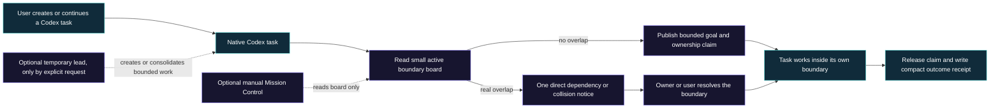

# Boundary-board simplification architectural review

- **Date:** 2026-07-21
- **Decision status:** Accepted product direction
- **Implementation status:** Schema-2 core and dry-run migration implemented and validated in source; legacy observer removed from the base package; release and real-project migration remain open
- **Operational status:** Coordinator is temporarily disabled in maintainer projects and global startup while realignment is underway
- **Superseded work:** PR #23 was closed without merge; its remote branch remains as the historical record

## Scope

This review records why Codex Coordinator should return to a task-boundary and visibility product instead of operating as an always-active orchestration system.

It covers:

- the observed workflow and performance symptoms;
- the original package shape and the current package shape;
- every capability-contract addition, why it was introduced, the benefit it sought, and its resulting cost;
- which protections must survive the simplification;
- a target architecture with no resident Coordinator task;
- failure modes that could appear if the simplification is implemented too aggressively;
- Doctor and Mission Control placement;
- a staged migration, validation, and rollback plan.

The first checkpoint recorded only the decision and repository opt-out. The current source checkpoint now implements the schema-2 boundary core, direct marker-only hook, read-only Doctor, lifecycle changes, tests, and public documentation. It does not update the globally installed plugin, migrate or re-enable user projects, alter native tasks, publish a release, or finish the separate Mission Control disposition.

## Decision

Codex Coordinator should become a repository-scoped **task boundary and visibility layer**.

The default product should have no resident Coordinator task, no persistent heartbeat, no all-task monitoring loop, and no requirement for one task to reconcile every other task. Native Codex tasks remain the execution and transcript authority. Coordinator records only the minimum active metadata needed to answer:

1. Which task owns this work?
2. What is that task's bounded goal?
3. Which files, resources, or exclusive actions has it claimed?
4. Is another task blocked on it?
5. Has the task completed, stopped, or released its claim?

A temporary lead role may exist only when the user explicitly requests decomposition, coordinated delivery, or a consolidated result. It is goal-scoped and ends with that goal. It is not a permanent repository task and does not turn repository enablement into continuous management.

Mission Control becomes a separately optional, manually started observer. Doctor becomes a small manual compatibility check whose failure action is to reinstall or update the plugin. Automatic installed-file repair, scheduled project scanning, semantic review, and Doctor findings leave the core.

### PR #23 closure

PR #23, `feat(doctor): pin installed core integrity`, was closed without merge on 2026-07-21. It added 4,072 lines and removed 205 lines across 23 files, mainly to harden Doctor self-repair, installed-runtime trust, rollback, and its Mission Control integration. Doctor grew from 681 to 1,931 lines and its focused test module from 727 to 2,342 lines.

The work solved real integrity problems, but it deepened the subsystem the accepted architecture removes from the core. Repeated review cycles exposed junction and symlink containment, check/use races, rollback accounting, cleanup truthfulness, caller compatibility, and runtime-authentication failures. The final head passed its automated checks and disabled automatic execution of an unauthenticated child runtime, but merging it would still commit the product to maintaining custom repair and runtime-trust machinery.

The remote branch is retained for history. Realignment should carry forward the lessons—bounded paths, truthful failure, no automatic optional runtime, and package-manager-owned reinstall—without cherry-picking the self-repair implementation.

## Symptoms that triggered the review

The problem was not the text repository or its test time. It was orchestration work around the repository.

The maintainer's slowdown investigation snapshot showed:

- 23 registered sessions while only one was working;
- 19 terminal sessions retained in the hot project state and three paused sessions;
- 28 task files and 45 inbox records;
- repeated writer/reviewer replacement across one pull-request correction chain;
- a persistent 15-minute repository heartbeat;
- hundreds of wait requests, mostly timeouts;
- large prompts repeatedly carrying Coordinator rules, project state, task histories, provider state, schedule state, and reconciliation ledgers;
- user-visible task-window clutter even after work became terminal;
- elapsed time dominated by polling, context replay, and repeated review cycles rather than source editing or tests.

The main observed failure was circular: more state and monitoring were added to prevent lost work, but processing that state became the largest source of latency and generated additional work windows that then required more state and monitoring.

## Storage attribution: the multi-gigabyte files

A live read-only storage audit separated native Codex data from Coordinator project state:

| Owner/path | Current size | Shape | Conclusion |
|---|---:|---|---|
| `%USERPROFILE%/.codex/archived_sessions/` | 5.951 GiB | 556 `.jsonl` files | Native Codex archived session history |
| `%USERPROFILE%/.codex/sessions/` | 2.203 GiB | 128 `.jsonl` files | Native Codex active/recent session history |
| `%USERPROFILE%/.codex/logs_2.sqlite` | 0.166 GiB plus a small WAL | SQLite `logs` table | Native Codex application log database |
| `%USERPROFILE%/.codex/state_5.sqlite` | 0.012 GiB plus a small WAL | Thread, spawn-edge, job, and tool tables | Native Codex application state database |
| This repository's `.codex/coordination/` | 0.396 MiB | 79 legacy marker/task/inbox files | Coordinator project metadata, not the multi-gigabyte owner |

The earlier “roughly 3 GB and 5 GB” observation was the native `sessions` and `archived_sessions` stores at that earlier point. They have continued to change with Codex use; the current snapshot is about 2.2 GiB and 6.0 GiB.

A schema-only sample of native session JSONL showed `session_meta`, `event_msg`, `response_item`, compacted state, world state, turn context, and inter-agent metadata. Event types included user and agent messages, `agent_reasoning`/`reasoning`, token counts, patch events, custom and function tool calls, and tool outputs. Response records also expose an `encrypted_content` field. This confirms the native session store is substantially more than a task-title log; it can contain transcript/event and tool records. The audit inspected record types and keys, not private content values.

Coordinator did not create Codex's SQLite databases. The legacy Mission Control collector and Doctor scanner imported `sqlite3` only to open existing Codex databases in `mode=ro`. That coupling was still brittle and unnecessary, so schema 2 removes it from every supported core path.

No native Codex session, archive, SQLite, or log file was deleted in this realignment. Those files own task history and application state outside Coordinator's authority. A retention or cleanup operation must be a separate, exact, user-reviewed Codex-data action; project deactivation and schema migration must never silently delete them.

## What led to the decision

The initial product addressed a real problem: independent Codex tasks need a small common place to declare ownership and avoid planned overlap. Later defects were also real:

- workers were created with empty holding prompts;
- tasks were reused for unrelated goals;
- task identities and routing were sometimes ambiguous;
- acknowledgement and status messages created noise;
- filtered discovery could miss active owners;
- archived owners could leave stale claims;
- too many small worker tasks could be created;
- external writes and provider actions needed explicit user authority;
- interrupted goals could be left without a return path;
- installed global guidance could drift from the source package.

Each correction was locally reasonable. The architectural error was making most corrections part of every task's hot path and turning enablement into permanent repository supervision.

The decision is therefore not “remove safety.” It is:

> Preserve the invariant; replace or remove the always-on mechanism.

Examples:

| Required invariant | Current mechanism | Simplified mechanism |
|---|---|---|
| No two planned owners for the same scope | One Coordinator owns all assignments and canonical reconciliation | Each task publishes its own bounded active claim; another task checks the board before writing |
| No task explosion | Coordinator classifies, creates, inventories, and archives workers | Default one task; additional durable tasks require explicit user decomposition or independently useful parallel work |
| No message explosion | Coordinator mediates messages and processes inbox ledgers | Direct, sparse, non-executable dependency/collision notices; no acknowledgement or status chatter |
| No lost goal work | Per-turn full ledger plus heartbeat return path | Each task owns its own outcome; a temporary lead consolidates only when explicitly requested |
| No stale installed behavior | Capability contract plus Doctor atomic self-repair | Small compatibility/version check; on failure, report “plugin is broken or outdated—reinstall/update it” |
| No private transcript duplication | Host cursor and no-mirror rules | Native Codex remains the only transcript owner; the board never reads or stores transcript bodies |
| No silent external writes | Coordinator consent and provider reconciliation | Every task retains advance disclosure and exact user authority for external writes |

## Evidence checked

- Repository status and recent Git history through `926a921`.
- Initial release commit `099e7da`.
- Tagged capability baselines `v0.2.0`, `v0.2.1`, and `v0.3.0`.
- Current `capabilities.json` contract version 19.
- Current and historical skill guidance files.
- `CHANGELOG.md`, `README.md`, `docs/OPERATING_GUIDE.md`, and current codebase architecture documents.
- SessionStart Mission Control dispatch.
- State-helper validation, create-if-absent, atomic replacement, and inbox checkpoint behavior.
- Doctor capability validation and installed-package repair path.
- Mission Control and Doctor native-state and rollout coupling.
- Package-contract, state-helper, SessionStart, handover-property, Mission Control, Doctor, and uninstall test inventories.
- Current project-local task, inbox, and registered-session counts.

## Tool baseline

The review used existing repository and Git evidence only:

- `git status`, `git log`, `git show`, `git ls-tree`, and commit-local capability comparisons;
- `rg` for runtime, contract, and test routing;
- the existing state-helper validator for coordination records;
- existing test names and assertions as the protection inventory.

No new scanner, dependency, service, database, agent task, or external workspace was created.

## Original guidance files versus current guidance

### Initial release: `099e7da`

The initial operational skill package contained six files: five Markdown guidance files plus agent display metadata.

| File | Original responsibility | Decision |
|---|---|---|
| `SKILL.md` | Enablement, identity, routing invariants, compact state shape, and minimal loop | Retain, but reduce it to boundary-board invariants and lazy activation |
| `agents/openai.yaml` | Agent-facing display metadata and starter prompt | Retain; remove prompts that imply permanent management |
| `references/installation.md` | Enable/disable and first-run setup | Retain; no Python auto-install or observer auto-start in the core |
| `references/maintenance.md` | Protected-file and upgrade boundaries | Retain; use normal reinstall/update rather than self-repair |
| `references/operations.md` | One combined guide for task ownership, messaging, execution, and completion | Retain as a short router or merge back into a smaller boundary guide |
| `references/recovery.md` | Restart, archived owner, and interrupted-transition handling | Retain, but scope recovery to stale claims and task ownership rather than Coordinator election |

The package contained 6 operational files, 68,551 bytes, and 694 lines. The Markdown guidance itself was 5 files and about 690 lines.

The original top-level contract explicitly said:

- do not build another runtime, scheduler, task service, database, dashboard, or lock manager;
- do not coordinate small, isolated, or read-only work where ownership does not overlap;
- keep each task bounded;
- allow disjoint same-checkout work;
- keep messages at safe boundaries;
- use native tasks and repository documents.

Those principles remain the right product center.

### Current source: `926a921`

The current operational skill package contains twelve files: nine Markdown guidance files, agent metadata, a capability contract, and a state helper.

| File | Why it was added or expanded | Benefit | Cost/effect | Target disposition |
|---|---|---|---|---|
| `SKILL.md` | Centralize all invariants and make installed sessions reload current behavior | Clear global contract and safer authority checks | Every coordinated turn begins with a large cross-cutting rule set | Retain and shrink substantially |
| `agents/openai.yaml` | Product-facing metadata and prompts | Better discovery and onboarding | Prompts can imply orchestration as the default product | Retain with boundary-board wording |
| `capabilities.json` | Detect behaviorally stale installations, not only missing files | Machine-checkable promises and release tests | Grew into a 41-key mirror of implementation policy and fed Doctor complexity | Retain a small user-visible protocol manifest; do not use it for self-repair |
| `scripts/coordination_state.py` | Deterministic parsing, safe record creation, and inbox checkpointing | Valuable validation and atomic create-if-absent behavior | Also supports the central ledger and reconciliation machinery | Retain a smaller task-claim/state validator |
| `references/doctor.md` | Installation repair and project-drift diagnosis | Clear diagnostic boundaries and zero-model checks | Doctor became a product subsystem with repair, scanning, findings, and semantic review | Remove from core; replace with a short manual troubleshooting guide |
| `references/execution.md` | Split the 247-line operations monolith | Tasks can load only execution rules | Large durable-task and Coordinator allocation policy still enters many turns | Retain a smaller boundary lifecycle guide |
| `references/installation.md` | Add Python bootstrap, Mission Control lifecycle, deactivation, and validation | Easier first run and reversible setup | SessionStart now starts extra runtime and may bootstrap Python | Retain setup only; move optional tools to separate installation |
| `references/maintenance.md` | Add safe uninstall, purge, schema migration, and protected targets | Strong preservation and rollback boundaries | Larger surface, partly driven by always-on runtime and Doctor | Retain manual update/uninstall protections |
| `references/messaging.md` | Separate routing and delivery safety | Exact routing and fewer visible messages | Central mediation prevents simple peer dependency notices and needs Coordinator availability | Retain sparse direct-message safety, remove permanent mediator |
| `references/operations.md` | Become a short action router after the guide split | Reduced unnecessary lane loading | Multiple lanes are often selected together; total guidance still grew | Retain only if the simplified package still needs more than one lane |
| `references/reconciliation.md` | Prevent lost work, preserve goal coverage, monitor providers/schedules, and guarantee continuation | Strong completeness and consent rules | Became the largest hot-path source of ledgers, polling, heartbeat checks, and context replay | Replace with lifecycle-boundary updates; move provider/schedule policy out of core |
| `references/recovery.md` | Handle missing state, takeover, archived sessions, and interrupted transitions | Safer recovery from real native task failures | Coupled recovery to a permanent Coordinator identity and epoch | Retain only task/claim recovery and incompatible-version failure behavior |

The current package contains 12 operational files, 202,583 bytes, and 1,987 lines. The Markdown guidance is 9 files and 1,169 lines. The line-count increase understates the runtime effect: the largest slowdown came from new mandatory behavior, not simply reading more text.

### Why the guide split was not itself a mistake

At `v0.2.1`, the original `operations.md` was split into `execution.md`, `reconciliation.md`, and `messaging.md`, leaving a short operations index. This was a sound response to a monolithic 247-line guide. It allowed action-specific loading and made ownership clearer.

The regression occurred because later behavior increasingly selected the reconciliation lane for ordinary turns, while the top-level skill also accumulated mandatory all-project rules. The target should keep modular guidance only where modules are independently optional. It should not preserve separate lanes merely because they already exist.

## Capability-contract evolution

The initial release had no `capabilities.json`.

- `v0.2.0` introduced contract version 3 with 8 capability keys.
- `v0.2.1` expanded it to contract version 9 with 18 keys.
- `93d65af` expanded it to 20 keys.
- `a3c4f92` expanded it to 22 keys.
- `9708d26` expanded it to 37 keys and changed monitoring from goal-scoped to persistent.
- `926a921` expanded it to contract version 19 with 41 keys.

### `v0.2.0`: first 8 capabilities

| Capability | Reason and benefit | Effect/cost | Target |
|---|---|---|---|
| `workerCreation` | Replace empty holding turns and second assignment messages with the real job in the first prompt | Less chatter and faster useful work | Retain when the user explicitly creates/decomposes work |
| `coordinatorRole` | Keep a lead control-first rather than having it also edit ordinary product files | Clear ownership separation | Demote to an optional temporary lead role |
| `monitoring` | Keep an unfinished delegated goal from being forgotten after the lead's turn ends | A temporary heartbeat appeared useful for unattended goals | Remove from the default product; allow only explicit native monitoring outside the boundary board |
| `modelDefault` | Respect the user's configured model | Avoids hard-coded model drift | Keep as host behavior, not a core coordination capability |
| `reasoningDefault` | Avoid silently inheriting expensive reasoning settings | Cost control | Keep as general task-generation guidance only if task creation remains |
| `stateTool` | Validate state and create records deterministically | Real safety and testability | Retain in simplified form |
| `subagents` | Allow short parent-owned helpers without visible project tasks | Reduces task-window growth | Retain |
| `taskLifecycle` | Pin/rename/archive/fork/handoff rules for native tasks | Better lifecycle hygiene | Keep archive, same-goal fork, and explicit handoff; remove permanent pinning and make renaming optional |

### `v0.2.1`: 10 additional capabilities

| Capability | Reason and benefit | Effect/cost | Target |
|---|---|---|---|
| `archivedRecovery` | Let an original user request recover an unusable owner without a ritual second approval | Prevented stale ownership deadlocks | Retain as on-demand stale-claim recovery |
| `continuationGuarantee` | Require evidence that unfinished work would be revisited | Prevented false “I will monitor” promises | Remove the guarantee and heartbeat; a temporary lead must state honestly when it will not continue automatically |
| `coordinationReadCache` | Avoid repeatedly rereading immutable inbox records | Reduced some repeated file reads | Remove with the central inbox reconciliation loop |
| `doctorDiagnostics` | Produce deterministic JSON and optional Mermaid evidence for installation drift | Better troubleshooting | Replace with a small check and reinstall/update instruction |
| `microtaskExecution` | Keep tests, lookups, and low-risk small fixes in the current task or a parent-owned subagent | Prevented visible task explosion | Retain |
| `nativeTaskReads` | Use host cursors and never mirror native task history | Prevented transcript duplication | Retain as a hard privacy/performance boundary |
| `operationsGuidance` | Split the operations monolith by action | Reduced unnecessary context when lanes stayed independent | Retain only if the simplified guidance still benefits from a split |
| `parallelWorkerTarget` | Target one to three workers and cap normal runs at five | Put an upper bound on task growth | Strengthen: default one active task; normally no more than three, with direct user override required above that |
| `registrationDelivery` | Move registration and acceptance out of visible messages | Reduced handshake chatter | Retain; no acknowledgement or “you may continue” messages |
| `workerGranularity` | Require durable, independently useful work before creating a task | Prevented one-thread-per-command behavior | Retain |

### `93d65af`: handoff and scope protections

| Capability | Reason and benefit | Effect/cost | Target |
|---|---|---|---|
| `externalWriteDisclosure` | Make filesystem capability distinct from user authority | Prevents hidden writes outside the scoped repository | Retain unchanged as a general safety invariant |
| `subagentDispatch` | Use a few parent-owned helpers only when independent lanes materially shorten work | Avoids unnecessary agent fan-out | Retain as guidance, not a board-state field |

### `a3c4f92`: Doctor expansion

| Capability | Reason and benefit | Effect/cost | Target |
|---|---|---|---|
| `doctorProjectScan` | Detect stale or inconsistent coordination state without a model | Deterministic, bounded diagnosis | Remove from the core; on-demand board status may report malformed or stale records without scanning every project |
| `doctorSemanticReview` | Detect tasks too small for durable threads and title/goal mismatch | Tried to catch task-fan-out quality problems | Remove; creation limits and simple human-visible board data are more direct and do not need a model review subsystem |

### `9708d26`: runtime and active-by-default expansion

This was the main architectural pivot. It bundled Mission Control and Python bootstrap, replaced opt-in-per-goal behavior with active-by-default repository management, retained a pinned Coordinator and heartbeat at idle, and made historical reconciliation part of the product.

| Capability | Reason and benefit | Effect/cost | Target |
|---|---|---|---|
| `delegationDecision` | Record reuse, retain, delegate, or create before spawning work | Directly addresses duplicate tasks | Retain and make it the primary creation guard |
| `globalUninstall` | Avoid unsafe drive scans and preserve project history during removal | Valuable maintenance safety | Retain as a manual maintenance utility |
| `historicalTaskReconciliation` | Avoid treating every old task as unfinished backlog | Better historical interpretation | Remove from the hot path; archives are cold and consulted only on explicit request |
| `idleBehavior` | Keep one lead available between goals | Faster theoretical restart | Remove; it creates a permanent task and continued monitoring obligation |
| `lifecycleCleanup` | Make deactivation and purge dry-run-first and history-preserving | Valuable reversibility | Retain for manual disable/uninstall flows |
| `missionControlLifecycle` | Auto-start a local dashboard and allow chat control | Immediate visibility | Move to a separate optional install, disabled and manually started by default |
| `pauseBehavior` | Allow observation without control actions | Safer pause semantics | Remove repository management mode; preserve direct per-task pause/stop behavior |
| `pythonRuntimeBootstrap` | Make bundled tools work on machines without a suitable Python | Easier setup | Remove from the base SessionStart path; optional tools report their prerequisite instead of installing it |
| `repositoryLifecycle` | Treat an enabled repository as continuously managed | Removed repeated enablement prompts | Replace with “available when needed”; no work starts without an explicit task or proven overlap check |
| `taskCoverage` | Put every same-repository task under one ownership view | Complete visibility | Replace with active explicit claims only; unclaimed isolated tasks stay ordinary native tasks |
| `taskExclusions` | Let only the user exempt a task from all-task management | Prevented agents from hiding work | With no all-task default, retain only an explicit user opt-out from boundary participation when needed |
| `taskTitlePolicy` | Improve generic generated task titles | Better sidebar readability | Optional UI convenience, not a core capability |
| `userStateReporting` | Always show mode and exclusions | Improved transparency | Replace with on-demand board status; do not add boilerplate to every task reply |
| `waitingClassification` | Require canonical dependency evidence before calling a task waiting | Prevented false “blocked” status from native idle alone | Retain: time or idle alone never releases or blocks ownership |
| `worktreeSelection` | Let the lead choose isolation when useful | Could shorten parallel critical paths | Return placement to the user/host or an explicitly assigned task; the board records, but does not choose, worktrees |
| `monitoring` change | Persist heartbeat while the repository remained enabled, even at workload idle | Guaranteed a resident return path | Remove completely from default enablement |

### `926a921`: delivery, provider, consent, and schedules

| Capability | Reason and benefit | Effect/cost | Target |
|---|---|---|---|
| `deliverySummary` | Stop a lead from reporting only worker status while forgetting the requested outcome | Better end-to-end goal reporting | Keep only in explicit temporary-lead mode or when the user asks for a consolidated result |
| `providerMonitoring` | Include PR/check/review/merge state in delivery decisions | Prevented local-green from being mistaken for delivered | Remove from boundary-board core; a Git/release task checks its own provider state |
| `providerMutationConsent` | Require exact current authority immediately before provider writes | Critical protection against stale approval | Retain as a general external-action invariant, not as always-on monitoring |
| `scheduledTaskReconciliation` | Prevent stale schedules or unrelated automations from being silently changed | Valuable schedule safety | Remove from core; a schedule/automation task checks exact project binding and asks for material changes |

## Net benefit and net effect

The additions produced real benefits:

- exact project and thread identity;
- one goal per task;
- safer external-write and provider authority;
- reuse-first task creation;
- bounded normal concurrency;
- fewer acknowledgement messages;
- stable-target review guidance;
- parent-owned subagents for microtasks;
- safer archive, handoff, uninstall, and migration behavior;
- no transcript mirroring;
- fail-closed malformed state handling.

They also changed the product promise and cost:

- an enabled repository acquired a permanent lead task;
- every same-repository task became managed by default;
- every material worker turn generated a durable reconciliation record;
- unfinished or paused work required a heartbeat return path;
- terminal and historical work remained in the lead's reasoning surface;
- provider, schedule, delivery, and retained-decision checks entered ordinary closure;
- Mission Control and Python bootstrap entered SessionStart;
- Doctor became an installer, repair engine, project scanner, finding generator, and optional semantic reviewer;
- the capability contract became a detailed implementation mirror that Doctor had to enforce and repair.

The safety benefit reached diminishing returns while the coordination cost became dominant.

## Target architecture

### Core product boundary

### State ownership

The physical schema should be finalized during implementation, but it must satisfy these constraints:

- `project.yaml` remains the stable repository identity and opt-in marker.
- Each active task owns one small record; no lead task is the sole writer for every task.
- Active records contain only: schema version, project ID, native thread ID, short goal, status, owned relative paths or exclusive resources, dependencies, and updated time/event cursor.
- Active records have a strict size bound and never contain transcript, reasoning, prompts, tool output, provider payloads, test logs, or whole diffs.
- Terminal work leaves the active board immediately and produces one compact cold receipt: outcome, artifact or commit references, blocker/decision if any, and completion time.
- Cold receipts are not loaded during ordinary work.
- Cross-task notices are append-only, recipient-specific, bounded, and used only for a real dependency, collision, stop, or user decision.
- The board is metadata and coordination evidence, not a filesystem lock, security sandbox, scheduler, or authority to mutate another task.

A likely implementation can reuse `project.yaml`, task records, the inbox concept, and the state helper while removing `CURRENT.md` as a manually reconciled single-writer authority. A per-owner active-record directory is safer than letting multiple tasks rewrite one board file. This shape requires a deliberate schema decision and migration; it must not be improvised during a behavior-only edit.

### Activation

- Global installation is inert.
- A repository marker means boundary-board support is available.
- A normal isolated task performs at most one bounded overlap check before substantial writes.
- If no relevant active claim exists, it proceeds normally and does not create a lead task.
- If overlap exists, the second task stops only the overlapping action and emits one bounded notice.
- A temporary lead exists only after an explicit user request to split, coordinate, or consolidate a goal.
- No background monitoring starts merely because a repository is enabled.

### Task creation limits

- Default: one active task.
- Create another durable task only for independently useful work that can proceed with a distinct boundary.
- Reuse one thread for investigation, implementation, tests, documentation, and follow-up inside the same coherent goal.
- Keep microtasks in the current owner or parent-owned subagents.
- Normal maximum: three active durable tasks.
- More than three requires a direct user decision with named independent lanes and a reason the added parallelism is worth the context and UI cost.
- No feature, Doctor finding, heartbeat, or historical record may create a task.

### Message limits

- No registration, acceptance, availability, status, “still working,” “done,” “thanks,” or permission-to-continue messages.
- No broadcast.
- At most one unresolved notice for the same dependency or collision.
- A peer notice cannot command another task or grant authority. It only reports the boundary and requests a decision.
- Exact project, sender task, recipient task, and message identity remain required.
- A later direct user instruction in the addressed task remains the only agent-independent override.

### What the product no longer promises

- Continuous project orchestration.
- Automatic completion of a multi-task shared goal.
- A permanent lead or consolidated final report for ordinary tasks.
- Provider, pull-request, release, or schedule monitoring unless the current task explicitly owns that outcome.
- Cross-machine synchronization.
- Enforcement against a task that ignores the board.
- Filesystem locking or prevention of all race conditions.
- Installation self-healing.

Reducing the promise is part of making the product honest and fast.

## Protections that must remain

The simplification must not remove these protections:

1. **One coherent goal per durable task.** A task is not silently repurposed by another task or by stale history.
2. **Reuse before create.** Same-area investigation, edits, tests, docs, and follow-up remain with one owner.
3. **Default-one concurrency.** One to three active durable tasks is a ceiling strategy, not a target to fill.
4. **Exact repository and native task identity.** Similar titles, recency, or folder names never route ownership or messages.
5. **Bounded ownership.** Relative paths, shared files, Git integration, runtime, deployment, environment, database, and external actions remain explicit when relevant.
6. **One integration owner.** Parallel writers do not independently stage, commit, rebase, merge, or rewrite shared Git state.
7. **Sparse communication.** Messages exist for a real dependency, collision, stop, or decision—not activity reporting.
8. **User authority.** A task or peer message cannot claim a user approved a new goal, destructive action, provider write, schedule change, or external write.
9. **External-write disclosure.** The exact external target and reason are disclosed before the first write; filesystem access is not permission.
10. **Immediate user stop.** `PAUSE`, `STOP`, and `CANCEL` apply directly to the addressed task without waiting for a lead.
11. **Native Codex authority.** Native task status and history remain authoritative; Coordinator never mirrors transcripts.
12. **Evidence before stale-owner transfer.** Time, idle, or a failed lookup alone never releases another task's claim.
13. **Stable review target.** Independent review uses one stable commit or immutable diff and reuses one coherent reviewer when correction remains in the same review goal.
14. **Fail-safe incompatible versions.** Unsupported board or marker schemas produce a clear compatibility message; they do not invent empty state or rewrite files.
15. **Dry-run destructive maintenance.** Deactivation, purge, uninstall, and schema migration preserve unrelated files and history unless the user explicitly approves deletion.
16. **Privacy and bounded records.** No credentials, private messages, transcripts, reasoning, full tool output, or unrelated local paths enter the board or public reports.

## Deeper failure-mode review

### High-risk failures if simplification is implemented badly

| Failure mode | What could blow up | Required mitigation | Residual limit |
|---|---|---|---|
| Two tasks claim overlapping paths at nearly the same time | Both proceed after reading an empty board | Use owner-specific active records plus an atomic claim/check operation for exact exclusive resources; recheck before shared-file or Git integration writes | The board remains coordination metadata, not a security lock; local race prevention must not be overclaimed |
| Path aliases hide overlap | `repo/A`, case variants, relative traversal, junctions, or symlinks appear distinct | Normalize repository-relative paths, compare ancestors/descendants, reject paths outside the Git common root, and treat reparse/symlink uncertainty as an unresolved claim | Strong filesystem containment belongs to the sandbox/Git layer, not this board |
| A task crashes without releasing ownership | A stale claim blocks later work indefinitely | On actual overlap, check the exact native task status once; transfer only when terminal/archived/unusable is proven, otherwise ask the user | Never release solely because time passed |
| Peer message spoofing | One task commands another or claims user authority | Peer messages are non-executable; validate exact project/sender/recipient; only direct user input or the recipient's own scope authorizes action | The system cannot authenticate beyond the host's native task identity |
| Board record corruption or incompatible schema | A malformed record is treated as no owner | Validate bounded records; unknown schema blocks only overlapping action and reports reinstall/update or migration need | Do not freeze unrelated disjoint work |
| One task claims the whole repository | Other useful work starves | Require narrow claims, show broad claims visibly, and let the user narrow or override them | Some genuinely broad refactors must serialize work |
| No lead means a multi-task goal lacks a final synthesis | Workers finish individually but nobody produces the combined answer | Promise consolidation only when the user explicitly creates a temporary lead goal; otherwise each task reports its own outcome | The boundary board is deliberately not a scheduler or delivery manager |
| Direct commits from several tasks collide | Index/branch/history changes conflict despite disjoint source paths | Keep one explicit Git integration owner whenever more than one writer exists | Direct commits remain the default for one owner; PR is optional policy |
| Optional observer reaches into private Codex storage | Host updates break the dashboard or expose excessive history | Mission Control reads only the supported board contract; no `state_*.sqlite`, rollout-tail, transcript, or diagnostic-log coupling in the target | Native task details beyond the board may be unavailable, which is acceptable |
| Installed package and source diverge | Old behavior continues silently | Small version/contract check reports the installed and required versions and tells the user to reinstall/update | No automatic repair; the user must deliberately run the normal package-manager action |

### Medium-risk operational failures

| Failure mode | Mitigation |
|---|---|
| Active-board growth | Hard cap active durable tasks; terminal records move immediately to cold receipts; bounded record size |
| Archive growth | Archives are never hot input; provide explicit user-authorized retention or purge tools rather than automatic transcript-like accumulation |
| Message accumulation | One unresolved notice per dependency/collision, compact resolution receipt, no acknowledgement chain |
| Lost dependency after restart | Dependency remains in the two affected task records or one recipient-specific notice; no full-turn ledger is required |
| Task resumes with old instructions after plugin update | Record protocol version; on mismatch, reload or reinstall before changing claims; disjoint read-only work can continue |
| SessionStart becomes slow | Read only marker and bounded active records; do not launch processes, scan archives, query private databases, or walk all task history |
| Optional tools become required accidentally | Base package tests must pass with Mission Control and Doctor extras absent |
| Review loops create new windows | One stable reviewer per coherent target; correction reuses that reviewer unless unusable or the review goal materially changes |
| A user thinks the board enforces filesystem isolation | Documentation and UI must call it advisory ownership metadata, not a lock or sandbox |
| Cross-machine work appears coordinated | Explicitly state that board state is local to one repository checkout/machine unless a future supported synchronization layer is separately designed |

### Risks of retaining too much

The most likely future regression is not missing a feature; it is reintroducing orchestration under another name.

Reject future core changes that:

- require a resident lead task;
- scan all native tasks on every turn;
- add a heartbeat for visibility;
- add provider, schedule, release, or deployment checks to ordinary task completion;
- copy task history, reasoning, or tool results into project state;
- create a new task from a warning or diagnostic;
- make an optional UI or maintenance tool part of SessionStart;
- add a second authoritative state store;
- promise automatic completion without a supported native event/continuation mechanism;
- turn every useful safety rule into a capability key and installed self-repair requirement.

## Doctor decision

Doctor's original motivation was valid: the globally installed skill and hook could drift from the source package while still looking structurally present. The automatic-repair implementation then had to solve trusted-source identity, installed target containment, symlink/junction handling, race-safe access, atomic multi-file replacement, rollback accounting, caller compatibility, capability-marker validation, project scanning, findings, and optional semantic review.

Current Doctor runtime and scanner code is about 1,835 lines, with about 1,116 lines of focused tests. This is disproportionate to the core user outcome.

Target behavior:

1. Read the installed plugin version and minimum required protocol/schema version.
2. Check that the small set of required packaged files can be loaded.
3. If valid, report `healthy` with versions.
4. If missing, stale, malformed, or contradictory, report: `Codex Coordinator is broken or outdated. Reinstall or update the plugin from the configured marketplace/source.`
5. Do not copy, replace, repair, roll back, scan projects, create findings, invoke a model, or schedule itself.

Normal package-manager reinstall/update becomes the repair owner. Existing Doctor security lessons should remain in this decision history and tests for any retained destructive maintenance tool, but they should not keep a self-repair engine alive without proven user value.

## Mission Control decision

Mission Control's motivation was also valid: users wanted one view of current tasks, overlap, and blockers without opening every task window. The implementation, however, became bundled, auto-started from SessionStart, dependent on Python bootstrap, and coupled to private Codex state/rollout shapes.

At the pre-removal checkpoint, the bundled Mission Control runtime was about 7,413 lines across 21 files, with about 1,359 lines in its two main test modules. It was larger than the task-boundary core and created an additional lifecycle to install, start, stop, update, diagnose, and secure.

The user approved removal from the schema-2 base package after verifying that the original implementation remains in the `v0.3.0` tag, later `main` history, and the preserved PR #23 remote branch. Current source therefore contains no Mission Control runtime, duplicate app wrapper, lifecycle launcher, or browser smoke test. Historical rationale stays in this record and Git rather than in 7,800 inert shipped lines.

Target behavior:

- separate optional installation;
- disabled by default;
- explicit manual start and stop;
- reads only the supported boundary-board records;
- no private SQLite or rollout inspection;
- no SessionStart launch;
- no Doctor repair or semantic review;
- no authority to create, wake, stop, archive, or command tasks.

The native Codex UI plus the compact board/status command is the current visibility product. A future observer must start as a new separate package and depends on real usage evidence, not sunk implementation cost.

## External architecture pattern check

The target borrows patterns rather than importing another agent runtime:

- [Claude Code agent teams](https://code.claude.com/docs/en/agent-teams) separates a shared task list from each teammate's context and warns that cost scales with active teammates. The shared-list pattern fits; always-on team creation does not.
- [OpenAI Agents SDK orchestration](https://openai.github.io/openai-agents-python/multi_agent/) distinguishes a manager calling bounded specialists from handoffs. That supports an optional temporary lead, not a permanent repository manager.
- [LangGraph subgraph persistence](https://docs.langchain.com/oss/python/langgraph/use-subgraphs) recommends per-invocation or stateless subagents for independent work and reserves persistent state for real multi-turn need. That supports cold receipts and private task context.
- [AutoGen](https://microsoft.github.io/autogen/stable/index.html) is an event-driven framework with an optional distributed agent runtime for multi-process agent communication and lifecycle management. That is more machinery than this product requires.

No framework dependency is recommended. Native Codex already supplies tasks, messages, and execution.

## Migration plan

Implementation remains separated from installed-runtime mutation, release, and user-project cleanup. Status below reflects the validated source checkpoint.

### Phase 1: contract and behavior simplification

**Source status: implemented.**

- Change enablement from active-by-default management to boundary-board availability.
- Remove permanent Coordinator creation, pinning, idle retention, and heartbeat requirements.
- Remove all-task coverage and per-turn reconciliation requirements.
- Keep one-goal, reuse-first, task limits, exact identity, sparse messages, external-write disclosure, user stop, and native-history boundaries.
- Make provider, schedule, release, review, and consolidated-delivery behavior task- or goal-specific.
- Replace Doctor repair behavior with compatibility check plus reinstall/update message.
- Stop Mission Control auto-start and make its absence a supported base configuration.

This phase should prefer behavior-only changes where possible and leave existing project records readable.

### Phase 2: active-board schema

**Source status: implemented.** Schema 2 uses one strict task-owned JSON file per active writer and one compact cold receipt per release. Schema-1 records remain preserved and ignored.

- Define a versioned per-owner active record and compact terminal receipt.
- Decide whether `CURRENT.md` becomes a generated view or is removed in a schema migration.
- Add bounded overlap detection and task-owned record updates.
- Define stale-claim resolution using exact native evidence.
- Define a small, recipient-specific peer-notice format.
- Prove that multiple tasks cannot overwrite one another's records.

Do not ship a partial schema that creates two authorities.

### Phase 3: optional tools separation

**Source status: implemented.** SessionStart and the core contract do not import, start, validate, or advertise Mission Control. Doctor scanning, findings, semantic review, and self-repair left the core. The legacy Mission Control runtime, duplicate source wrapper, lifecycle launcher, and browser smoke test were removed from current source and remain available in tagged/history revisions.

- Package Mission Control separately only if retained.
- Remove it and Python bootstrap from SessionStart.
- Remove Doctor project scan, semantic review, findings, and self-repair.
- Keep a small manual compatibility command in the base package only if it is simpler than relying solely on the plugin manager.

### Phase 4: migration and cleanup

**Source status: dry-run-first migration implemented; no user project migrated.** The maintainer repositories remain disabled and preserved. The lifecycle helper inventories bounded schema-1 project state, requires deactivation plus exact project and stopped-runtime confirmations, saves the exact old marker, creates an empty schema-2 board, and keeps the new marker disabled. It creates no claim from legacy history and does not inspect native Codex or external observer state.

- Provide a dry run showing existing markers, active claims, terminal task records, heartbeat, and optional-tool state.
- Stop/remove only Coordinator-owned heartbeat and auto-start behavior.
- Preserve terminal history until the user chooses retention or purge.
- Never delete native Codex tasks or rollouts as part of the product migration.
- Do not alter unrelated automations, global configuration, environment, Git state, or user-created processes.

## Rollback

- Keep the current stable tagged release available during the simplification trial.
- Make schema migration reversible or leave old records preserved and ignored.
- Do not reuse old state as authority after rollback unless its version matches exactly.
- A rollback restores the previous plugin version through the package manager; it does not hand-edit installed files.
- Optional Mission Control state remains separate and may be left stopped.
- No rollback may recreate deleted task transcripts or project history, so migration must preserve them by default.

## Verification plan

The implementation is not complete until tests prove both reduced overhead and retained protection.

### Core behavior tests

- Isolated task with no active claim creates no Coordinator, heartbeat, message, or extra task.
- Two tasks with disjoint paths proceed without contacting one another.
- Two tasks with overlapping paths produce one bounded collision notice and no duplicate writer.
- One coherent goal reuses one task for investigation, edits, tests, documentation, and follow-up.
- Microtasks remain inside the owner or parent-owned subagents.
- Normal task count stays at one and never exceeds three without direct user authority.
- No registration, acceptance, availability, status, or completion acknowledgement messages are emitted.
- Direct user stop applies immediately.
- External writes still require exact advance notice and authority.
- Peer messages cannot command another task or relay user authority.
- Native transcript or rollout content is never copied or parsed.

### Recovery tests

- Crashed owner claim remains until exact native terminal/unusable evidence exists.
- Time, idle, timeout, or filtered discovery miss never releases ownership.
- Unsupported schema blocks only conflicting writes and provides a reinstall/update or migration path.
- Terminal work exits the hot board and leaves one bounded receipt.
- Cold archives are not loaded during an ordinary task.

### Optional-tool tests

- Base plugin installs and works with Mission Control absent.
- SessionStart launches no process and performs no Python installation.
- Legacy Mission Control is unreachable from the base hook, Doctor, state helper, lifecycle helper, contract, and prompts.
- Doctor check never writes and gives a deterministic reinstall/update instruction on failure.
- No Doctor project scan, model review, finding, scheduler, or repair path remains reachable.

### Performance acceptance

- SessionStart and the first overlap check remain bounded by a small fixed input size.
- An isolated task pays no cost proportional to historical task count.
- Completing a task writes one active-state transition and one compact receipt, not a whole-turn ledger.
- No background task, heartbeat, or polling loop runs while the user is not explicitly coordinating a live goal.
- A representative text-only change completes within the native task and test time rather than spending most elapsed time in coordination.

## Source implementation checkpoint

The schema-2 source checkpoint implements:

- one task-owned JSON claim per exact native thread UUID;
- strict allowed fields, 4 KB records, concrete repository-relative paths, and fixed active-task limits;
- case-insensitive equal and ancestor path conflicts plus exact exclusive-action conflicts;
- revision checks, atomic writes, and a short cross-platform OS lock around mutations;
- compact cold receipts that ordinary reads never scan;
- a marker-only five-second SessionStart with no child process or Python bootstrap;
- a schema-21 contract with 18 product-level fields instead of the schema-19 41-key orchestration mirror;
- a manual read-only Doctor whose only repair recommendation is update or reinstall;
- schema-2 lifecycle operations with no task, pin, heartbeat, schedule, or Mission Control actions;
- legacy schema-1 preservation and cleanup reporting without reactivation;
- dry-run-first schema-1 migration with exact marker backup, empty active/archive directories, no ownership inference, and no automatic reactivation;
- no Mission Control runtime, UI, launcher, lifecycle helper, or browser test in the base package;
- current README, operating, architecture, privacy, discovery, site, and testing documentation.

Measured on Windows with Python 3.13, including normal local process-start cost where stated:

| Operation | Median | p95 | Output or record size |
|---|---:|---:|---:|
| Disabled SessionStart process | 58.22 ms | 70.68 ms | 0 bytes |
| Enabled SessionStart process | 60.24 ms | 69.42 ms | 422 bytes |
| Empty in-process board list | 0.752 ms | 1.218 ms | 144-byte JSON |
| Three-claim in-process board list | 1.387 ms | 2.236 ms | 1,123-byte JSON |
| Claim mutation | 4.614 ms | 6.586 ms | 378-byte maximum sample |
| Release mutation | 4.149 ms | 5.141 ms | 254-byte maximum receipt |

The full standard-library suite ran 77 tests in about 6.4 seconds and passed. Two expected checks skipped: optional property testing because its development-only dependency was absent, and real directory-symlink creation because the Windows account lacked that privilege. Link/junction rejection remains implemented; the skipped test does not weaken ordinary collision, concurrency, privacy, size, hook, Doctor, or lifecycle coverage.

Hot-path code and guidance changed as follows relative to the pre-realignment source head:

| Surface | Before | Now | Change |
|---|---:|---:|---:|
| SessionStart | 941 lines | 132 lines | -809 |
| Doctor | 681 lines | 225 lines | -456 |
| Skill Markdown | 799 lines | 259 lines | -540 |
| Python bootstrap scripts | 204 lines | 0 | -204 |
| State helper | 678 lines | 682 lines | +4 |

The state helper did not shrink by line count because the new decentralized path keeps strict schema, containment, concurrency, and rollback protections. Its measured empty and three-record reads remain under 2.3 ms at p95 and do not touch legacy or archive history.

## Agent-led review

This review was intentionally completed inside the existing documentation task. No additional user-visible worker task was created because the user explicitly identified excess task windows and the evidence lanes were tightly integrated.

The real paths traced were:

- user task to marker/state/Coordinator rules;
- SessionStart to automatic Mission Control lifecycle dispatch;
- worker turn to reconciliation record to Coordinator ledger and heartbeat;
- capability contract to Doctor validation and installed self-repair;
- Mission Control/Doctor to private native state and rollout metadata;
- tagged-release capability additions to their changelog and test rationale.

## Findings

1. **Critical — The product boundary drifted from coordination metadata to permanent orchestration.** Active-by-default management, a pinned lead, persistent heartbeat, all-task coverage, and full-goal reconciliation are the primary slowdown source.
2. **High — Doctor's self-repair scope is disproportionate.** The security and rollback work is technically serious, but normal reinstall/update is a smaller and clearer owner for broken package files.
3. **High — Optional Mission Control is not operationally optional.** Bundling and SessionStart auto-launch make it part of the base runtime despite optional wording.
4. **High — Removing the lead without task-owned claims would create a race and stale-ownership gap.** The simplification needs per-owner bounded state and evidence-based stale-claim transfer.
5. **Medium — Many later capabilities should survive as invariants but not as always-on subsystems.** Task limits, sparse messaging, exact routing, user authority, external-write disclosure, and native-history ownership remain core protections.
6. **Medium — The capability contract mirrors implementation detail.** A slim protocol manifest is useful, but 41 machine-enforced policy keys create upgrade and repair coupling.
7. **Medium — The product promise must narrow.** A boundary board cannot promise automatic multi-task completion, provider monitoring, or consolidated delivery unless the user explicitly requests a temporary lead.

## Recommended fixes

1. Keep the boundary-board decision as the target architecture.
2. Preserve the current stable release, closed PR #23 branch, legacy state, and Git history as rollback and rationale evidence.
3. Keep the new regression tests for task count, message count, hot-state size, no background process, and no private transcript.
4. Keep Mission Control out of the base package. Consider a new separate board-only observer only after real usage evidence.
5. Dry-run the explicit schema-1-to-schema-2 migration against each chosen project; never infer active owners from old history.
6. Do not install, enable, push, publish, or release until the user reviews the source checkpoint and exact migration result.

## Verification

This review now proves the source checkpoint and decision history, not an installed, migrated, enabled, or released product.

Proven:

- the original and current file inventories and sizes;
- the capability additions and changes at each relevant commit;
- the intended benefit recorded in changelog, docs, tests, and runtime paths;
- the historical auto-start, heartbeat, reconciliation, provider/schedule, Doctor, and Mission Control coupling that led to removal;
- current local task/inbox/session growth;
- the schema-2 active-board shape and strict bounded records;
- concurrent disjoint and conflicting claim behavior;
- compact receipt and archive-free hot reads;
- marker-only startup and read-only Doctor isolation;
- the smaller capability contract and current documentation;
- the measured source-checkpoint performance above.

Not yet proven:

- migration applied to a real user project after review of its dry-run inventory;
- behavior of a separately installed schema-2 package in a real re-enabled project;
- release and user-workflow performance after installation.

## Temporary suspension and re-enable requirement

On 2026-07-21, the user directed that Codex Coordinator remain disabled until the simplified product is proven usable. This is an explicit temporary suspension, not removal of project identity or history.

The suspension boundary is:

- `coordination_enabled` is `false` in every maintainer project discovered during the suspension;
- Coordinator discovery blocks were removed from those project guidance files;
- the global Coordinator `SessionStart` registration was removed while the hook script, global skill, plugin source, project identities, current state, task records, and history were preserved;
- Coordinator-related scheduled automations were disabled;
- a leftover Mission Control test listener was stopped after its exact temporary test scope was verified;
- no project is re-enabled automatically by an install, update, schema migration, compatibility check, Mission Control launch, automation, or task discovery.

Re-enable Coordinator only after all of the following are true:

1. The boundary-board behavior and its smaller contract are implemented and reviewed.
2. Tests prove that an isolated task creates no Coordinator task, heartbeat, message, background process, or historical-state scan.
3. Tests prove overlap protection, exact identity, sparse notices, user authority, immediate stop, stale-claim safety, compact receipts, and transcript privacy still work.
4. Session start performs no Python bootstrap or Mission Control launch and has a small fixed input/time bound.
5. A representative text-only workflow shows that coordination overhead is small relative to the actual task and tests.
6. The user explicitly authorizes re-enablement after reviewing the changed-file plan, migration result, and validation evidence.

Re-enable projects deliberately, one project at a time: restore the supported global hook only if the simplified design still needs it, set that project's marker to `true`, restore only the exact Coordinator discovery block, reconcile preserved state without resetting it, and run the project-level smoke checks. Do not bulk-enable all projects merely because a fixed version was installed.

## Follow-up

The source realignment may be committed locally after final review. It must not be pushed, installed globally, used to migrate or re-enable a project, published, or released without separately naming the exact action and obtaining direct user authority.

The observer decision is complete for the base package: it ships no Mission Control. The next operational step is to review one real project's migration dry run, then separately decide whether to install and re-enable the schema-2 package for a bounded workflow trial. A new observer is not on the core path and needs separate usage evidence and approval.
