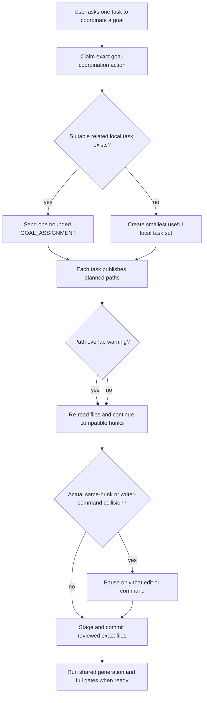

# Cooperative shared-checkout architectural review

Status: accepted correction for the schema-2 implementation
Date: 2026-07-23

## Scope

This review covers the remaining workflow stops after the first boundary-board simplification:

- broad path claims stopping compatible work;
- a durable `git-integration` owner stopping branch, commit, and push work;
- shared generated assets and full gates being treated as task property;
- new task creation happening before reuse of a useful related task; and
- cross-task assignment being forbidden even when the user explicitly appointed one goal Coordinator.

It does not restore a resident Coordinator, heartbeat, polling, transcript storage, task ledger, automatic fan-in, private Codex inspection, Mission Control runtime, or Doctor repair.

## Symptoms that triggered the correction

The schema-2 design removed the largest old costs, but one old assumption survived: a declared area was treated as an exclusive lease for the whole task lifetime. That produced two concrete failure patterns.

1. A task declaring a broad architecture or documentation area prevented a later integration task from regenerating a shared system map, even though generation was the required downstream step.
2. A task declaring `git-integration` prevented every other task from creating the agreed branch, committing its own finished files, or pushing the shared result. The final generated-map check and complete repository gate then remained pending.

The problem was not Python runtime or board size. It was decision latency: agents interpreted planned scope as permission to stop other compatible work and waited for task-level release instead of resolving only an actual file or command collision.

A second gap caused extra task windows. The guidance allowed a Coordinator to create two or three durable tasks but did not require it to look for a suitable related local task first. The message contract then prohibited the one bounded assignment needed to reuse that task.

## Evidence checked

- `coordination_state.py` rejected equal, ancestor, case-equivalent, and repository-wide path overlap with `ClaimConflict` before and after every claim write.
- Generated `CURRENT.md` named a durable Git integration owner.
- The skill, execution guide, operating guide, README, architecture guide, public site, capability contract, Doctor expectation, and tests all repeated the same hard-lock behavior.
- Concurrency tests required one winner for overlapping paths and one `git-integration` owner.
- The earlier simplification review already said reuse-first was the primary protection against task growth, but the released guidance did not implement a native task-reuse step.
- The current runtime already has the smaller required primitives: exact native task identity, per-task claims, bounded records, expected revisions, a short metadata lock, native task messaging, Git's index lock, narrow patch context, and normal diff review.

No external service or third-party dependency is required for this correction.

## Tool baseline

The architecture uses existing authorities instead of recreating them:

| Need | Existing authority |
|---|---|
| Task identity, lifecycle, status, messages, transcript | Native Codex task tools |
| Source content, history, index serialization, diffs | Git |
| Narrow optimistic edit check | Current file content and patch context |
| Planned task visibility | Schema-2 active claims and generated `CURRENT.md` |
| Singular operation ownership | Exact exclusive-action claim |
| Package compatibility | Read-only Doctor |

The board does not try to implement a line-lock service. Agents re-read the file, use narrow patches, and inspect the diff. A failed patch context or an incompatible same-hunk change is concrete collision evidence. An ancestor path string is not.

## Agent-led review

No extra durable review task was opened for this correction. That was deliberate: the change was one coherent contract update, and opening more tasks to review task-sprawl behavior would reproduce the failure being fixed. The implementation is instead checked by focused unit tests, stateful property tests, an isolated package workflow, the full suite, and installed-package validation.

## Findings

### 1. High — path ownership was a false lock

Directories are useful for showing planned work, but too coarse for mutual exclusion. A task may claim `docs/architecture` while another safely edits a different file or runs the generator that owns the final output. Treating both as one conflict stops useful work without proving a collision.

Decision: keep case-insensitive equal and ancestor detection, but return it in `warnings`. Both claims remain active. Stop only the exact hunk or writer command that actually conflicts.

### 2. High — durable Git ownership serialized whole tasks

Git needs short command serialization, not one owner for the lifetime of a task. Git already protects the index with its lock. The additional `git-integration` lease prevented unrelated commits and turned one delayed task into a repository-wide stop.

Decision: retire `git-integration` for new claims and treat existing claims as advisory. Establish the shared branch before parallel writers start. Each task may stage and commit only reviewed exact files, must preserve foreign staged work, and may non-force push when authorized. Broad staging, branch switching, pull/rebase/merge, reset/restore/stash/clean, and force-push remain prohibited while other writers are active.

### 3. High — reuse-first existed as intent, not behavior

A low task cap prevents unbounded growth but does not choose the best existing context. Without an explicit reuse step, a Coordinator can consume the cap with new windows while related local tasks remain available.

Decision: before native task creation, inspect only enough recent native task metadata to find a suitable related local task in the same Git repository and primary checkout. Reuse it when its context is useful, it is not handling unrelated work, and it has no unresolved user decision. Create a new local task only when no suitable task exists.

### 4. High — the message policy prevented safe reuse

Ordinary peer messages must not relay authority, but a user-appointed Coordinator needs one way to give a reused task its bounded vertical.

Decision: add one `GOAL_ASSIGNMENT` exception. It is valid only from the exact active `goal-coordination` owner, under the user's current shared goal, to a verified suitable task in the same repository and checkout. It contains a complete in-repository goal, paths, checks, and completion condition. It cannot grant release, deployment, provider, destructive, credential, environment, or external-write authority. The receiver verifies the contract and updates only its own claim. There is no acceptance, acknowledgement, progress, or completion-message loop.

### 5. Medium — shared integration surfaces were assigned like source modules

Generated system maps, lockfiles, schemas, shared indexes, formatter-wide output, and full repository gates combine work from several lanes. Giving them to one long-lived task makes that task a hidden finalizer and blocks the actual integration path.

Decision: these assets have no durable owner. Read-only gates can run at any time. A writer command runs after its required source changes are present; only a known concurrent writer command waits. The output is regenerated against the complete shared working tree, reviewed, and committed through exact file paths.

### 6. Retained — the small core protections still solve real failures

The correction keeps:

- exact native task and project identity;
- one-task default, three-task normal limit, and twelve-task hard limit;
- per-task records with strict allowed fields and a 4 KB cap;
- no prompts, reasoning, transcript, tool output, source, or full-turn ledgers;
- expected revisions, atomic record writes, and the short metadata lock;
- exact exclusive-action conflict prevention for truly singular operations;
- direct user stop and one-shot own-claim Stop guard;
- exact external-write consent;
- evidence-based stale recovery rather than time or silence;
- compact cold receipts and active-only hot reads;
- a bounded marker-only SessionStart; and
- native Codex and Git as the execution and source authorities.

Doctor remains a manual read-only package compatibility check whose remedy is update or reinstall. Mission Control remains absent from the base package; any future observer must be a separate, manual, read-only install with no task authority.

## Accepted workflow

## What blocks and what does not

| Condition | Result |
|---|---|
| Same or ancestor planned path | Warning; both tasks continue compatible work |
| Same file, different compatible hunks | Re-read, patch narrowly, inspect diff, continue |
| Same incompatible hunk | Pause that edit and send at most one collision notice |
| Same exact exclusive action | Claim rejected until the active owner releases it |
| Existing `git-integration` claim | Legacy warning only |
| Shared map, schema, lockfile, index, formatter, or full gate | No durable owner; serialize only an actual writer command |
| Another task has unrelated staged files | Preserve them; commit only exact reviewed paths |
| Git index lock or changed `HEAD` during a command | Stop that Git command, refresh, and retry after the immediate collision |
| Another task is merely active, idle, silent, or old | No automatic stop, wake, poll, or stale inference |

## Failure-mode review

### Two tasks edit the same hunk

The board warns but does not prevent the second task. The second task must re-read before writing and use a narrow patch. If the patch context fails or the resulting diff would overwrite incompatible work, it pauses only that hunk. This is intentionally optimistic: a path board cannot truthfully enforce line ownership.

### Two tasks run Git commands together

Git's index lock makes one command fail or wait at the real shared resource. The task refreshes `HEAD`, index, and staged paths before retrying. Exact path commits and a ban on broad staging reduce accidental inclusion. The design does not promise safe concurrent rebase, merge, cleanup, or force-push; those remain out of bounds during parallel writing.

### A reused task has stale or unrelated context

The Coordinator must verify repository, primary checkout, relationship to the new goal, active work, and unresolved user decisions before assignment. The receiver repeats the identity and goal checks. If they fail, it does not act. A new local task is safer than forcing unrelated context reuse.

### A Coordinator tries to expand authority

`GOAL_ASSIGNMENT` cannot grant external or destructive authority. Exact release, deployment, environment, database, provider, or scheduled-task work still needs the authority applicable to the acting task and, where singular, a narrow exclusive action.

### Generated output changes files from several lanes

The generator sees the shared checkout by design. Its owner reviews the entire exact output and commits only generated files it understands. Unexpected source changes are not staged. A full gate may report failures from another lane, but reporting a failure is not authority to rewrite that lane.

### Too many tasks still appear

Reuse-first is required, not merely recommended. The normal limit remains three and the hard limit twelve. A command, small review, mechanical change, or short dependent check stays in the current task or a parent-owned subagent when the host supports it.

## Verification

The implementation must prove:

- ancestor, case-equivalent, repository-wide, and exact path overlap returns warnings and keeps both claims;
- exact exclusive actions still have one owner under concurrent claims;
- legacy `git-integration` overlap is advisory;
- `CURRENT.md` contains no special Git owner;
- one isolated workflow accepts an overlapping path, reports its warning, and releases all claims;
- the capability and Doctor contracts agree on contract 27;
- guidance requires reuse-before-create, one bounded assignment, exact-file commits, and shared integration surfaces;
- stateful property tests preserve revision safety, exact exclusive-action safety, active-view truth, and compact terminal receipts; and
- the full dependency-free test suite, package checks, link checks, and installed-package Doctor pass.

## Migration and compatibility

No board-schema migration is needed. Claim schema 1 and project marker schema 2 remain unchanged. Existing path claims become warnings under the new helper. Existing `git-integration` actions stay readable and visible in their task row but no longer block another claim or receive a special `CURRENT.md` header.

The capability contract changes from 26 to 27. Installed packages must be updated or reinstalled so the skill, helper, Doctor, and tests agree. Repository enablement remains an explicit user decision; this source repository stays disabled during development.

## Rollback

A rollback uses the normal plugin manager to restore the prior package or the preserved Git revision. It does not hand-edit installed files or project claims. Rolling back restores the broad path and durable Git locks, so it is a compatibility fallback rather than the preferred operating model.

## Residual risks and follow-up

- Native tasks can still ignore written guidance; Coordinator is not a sandbox or policy engine.
- The host may not expose task reuse, messaging, local placement, or subagents in every mode. In that case, keep work in the current task or create one verified local task; never invent a worktree or claim the host performed a reuse it could not perform.
- Optimistic same-file work depends on narrow edits and diff review. It cannot guarantee semantic compatibility between separate hunks.
- A remote branch may change outside the shared checkout. Tasks do not auto-pull or rebase around active writers; they surface the exact Git blocker.
- Read-only full gates can consume compute, but they do not need a coordination owner. Scheduling repeated gates would be a separate explicit automation decision and is not part of this product.
- A future line-aware merge helper or observer would require evidence that these residual collisions are common enough to justify new machinery. It must not be designed pre-emptively into the hot path.

This correction returns the product to its intended boundary: a small task-visibility board that helps native Codex tasks cooperate in one checkout, not a manager that decides whether otherwise valid work may proceed.
