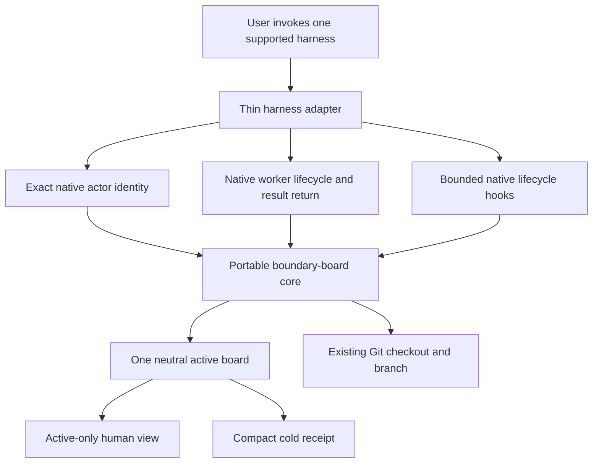

# Cross-harness portability architectural review

> Current Codex-adapter follow-up (2026-07-23): contract 34 keeps SessionStart bounded but no longer marker-only. It may count recognized routing-only pending-notice filenames for the exact current task UUID without reading their bodies. Codex goal supervision uses native exact-task event waits and may use one temporary native thread heartbeat only for an explicitly unattended goal. Any future adapter must prove equivalent bounded host primitives or omit that capability; it must not replace them with a portable resident monitor.

Status: proposed roadmap; no cross-harness implementation or compatibility claim exists yet
Date: 2026-07-23

## Scope

This review explains how to turn the proven Codex-specific boundary board into a portable product without rebuilding an orchestration system. Claude Code is the first target. Hermes Agent and OpenClaw are later adapter targets after the Claude contract is proven.

This is a design record, not an implementation. The released Codex plugin remains unchanged and remains the only supported runtime. A successful skills-directory copy is not treated as proof that another harness can execute the workflow correctly.

## Decision summary

1. Keep the current Codex v0.4 package stable.
2. Build the portable edition in this repository as a sibling package, not in a new codebase.
3. Share one small host-neutral board engine and one Agent Skills-compatible instruction core.
4. Put task identity, worker creation or reuse, messaging, lifecycle hooks, and install metadata behind thin harness adapters.
5. Implement and prove the Claude adapter first.
6. Do not use Claude agent teams as the first runtime. They are experimental and already provide their own task list and mailbox, which would compete with this product's authority.
7. Evaluate Hermes second and OpenClaw third. Their existing skill and delegation support reduces packaging work, but neither should inherit unproven Claude-specific behavior.
8. Never run a Codex-only board and a portable board as two active authorities in the same repository. Migration or activation must select exactly one.

## Evidence checked

### Current repository

- The schema-2 state helper owns bounded claim validation, optimistic revisions, a short metadata lock, atomic writes, advisory path overlap, exact exclusive-action conflict checks, active-view generation, and compact release receipts.
- The state helper itself does not read Codex transcripts, private databases, provider state, task lists, or messages.
- Codex coupling is concentrated in the skill wording, `threadId` and UUID assumptions, project discovery text, plugin metadata, SessionStart and Stop hook wire formats, native task reuse and messaging guidance, and package Doctor expectations.
- The current project marker and state root are under `.codex/coordination/`.
- Current tests intentionally enforce one-task default, reuse before create, two or three active durable tasks in total, same-checkout cooperative Git, sparse notices, no polling, no transcript storage, and reinstall-only Doctor recovery.

### Packaging probe

On 2026-07-23, the official skills CLI successfully found and copied the current skill into a clean temporary Claude Code project:

```text
npx skills add eyeinthesky6/codex-coordinator \
  --agent claude-code \
  --skill codex-coordinator \
  --yes --copy
```

The CLI reported one project-scoped Claude Code skill at `.claude/skills/codex-coordinator`. The copied `SKILL.md` remained explicitly Codex-specific. This proves Agent Skills packaging and discovery only. It does not prove Claude task identity, claims, hooks, delegation, lifecycle closure, or same-checkout coordination.

### External platform sources

- The [Agent Skills specification](https://agentskills.io/specification) defines a portable `SKILL.md` directory with optional `scripts/`, `references/`, and `assets/`, progressive disclosure, and a host-specific `compatibility` field. Tool names and executable-language support may vary by client.
- Claude Code supports project and plugin skills, plugin manifests, subagents, and lifecycle hooks. See [skills](https://code.claude.com/docs/en/slash-commands), [plugins](https://code.claude.com/docs/en/plugins), [subagents](https://code.claude.com/docs/en/sub-agents), and [hooks](https://code.claude.com/docs/en/hooks).
- Claude [agent teams](https://code.claude.com/docs/en/agent-teams) use separate sessions plus a native shared task list and mailbox. They are experimental, require user approval to start, and deliver teammate messages automatically.
- Hermes skills follow the Agent Skills standard and may be loaded from an external shared directory. Hermes also supports bounded subagent delegation and lifecycle hooks. See [Hermes skills](https://hermes-agent.nousresearch.com/docs/user-guide/features/skills), [delegation](https://hermes-agent.nousresearch.com/docs/user-guide/features/delegation), and [hooks](https://hermes-agent.nousresearch.com/docs/user-guide/features/hooks).
- OpenClaw loads normal `SKILL.md` directories and can map compatible Codex or Claude bundles into its plugin inventory. Its bundle mapping is deliberately partial, so mapped skill content does not prove mapped lifecycle behavior. See [OpenClaw skills](https://docs.openclaw.ai/skills), [plugin bundles](https://docs.openclaw.ai/plugins/bundles), [subagents](https://docs.openclaw.ai/subagents), and [hooks](https://docs.openclaw.ai/automation/hooks).

## Tool baseline

The portable design must keep existing authorities instead of copying them:

| Need | Portable owner |
|---|---|
| Skill discovery and progressive disclosure | Agent Skills-compatible `SKILL.md` |
| Source, branch, index, diffs, and history | Git |
| Active planned ownership | One small task-owned board record |
| Task or agent identity | The active harness adapter |
| Worker lifecycle and result return | The active harness |
| User permission and external-write authority | The acting harness conversation |
| Package install, update, and rollback | Each harness's normal package manager |
| Cross-harness contract tests | This repository |

The portable product must not own transcripts, reasoning, tool output, host memory, host task queues, provider state, schedules, or long-running worker supervision.

## Agent-led review

No extra durable task was opened for this review. The work was one read-only architecture and documentation pass, and creating more task windows would have contradicted the product constraint being documented.

The review traced the current board engine, package and hook contracts, task-leadership tests, and the official extension surfaces of all three candidate harnesses. Claude received the detailed design because it is the first target. Hermes and OpenClaw are intentionally kept at adapter-discovery depth until the Claude boundary has runtime evidence.

## Findings

### 1. The skill format is already portable; the behavior is not

The current folder shape and frontmatter are valid Agent Skills material. The current instructions nevertheless depend on native Codex tasks, exact Codex task UUIDs, Codex task messaging, Codex SessionStart and Stop payloads, and `.codex/coordination/` state.

A search-and-replace from “Codex” to “agent” would create false compatibility. The correct split is a neutral behavioral core plus explicit harness adapters.

### 2. The state engine is mostly reusable

These mechanisms are host-neutral and should remain one implementation:

- bounded active records and a hard board limit;
- task-owned updates with expected revisions;
- atomic writes and a short metadata lock;
- advisory path overlap;
- exact exclusive-action conflict prevention;
- compact cold receipts;
- an active-only, non-authoritative human view;
- no normal archive scans; and
- no transcript, prompt, reasoning, code, or tool-output fields.

The current identity and path contract is not neutral. It assumes a UUID-shaped `threadId` and a `.codex/coordination/` root. Claude hook examples expose `session_id` and `agent_id` as separate opaque identities, and other harnesses use their own session shapes. The portable schema must not assume every actor ID is a UUID.

Do not change schema 2 in place. Define the neutral identity and state-root contract only after capturing real Claude main-session and subagent hook payloads. Store a bounded exact native identity for equality while deriving a safe record filename; never use a transcript path as identity.

### 3. One shared repository is enough

A separate repository now would duplicate tests, privacy rules, state handling, and release work. The better shape is:

```text
this repository
├── current Codex v0.4 package       # stable compatibility line
├── portable Agent Skills core       # host-neutral instructions and references
├── shared board engine              # one tested implementation
└── adapters
    ├── Claude Code                  # first
    ├── Hermes Agent                 # later
    └── OpenClaw                     # later
```

This is a logical target layout, not authorization to create these paths now. A separate repository becomes reasonable only if the portable edition develops a different security boundary, maintainer group, license, or release cadence.

### 4. A harness adapter should be deliberately small

Every adapter must answer only these questions:

1. What is the exact current native actor identity?
2. What repository, primary checkout, worktree, and branch is it using?
3. Can the harness safely reuse an existing related worker, or should work remain in the current session?
4. If the user requests decomposition, how are at most two or three complete lanes created?
5. How does one bounded assignment or real collision notice reach the exact recipient?
6. Which lifecycle events can remind an actor to release its own claim?
7. How is the plugin installed, updated, disabled, and removed through the harness's normal manager?

If a harness cannot answer one of these reliably, the adapter must degrade to one task and manual claims. It must not invent task state, scrape transcripts, poll logs, or add a resident coordinator.

### 5. The hot path must stay smaller than the host's own execution loop

No adapter may add:

- a background watcher, heartbeat, timer, cron job, or periodic task scan;
- mandatory progress, acknowledgement, completion, or status messages;
- transcript or reasoning ingestion, even when the host exposes transcript paths;
- automatic reconciliation of every host session;
- a second shared task list when the host already owns one;
- recursive delegation by default;
- automatic worktrees, branch switching, or pull-request creation; or
- self-repair, rollback management, or archive scanning.

## Target architecture



The adapter translates. The core validates. The harness executes. Git remains the source authority.

## Claude-first design

### Distribution

Create a Claude plugin sibling only after the neutral skill text exists. Claude's supported plugin layout can bundle:

- `.claude-plugin/plugin.json` for package identity;
- `skills/<name>/SKILL.md` plus the same references and scripts used by the portable core;
- `hooks/hooks.json` for bounded lifecycle integration; and
- optional subagent definitions only if a runtime trial proves they reduce repeated prompting.

The skills CLI remains useful for discovery and a skill-only trial, but a skill-only installation does not include plugin hooks and must not be marketed as full parity. The Claude plugin manager should own full install, update, disable, and removal.

### Execution model

Claude MVP should use one main session by default and native subagents only for two or three complete, low-chatter verticals. Subagents already return their summaries to the parent, so no polling or custom completion-message loop is needed.

Do not set `isolation: worktree`; the accepted product model is the established shared checkout and branch. Each writing subagent receives:

- the complete bounded goal;
- current repository and checkout identity;
- intended paths and exact exclusive actions;
- focused verification and completion conditions;
- exact-file Git rules; and
- an instruction to publish and release only its own board claim.

Small checks and mechanical edits stay in the main session. Independent user-opened Claude sessions may participate by claiming their own boundaries, but the first adapter must not promise automatic discovery, wake-up, or reuse of arbitrary existing sessions unless Claude exposes a stable supported interface and the trial proves it.

### Why agent teams are deferred

Claude agent teams already introduce a team lead, persistent task list, mailbox, dependency management, teammate lifecycle, and automatic delivery. Mounting the boundary board on top would create two task authorities and recreate the earlier Coordinator bloat.

The first Claude adapter therefore does not require agent teams. A later experiment may compare “native team only” with “portable board plus ordinary subagents,” but the board should not mirror team tasks or mailboxes. If native teams solve the complete same-checkout visibility problem with lower cost, the correct outcome may be a small compatibility skill that defers to the native team rather than another runtime adapter.

### Identity and lifecycle

The Claude adapter should consume only documented hook fields needed for identity and bounded lifecycle:

- main session: `session_id` from SessionStart and Stop;
- child worker: `agent_id` plus parent session identity from SubagentStart and SubagentStop where available;
- repository context: hook `cwd` plus Git common-directory and primary-worktree checks; and
- one-shot own-claim continuation: `stop_hook_active` circuit breaking.

Ignore `transcript_path`, `agent_transcript_path`, `last_assistant_message`, and host memory. Their availability is not permission to create another history or completion detector.

SessionStart remains read-only. It may inject one short instruction only for an explicitly enabled compatible project. If the adapter implements the routing-only failed-delivery fallback, SessionStart may also count recognized notice filenames for the exact current actor without reading their bodies. Stop and SubagentStop may inspect only the exact current actor's small claim. Every hook stays bounded, local, network-free, and fail-open.

### State and migration

The portable edition needs one neutral project state root shared by every portable adapter. `.agents/coordination/` is the leading candidate because it is not owned by one model provider and `.agents/skills/` already appears in cross-agent installation flows. This path is not yet approved as a protocol field; verify client behavior and repository conventions during the Claude spike before freezing it.

Never dual-write `.codex/coordination/` and a neutral root. A project that moves from the Codex-only package to the portable package must use a dry-run-first, explicit migration:

1. inventory the existing marker, active claims, and archive without importing transcripts;
2. require all active claims to be released or explicitly preserved as historical evidence;
3. deactivate the Codex-only marker;
4. create the neutral marker and state root while still disabled;
5. verify the selected adapter and package contract; and
6. enable only after the user explicitly approves the cutover.

Old receipts remain cold history. They are not copied into the hot board.

### Claude acceptance gate

Do not claim Claude support until a clean project proves all of the following:

1. The Claude plugin installs and validates through the normal Claude manager.
2. A disabled or absent project is silent and creates no state.
3. An enabled SessionStart reads the bounded marker and, only if failed-delivery fallback is supported, counts recognized filenames for the exact current actor without reading notice bodies.
4. One main session can claim, update, and release its own exact identity.
5. Two native subagents can work in the same checkout on disjoint lanes without creating worktrees.
6. Path overlap warns but does not stop compatible work.
7. One exact exclusive action still has one owner under concurrent attempts.
8. Parent result return needs no polling, acknowledgement, or transcript parsing.
9. Stop and SubagentStop cannot trap a session and touch only the exact actor claim.
10. No hook or helper reads Claude transcript or memory files.
11. Direct commits remain possible through exact-file staging; pull requests remain optional.
12. Package validation, board property tests, privacy checks, uninstall, and reinstall pass on Windows, macOS, and Linux where Claude supports the plugin.

## Hermes-later adapter

Hermes is a good second target because its skill system follows Agent Skills, supports external skill directories, exposes session and subagent lifecycle hooks, and defaults to three concurrent delegated children. Its parent receives delegated results without a custom polling loop.

The Hermes adapter must nevertheless handle three platform-specific risks:

1. Hermes may modify skills found in writable external directories. Release packages must be installed through a reviewed immutable or operator-controlled path; a shared source checkout must not silently become agent-managed memory.
2. Hermes writes detailed delegation logs containing thinking snippets, tool calls, and results. The portable board must never read, copy, summarize, index, or depend on those logs.
3. Delegated workers are tied to their parent session and process. Do not add cron jobs or background terminal work merely to make them durable. If durability is required, it is a separate user-selected Hermes workflow, not Coordinator behavior.

Hermes work starts only after Claude freezes the neutral identity, state-root, and adapter contracts. First prove a skill-only install, then a thin hook/plugin adapter, then same-checkout delegation with the default flat depth. Nested orchestrator delegation remains off.

## OpenClaw-later adapter

OpenClaw is third because it already recognizes Agent Skills and compatible Codex or Claude bundles. The future Claude bundle may therefore provide immediate skill discovery with little or no extra packaging.

Do not infer full compatibility from bundle detection. OpenClaw documents partial mapping: skill roots are supported broadly, while hook behavior depends on OpenClaw-compatible hook layouts and runtime expectations. A thin native adapter may still be required for identity, claims, lifecycle, and same-checkout proof.

OpenClaw also runs a persistent Gateway and exposes sessions, subagents, internal hooks, plugin hooks, background work, logs, and scheduling. The adapter must use only the minimum native session and subagent events. It must not turn the Gateway into a resident Coordinator, read session history as board state, enable command logging, create standing orders, or schedule monitoring.

The OpenClaw trial should begin with its compatible-bundle inspection command and a clean workspace. Only after the runtime reports the exact mapped skill and hook surfaces should native adapter work be considered. ClawHub publication is a later distribution decision, after security scanning and install-policy behavior are verified.

## Portable capability matrix

| Capability | Codex v0.4 now | Claude first | Hermes later | OpenClaw later |
|---|---|---|---|---|
| Agent Skills discovery | Proven | Packaging proven; behavior unproven | Officially supported | Officially supported |
| Full package format | Codex plugin | Claude plugin | Hermes skill plus thin plugin/hooks if needed | Compatible bundle first, native plugin only if needed |
| Main actor identity | Exact native task UUID | Session hook `session_id` trial required | Session hook trial required | Session identity trial required |
| Child actor identity | Native task UUID or parent-owned subagent | `agent_id` trial required | Delegated subagent identity trial required | Spawned-session/subagent identity trial required |
| Result return | Native tools | Native subagent return | Native delegated result | Native announce/session return |
| Durable independent task reuse | Supported when native task tools expose it | Not promised in MVP | Not promised | Not promised |
| Background monitor | None | None | None | None, even though a Gateway exists |
| Transcript use | None | Forbidden | Forbidden, including delegation logs | Forbidden, including session history |
| Worktree creation | None | None | None | None |
| Pull-request requirement | None | None | None | None |

## Recommended implementation order

### Phase 0 — freeze the portable contract

- Keep Codex v0.4 unchanged.
- Capture real Claude SessionStart, Stop, SubagentStart, and SubagentStop payload shapes without transcript reads.
- Decide the neutral state root and opaque identity rules.
- Specify an adapter interface and cross-harness capability tests.
- Decide the portable product name only after the Claude user workflow is clear.

### Phase 1 — extract without changing Codex behavior

- Move or wrap host-neutral board logic behind one shared implementation.
- Keep Codex schema-2 behavior and package paths passing unchanged.
- Add regression tests proving no dual state authority and no runtime dependency on adapter modules.

### Phase 2 — Claude skill and plugin

- Rewrite the portable instructions in host-neutral language.
- Add the thin Claude manifest and bounded hooks.
- Use native subagents for the first two-or-three-lane workflow.
- Run the complete Claude acceptance gate in a disposable repository, followed by one explicit real-project pilot.

### Phase 3 — release decision

- Publish only after install, update, disable, uninstall, privacy, and cross-platform checks pass.
- Keep skills.sh discovery, but distinguish skill-only installation from full Claude plugin installation.
- Do not label the Codex package itself cross-platform.

### Phase 4 — Hermes

- Reuse the neutral skill and board engine.
- Add only the identity and lifecycle adapter that runtime evidence requires.
- Keep external skill mutation and delegation-log ingestion explicitly forbidden.

### Phase 5 — OpenClaw

- Trial compatible-bundle loading first.
- Add a native adapter only for features the bundle cannot map safely.
- Keep Gateway monitoring, schedules, session-history reads, and standing coordination outside the product.

## Recommended fixes before implementation

1. Add a small adapter contract document or typed protocol before extracting source.
2. Add fixture-based tests from real, redacted Claude hook payloads.
3. Separate portable wording from Codex-specific task-tool instructions.
4. Make the board engine accept adapter-supplied identity and state root without importing an adapter.
5. Keep package Doctors adapter-specific and read-only. A failed adapter is updated or reinstalled.
6. Add a single compatibility matrix generated from tests, not hand-maintained marketing claims.
7. Preserve the current task and message limits unchanged unless a harness trial proves a smaller safe limit.

## Verification

This documentation pass verified:

- current Codex package and board ownership from source and tests;
- current Agent Skills structure and discovery rules from the specification;
- a clean Claude Code skill-directory copy from the public GitHub repository;
- documented Claude plugin, subagent, team, and hook boundaries;
- documented Hermes skill, delegation, log, and hook boundaries; and
- documented OpenClaw skill, compatible-bundle, subagent, and hook boundaries.

It did not run Claude subagents, Claude hooks, Hermes, or OpenClaw. Those remain implementation gates, not inferred support.

## Failure-mode review

### Two harnesses are enabled in one repository

Reject dual active authorities. The user must select one portable board. Adapters may share that board only after their identities are supported by the same neutral schema. A Codex-only schema-2 board is migrated or remains the sole authority; it is never mirrored.

### A host exposes more data than the adapter needs

Ignore it. Transcript paths, live logs, memories, mailboxes, shared task lists, session histories, and tool traces are host-owned. Availability does not make them Coordinator inputs.

### A host cannot reuse another durable session

Keep the work in the current session or create native child workers only when the user requested decomposition. Mark durable reuse unsupported. Do not add a watcher, database, or synthetic wake-up layer.

### A hook is disabled, blocked, or crashes

Core claiming remains manually usable. Hook failures are visible compatibility failures but fail open so they cannot trap execution. Doctor reports update or reinstall; it does not repair files.

### Native orchestration is already better

Prefer the native feature and shrink the adapter. The product should provide missing boundary visibility, not compete with a harness's mature task, result-return, permission, or messaging system.

## Rollback

Every adapter is separately installable and removable. Removing a Claude, Hermes, or OpenClaw adapter must leave Git and native sessions untouched. Portable state stays disabled and preserved unless the user separately confirms purge. Rollback never reactivates the Codex-only board automatically.

The current Codex v0.4 tag and release remain the compatibility fallback while the portable edition is experimental.

## Follow-up

The next authorized change should be a bounded Claude adapter spike on a new branch. It should stop after the Phase 0 identity and hook fixtures plus a clean plugin validation plan, show the exact outgoing files and reasons to the user, and obtain approval before changing the released Codex package or project state.

Hermes and OpenClaw work should not start in parallel with the Claude spike. Their documented role is to test whether the neutral adapter contract is genuinely portable after one non-Codex implementation exists.
