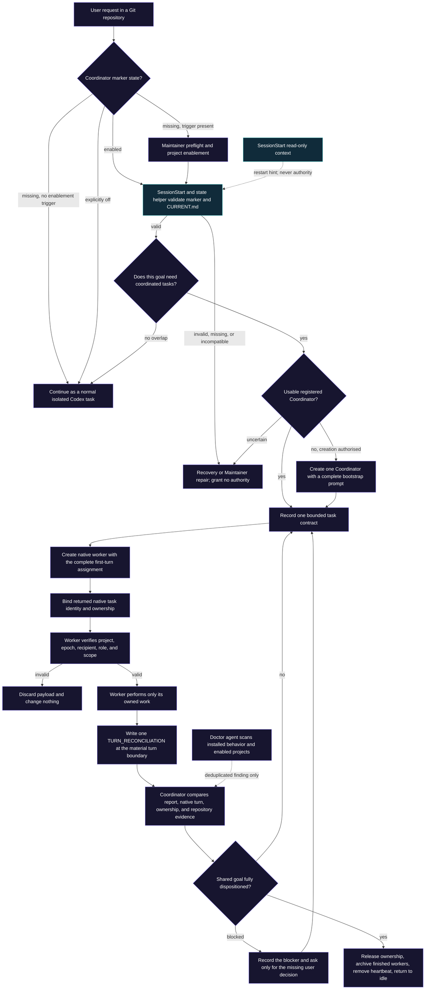

# Architecture

Codex Coordinator adds a small coordination layer around Codex's native tasks. It does not run a daemon, own Git operations, or replace Codex agents.

## Decision and state route

Most Coordinator behavior is an instruction-driven state machine, not one Python call stack. Solid boxes below are decisions agents must follow from the skill; blue boxes are the executable checks that make state parsing and installation safer.

- **Instruction-driven route:** enablement, authority, task creation, routing, ownership, reconciliation, recovery, and completion are enforced by the agents following the skill and canonical records.
- **Executable check:** the SessionStart hook, state helper, and installation Doctor reject malformed inputs and expose safe read-only evidence. They do not assign work or change project authority.

## Main flow

1. A user invokes `$codex-coordinator` for work that needs coordination.
2. The skill checks the repository marker and current task context.
3. For meaningful parallel or cross-task work, it lazily creates the repository-scoped marker, local current-state record, and only the task records that are needed.
4. The Coordinator records a bounded contract, creates each worker with the complete first-turn assignment, and immediately binds Codex's returned native task identity.
5. The Coordinator remains control-first; bounded workers own normal product and integration execution. Subagents may help a registered task while their parent retains durable ownership and reporting.
6. One temporary native heartbeat reconciles changed worker turns while a shared goal is live. It uses a host-native incremental cursor when available and never mirrors Codex task history. Native messages remain a sparse fallback for exact control transitions or one unattended result/blocker wake.
7. Durable repository-local records preserve the handoff when a task pauses, compacts, or restarts. The bundled state helper validates required fields, identifiers, table rows, uniqueness, and reconciliation ledgers, safely creates task or inbox records without overwriting existing files, and maintains an optional two-phase hash checkpoint only for inbox records already reconciled by the exact current Coordinator.
8. On SessionStart, the Python hook reads bounded state from the primary worktree and emits a short context block. It does not change repository files.
9. An optional Codex automation may run Doctor across locally discovered enabled projects. Doctor writes only deduplicated inbox findings; each project Coordinator remains the sole owner of canonical reconciliation and repair.

## State boundary

- `.codex/coordination/project.yaml` is the stable, trackable discovery marker.
- Mutable ownership, task, and handoff records stay local to the checkout and are ignored by Git.
- A project ID and current epoch guard cross-task routing. Messages without the expected repository identity and recipient are not actionable.
- Git worktrees isolate files and branches; Coordinator records ownership and handoffs. These are complementary controls.

## Hook safety boundary

The hook validates and bounds marker values, text size, table rows, Git output, and emitted context. It uses a bounded Git query to find the primary worktree, treats malformed or truncated state as unknown, and never turns recovered text into authority.

## Doctor safety boundary

Doctor is a scheduled maintenance audit, not a daemon or second project Coordinator. It compares native task state with existing project records and may write one append-only, deduplicated finding to the affected project's private inbox. It never edits canonical ownership, creates or wakes tasks, or sends routine task messages.

In a configured development or legacy manual setup, the source-sync helper validates one trusted plugin source and atomically refreshes only the manual global skill and exact legacy hook. Its installed checks include the current capability contract, required operating guidance, state-helper syntax, skill links, and hook behavior. An optional Mermaid map projects those structured results for visual diagnosis; it neither performs checks nor changes their authority. Doctor does not rewrite managed plugin caches or project files.

## What the plugin does not own

- Git commits, merges, branches, or worktree lifecycle.
- Deployment, database, environment, or provider permissions.
- Cross-machine state synchronization.
- Application locks or enforcement.

## Evidence

- `plugins/codex-coordinator/skills/codex-coordinator/SKILL.md`
- `plugins/codex-coordinator/skills/codex-coordinator/references/operations.md`
- `plugins/codex-coordinator/skills/codex-coordinator/references/execution.md`
- `plugins/codex-coordinator/skills/codex-coordinator/references/reconciliation.md`
- `plugins/codex-coordinator/skills/codex-coordinator/references/messaging.md`
- `plugins/codex-coordinator/skills/codex-coordinator/references/recovery.md`
- `plugins/codex-coordinator/skills/codex-coordinator/references/doctor.md`
- `plugins/codex-coordinator/scripts/codex_coordinator_session_start.py`
- `plugins/codex-coordinator/scripts/codex_coordinator_doctor.py`
- `.gitignore`
