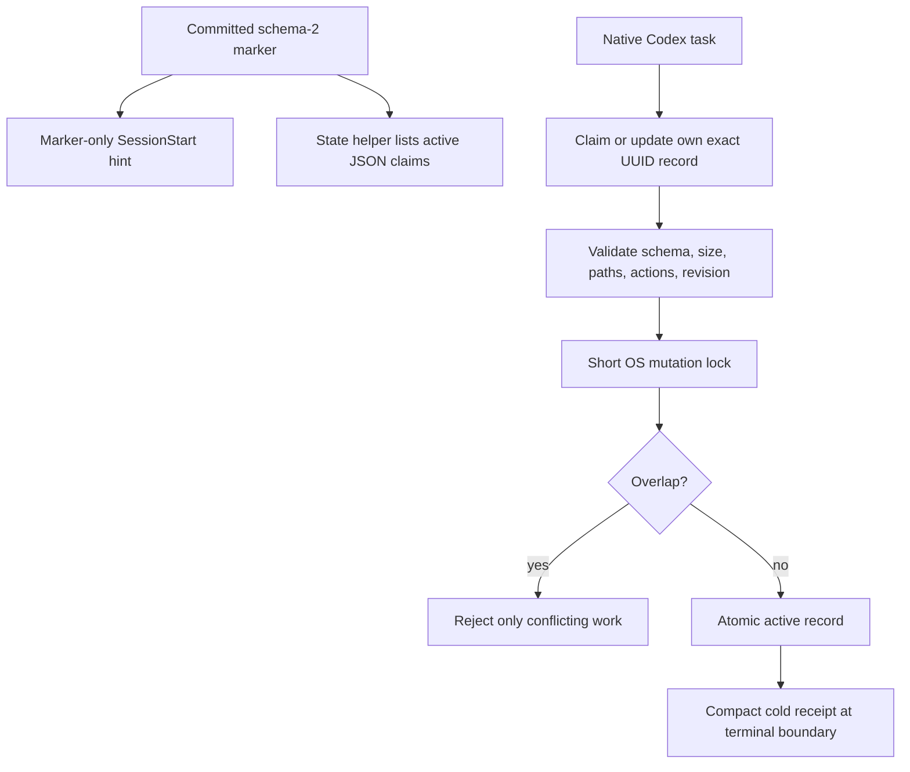

# Architecture

Codex Coordinator schema 2 is a repository-local task-boundary and visibility layer. It is not an orchestration runtime.

The accepted decision, history, retained protections, rejected mechanisms, migration gates, and rollback plan are in [the boundary-board simplification review](2026-07-21_boundary-board-simplification_architectural_review.md).

## Authorities

| Concern | Authority |
|---|---|
| Task window, execution, status, messages, transcript | Native Codex |
| Source and history | Git and the repository's existing workflow |
| Active planned ownership | One task-owned JSON record per active writer |
| User permissions and external writes | Direct user instructions in the acting task |
| Package update and repair | Normal plugin manager |

There is no second transcript store, central work ledger, Coordinator task, scheduler, heartbeat, provider monitor, or mandatory PR authority.

## Data flow

## Marker

`.codex/coordination/project.yaml` is the only committed project state. Schema 2 names exact local active and archive paths and disables cross-project access. A false marker is an immediate opt-out; no board state is read.

Schema 1 is legacy. Its `CURRENT.md`, tasks, inbox, cache, and history remain preserved but are never active authority in schema 2.

## Active board

`.codex/coordination/active/<thread-uuid>.json` contains only:

- schema and project identity;
- exact native thread UUID;
- short title and bounded goal;
- `active` or `blocked` status;
- revision and timestamps;
- concrete repository-relative paths;
- exclusive action slugs;
- exact dependency thread UUIDs;
- whether a direct over-limit decision was supplied.

Unknown fields are rejected. Every file is capped at 4 KB. The active board is capped at twelve records and ordinary creation stops at three without a direct user decision.

Path overlap is case-insensitive and ancestor-aware. Exclusive actions conflict by exact slug. Each mutation runs inside a short cross-platform OS file lock, verifies expected revision, writes atomically, and performs a post-write conflict check.

The lock serializes metadata updates only. It is not a source-file lock or permission system.

## Cold receipts

Release writes one compact receipt under `.codex/coordination/archive/`, then removes the active claim. Receipts include identity, title, goal, final status, final revision, and close time. They omit paths, actions, messages, transcripts, and tool output.

Ordinary list, claim, SessionStart, and Doctor paths never scan the archive.

## Task model

One native task is the default. Extra durable tasks require substantial independently useful work. Three is the normal active maximum; twelve is hard.

A temporary lead exists only for explicit decomposition or synthesis. It has no special record, permanent identity, heartbeat, or repository authority.

With multiple writers, one task claims `git-integration`. Direct commits and pushes are normal for one owner. PRs are optional policy.

## Messaging

The board is the normal visibility path. Peer messages are limited to `COLLISION`, `DEPENDENCY`, and `RELEASED`. They are plain-text, sparse, exact-recipient, same-project, and non-executable. There are no registration, acceptance, progress, status, thanks, or acknowledgement chains.

## SessionStart

The hook parses its JSON input, walks at most 64 parent directories to find a Git marker, reads at most 16 KB, validates schema and fixed paths, and emits a short hint. It does not import or launch Mission Control, install Python, read the board, inspect private Codex data, or create state.

## Doctor

Doctor is read-only. It checks five package surfaces: manifest, capability contract, skill/frontmatter/links, state-helper syntax, and direct hook registration/syntax. It neither executes the hook nor scans projects. Broken packages are updated or reinstalled.

## Optional observer boundary

No schema-2 observer is currently supported. Legacy Mission Control source is inert and retained only while the separate-tool decision is pending. Nothing in the base hook, Doctor, lifecycle helper, state helper, capability contract, or prompts imports or starts it.

Any retained future observer must be separately installed, manually started, read-only, and limited to schema-2 board files. It must not inspect private Codex SQLite or rollout data or expose task, repair, model, provider, schedule, or write controls.

## Failure posture

Fail closed on an enabled unsupported marker, malformed claim, wrong project, invalid exact identity, lost revision, unresolved overlap, unclear external authority, or safety-critical conflict. Keep disjoint authorized work moving.

Silence, age, idle, timeout, and filtered discovery misses never prove staleness. Releasing another owner's record requires exact native terminal, archived, or unusable evidence plus a current user request covering the same unfinished work.

## Explicit non-goals

- automatic task creation or scheduling;
- permanent coordination or all-task reconciliation;
- provider, PR, release, deployment, or automation monitoring;
- task transcript, reasoning, prompt, or tool-output storage;
- cross-project or cross-machine coordination;
- filesystem enforcement;
- automatic package repair;
- automatic observer startup;
- re-enabling a project without direct user approval.
