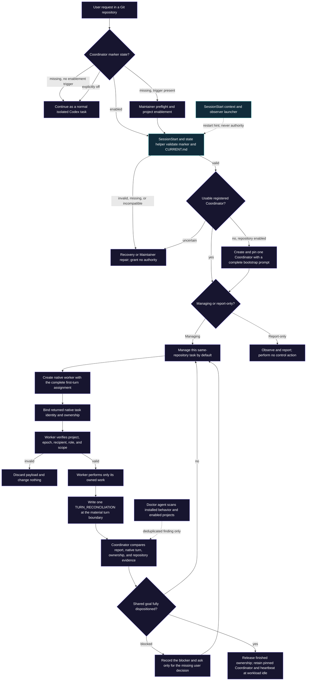

# Architecture

Codex Coordinator adds a small coordination layer around Codex's native tasks. It does not run a daemon, own Git operations, or replace Codex agents.

## Decision and state route

Most Coordinator behavior is an instruction-driven state machine, not one Python call stack. Solid boxes below are decisions agents must follow from the skill; blue boxes are the executable checks that make state parsing and installation safer.

- **Instruction-driven route:** enablement, authority, task creation, routing, ownership, reconciliation, recovery, and completion are enforced by the agents following the skill and canonical records.
- **Executable check:** the SessionStart hook, state helper, and installation Doctor reject malformed inputs and expose safe read-only evidence. They do not assign work or change project authority.

## Main flow

1. Every task checks the repository marker; a global installation with no enabled marker remains inert.
2. In an enabled repository, the task loads the skill and verifies the pinned accepting Coordinator, current mode, and user exclusions.
3. Initial enablement creates the repository-scoped marker and local state, then creates, registers, pins, and monitors exactly one Coordinator before claiming active management.
4. The Coordinator records a bounded contract, chooses the shared checkout or a bounded linked worktree, creates each worker with the complete first-turn assignment, and immediately binds Codex's returned native task identity. It may choose a worktree for an independent writer when isolation avoids an unnecessary wait and one integration owner is named.
5. Managed-by-default is an observation and ownership rule, not an approval gate. Conflict-free tasks proceed after recording notice; only a recorded dependency, pause, pending command, decision, or ownership conflict puts work in a waiting state. The Coordinator remains control-first; bounded workers own normal product and integration execution. Subagents may help a registered task while their parent retains durable ownership and reporting.
6. One repository heartbeat reconciles changed same-repository task turns while Coordinator is enabled, including workload-idle and report-only periods. It uses a host-native incremental cursor when available and never mirrors Codex task history. Native messages remain a sparse channel for exact control transitions.
7. Durable repository-local records preserve the handoff when a task pauses, compacts, or restarts. The bundled state helper validates required fields, identifiers, table rows, uniqueness, and reconciliation ledgers, safely creates task or inbox records without overwriting existing files, and maintains an optional two-phase hash checkpoint only for inbox records already reconciled by the exact current Coordinator.
8. On SessionStart, the Python hook reads bounded state from the primary worktree, emits a short context block, and starts or reuses the bundled local Mission Control observer when the repository is enabled. It does not change repository files.
9. An optional Codex automation may run Doctor across locally discovered enabled projects. Doctor writes only deduplicated inbox findings; each project Coordinator remains the sole owner of canonical reconciliation and repair.

## Mission Control observer

Mission Control is an optional runtime bundled with the plugin and kept behind a separate local process boundary. Its Python standard-library server binds only to `127.0.0.1`, reads bounded local Codex receipts and Coordinator records, and renders a reviewer-facing snapshot. The first valid Coordinator SessionStart launches it once; later sessions reuse it. Native task receipts indicate activity, idleness, or completion; they do not create a coordination wait. Mission Control shows waiting work only when canonical records contain a dependency, pause or resume condition, pending control command, unresolved decision, or ownership conflict.

The dashboard may update its own local settings, run the bounded Doctor contract, and shut down its own server. A shutdown records a local disabled preference so the next SessionStart respects the user's choice; an explicit chat start re-enables it. It cannot assign work, change ownership, send task messages, edit application code, or replace the canonical Coordinator records.

## State boundary

- `.codex/coordination/project.yaml` is the stable, trackable discovery marker.
- Mutable ownership, task, and handoff records stay local to the checkout and are ignored by Git.
- A project ID and current epoch guard cross-task routing. Messages without the expected repository identity and recipient are not actionable.
- Git worktrees isolate files and branches; Coordinator may select that placement for a bounded independent writer and records ownership, integration responsibility, and handoffs. Canonical state remains in the primary worktree.

## Hook safety boundary

The hook validates and bounds marker values, text size, table rows, Git output, and emitted context. It uses a bounded Git query to find the primary worktree, treats malformed or truncated state as unknown, and never turns recovered text into authority. Only after a valid enabled marker is confirmed may it launch the packaged lifecycle helper; that helper writes only its local application-data preference and starts the loopback observer.

## Doctor safety boundary

Doctor is a scheduled maintenance audit, not a daemon or second project Coordinator. It compares native task state with existing project records and may write one append-only, deduplicated finding to the affected project's private inbox. It never edits canonical ownership, creates or wakes tasks, or sends routine task messages.

In a configured development or legacy manual setup, the source-sync helper validates one trusted package and atomically refreshes only the manual global skill and exact legacy hook. Installed checks cover the current capability contract, required operating guidance, state-helper syntax, skill links, and hook behavior. Doctor may separately inspect enabled projects and add deduplicated findings to their private inboxes, but it does not rewrite managed plugin caches, Mission Control, canonical project state, or application files. Mission Control's Python, static assets, launchers, HTTP boundary, and browser behavior are release-test responsibilities.

## What the plugin does not own

- Git commits, merges, branches, or the native worktree lifecycle. Coordinator may choose and record execution placement, but Codex and Git perform those operations through their existing surfaces.
- Deployment, database, environment, or provider permissions.
- Cross-machine state synchronization.
- Application locks or enforcement.

## Evidence

- `plugins/codex-coordinator/skills/codex-coordinator/SKILL.md`
- `plugins/codex-coordinator/skills/codex-coordinator/references/operations.md`
- `plugins/codex-coordinator/skills/codex-coordinator/references/execution.md`
- `plugins/codex-coordinator/skills/codex-coordinator/references/reconciliation.md`
- `plugins/codex-coordinator/skills/codex-coordinator/references/messaging.md`
- `plugins/codex-coordinator/skills/codex-coordinator/references/recovery.md`
- `plugins/codex-coordinator/skills/codex-coordinator/references/doctor.md`
- `plugins/codex-coordinator/scripts/codex_coordinator_session_start.py`
- `plugins/codex-coordinator/scripts/codex_coordinator_doctor.py`
- `apps/mission_control/`
- `tests/test_mission_control.py`
- `.gitignore`
