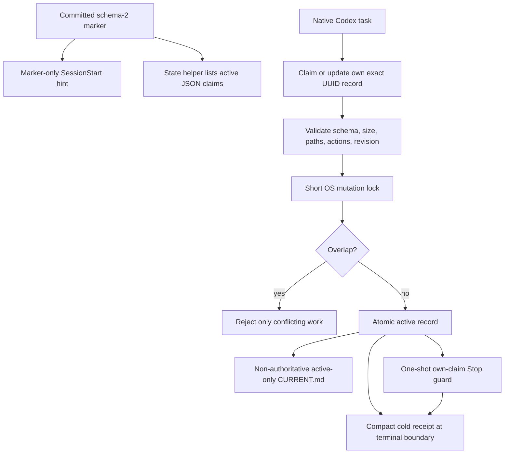

# Architecture

Codex Coordinator schema 2 is a repository-local task-boundary and visibility layer. An explicitly requested task may coordinate one goal, but there is no always-on/resident monitoring Coordinator.

The accepted decision, history, retained protections, rejected mechanisms, migration gates, and rollback plan are in [the boundary-board simplification review](2026-07-21_boundary-board-simplification_architectural_review.md). The lifecycle correction for forgotten terminal claims is in [the one-shot Stop guard review](2026-07-22_claim-lifecycle-stop-guard_architectural_review.md).

## Authorities

| Concern | Authority |
|---|---|
| Task window, execution, status, messages, transcript | Native Codex |
| Source and history | Git and the repository's existing workflow |
| Active planned ownership | One task-owned JSON record per active writer |
| Goal Coordinator | The one claim holding the exclusive `goal-coordination` action |
| User permissions and external writes | Direct user instructions in the acting task |
| Package update and repair | Normal plugin manager |

There is no second transcript store, central work ledger, automatically created or always-on monitoring Coordinator, scheduler, heartbeat, provider monitor, or mandatory PR authority.

## Data flow

## Marker

`.codex/coordination/project.yaml` is the only committed project state. Schema 2 names exact local active and archive paths and disables cross-project access. A false marker is an immediate opt-out; no board state is read.

Schema 1 is legacy. Its `CURRENT.md`, tasks, inbox, cache, and history remain preserved but are never active authority in schema 2.

Schema 2 generates `CURRENT.md` with different semantics: an atomically rebuilt, active-only human view backed by the per-task JSON claims. It shows the shared goal from the `goal-coordination` claim, active task goals and ownership, status and dependencies, and the `git-integration` owner. It is never mutation authority, an inbox, a task ledger, a transcript, or historical memory.

## Active board

`.codex/coordination/active/<thread-uuid>.json` contains only:

- schema and project identity;
- exact native thread UUID;
- short title and bounded goal;
- `active` or `blocked` status;
- revision and timestamps;
- concrete repository-relative paths;
- exclusive action slugs;
- exact dependency thread UUIDs;
- whether a direct over-limit decision was supplied.

Unknown fields are rejected. Every file is capped at 4 KB. The active board is capped at twelve records and ordinary creation stops at three without a direct user decision.

Path overlap is case-insensitive and ancestor-aware. Exclusive actions conflict by exact slug. Each mutation runs inside a short cross-platform OS file lock, verifies expected revision, writes atomically, and performs a post-write conflict check.

The lock serializes metadata updates only. It is not a source-file lock or permission system.

## Cold receipts

Release writes one compact receipt under `.codex/coordination/archive/`, then removes the active claim. Receipts include identity, title, goal, final status, final revision, and close time. They omit paths, actions, messages, transcripts, and tool output.

Ordinary list, claim, SessionStart, and Doctor paths never scan the archive.

## Task model

One native task is the default. When the user explicitly requests coordination, one normal task may claim `goal-coordination` for a bounded goal and assign two or three complete durable verticals. Three is the normal active maximum; twelve is hard.

The Coordinator gives each vertical its complete goal, exact ownership, verification, and completion condition. It remains available only when invoked for that goal and ends with the goal. It does not poll, run a heartbeat, demand status reports, or promise automatic fan-in. Native completion does not wake it automatically; when invoked again, it reads current state and uses native results only as needed. Short dependent checks can still use parent-owned subagents.

All coordinated tasks use the same primary checkout, current worktree, and current branch. They do not create or switch branches or worktrees. With multiple writers, exactly one task claims `git-integration`; every other task avoids Git mutations. PRs are optional policy.

## Messaging

The board is the normal visibility path. Peer messages are limited to `COLLISION`, `DEPENDENCY`, and `RELEASED`. They are plain-text, sparse, exact-recipient, same-project, and non-executable. There are no registration, acceptance, progress, status, thanks, or acknowledgement chains.

## SessionStart

The hook parses its JSON input, walks at most 64 parent directories to find a Git marker, reads at most 16 KB, validates schema and fixed paths, and emits a short hint. It does not import or launch Mission Control, install Python, read the board, inspect private Codex data, or create state.

## Stop guard

The Stop hook closes the normal lifecycle gap without adding a second task authority. It validates the enabled marker, resolves the primary worktree, and reads only `.codex/coordination/active/<session_id>.json`, capped at 4 KB. It does not list the board.

If that exact claim is still `active`, the hook emits one Codex continuation prompt asking the same task to release terminal ownership or explicitly retain unfinished ownership. It never infers completion from assistant text or a transcript. A blocked claim, missing claim, disabled marker, or `stop_hook_active: true` is silent. All exceptions fail open so a hook fault cannot trap the task.

This covers the normal completed-turn path. Codex exposes no app-archive event, so abrupt UI archive remains an evidence-based, on-demand stale recovery case. Adding a watcher, heartbeat, native-history scan, or private-database reader for that rare path is explicitly rejected.

## Doctor

Doctor is read-only. It checks six package surfaces: manifest, capability contract, skill/frontmatter/links, state-helper syntax, project-lifecycle syntax, and direct lifecycle-hook registration/syntax. It neither executes a hook nor scans projects. Broken packages are updated or reinstalled.

## Optional observer boundary

No schema-2 observer is shipped. The legacy Mission Control runtime and lifecycle source was removed from the base package and remains recoverable from `v0.3.0` and Git history. Nothing in the base hook, Doctor, state helper, capability contract, or prompts imports or starts an observer.

Any future observer must be a new separate package, manually started, read-only, and limited to schema-2 board files. It must not inspect private Codex SQLite or rollout data or expose task, repair, model, provider, schedule, or write controls.

## Failure posture

Fail closed on an enabled unsupported marker, malformed claim, wrong project, invalid exact identity, lost revision, unresolved overlap, unclear external authority, or safety-critical conflict. Keep disjoint authorized work moving.

Silence, age, idle, timeout, and filtered discovery misses never prove staleness. Releasing another owner's record requires exact native terminal, archived, or unusable evidence plus a current user request covering the same unfinished work.

## Explicit non-goals

- automatic task creation or scheduling;
- permanent coordination or all-task reconciliation;
- provider, PR, release, deployment, or automation monitoring;
- task transcript, reasoning, prompt, or tool-output storage;
- cross-project or cross-machine coordination;
- filesystem enforcement;
- automatic package repair;
- automatic observer startup;
- re-enabling a project without direct user approval.
