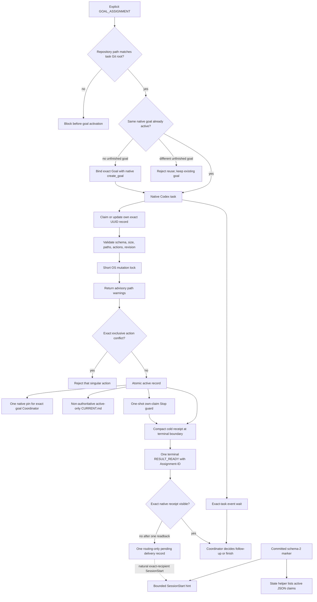

# Architecture

Codex Coordinator schema 2 is a repository-local task-boundary and visibility layer. An explicitly requested task may coordinate one goal, but there is no always-on/resident monitoring Coordinator.

The accepted decision, history, retained protections, rejected mechanisms, migration gates, and rollback plan are in [the boundary-board simplification review](2026-07-21_boundary-board-simplification_architectural_review.md). The cooperative shared-checkout correction is in [its follow-up review](2026-07-23_cooperative-shared-checkout_architectural_review.md). The lifecycle correction for forgotten terminal claims is in [the one-shot Stop guard review](2026-07-22_claim-lifecycle-stop-guard_architectural_review.md). The terminal return and ambiguous-mutation correction is in [the assignment-receipt review](2026-07-23_terminal-return-idempotency_architectural_review.md). The correction that binds every durable lane to Codex Goal mode is in [the native-goal binding review](2026-07-23_native-goal-binding_architectural_review.md). The no-receipt recovery boundary is in [the inbox-return review](2026-07-23_inbox-return-boundary_architectural_review.md). Event-driven goal supervision and its temporary unattended fallback are in [the goal-supervision review](2026-07-23_goal-supervision_architectural_review.md). The bounded navigation pin is in [the goal-Coordinator auto-pinning review](2026-07-23_goal-coordinator-auto-pinning_architectural_review.md). The five-task default and user-managed capacity policy are in [the task-ceiling review](2026-07-23_five-task-user-managed-ceiling_architectural_review.md). The action-only communication correction is in [the pull-first inter-task communication review](2026-07-23_pull-first-inter-task-communication_architectural_review.md).

The released runtime remains Codex-specific. A proposed sibling portable edition, with Claude first and Hermes and OpenClaw later, is documented in [the cross-harness portability review](2026-07-23_cross-harness-portability_architectural_review.md). That roadmap is not a current compatibility claim and does not change schema 2.

## Authorities

| Concern | Authority |
|---|---|
| Task window, persisted goal, automatic continuation, execution, status, messages, transcript | Native Codex |
| Source and history | Git and the repository's existing workflow |
| Active planned ownership | One task-owned JSON record per active writer |
| Goal decision and supervision | The native-goal task holding the exclusive `goal-coordination` action |
| Goal-owner pin state | Native Codex and the user; Coordinator sets one initial pin and never clears it |
| Unconfirmed native delivery fact | One routing-only pending delivery record with no execution authority |
| User permissions and external writes | Direct user instructions in the acting task |
| Package update and repair | Normal plugin manager |

There is no second transcript store, central work ledger, automatically created or always-on monitoring Coordinator, repository scheduler, permanent heartbeat, provider monitor, or mandatory PR authority. One explicitly unattended goal may use one temporary native heartbeat attached to its Coordinator task.

## Data flow

```mermaid
flowchart TD
    U["Explicit GOAL_ASSIGNMENT"] --> Q{"Repository path matches task Git root?"}
    Q -- "no" --> B["Block before goal activation"]
    Q -- "yes" --> GQ{"Same native goal already active?"}
    GQ -- "yes" --> T
    GQ -- "no unfinished goal" --> NG["Bind exact Goal with native create_goal"]
    GQ -- "different unfinished goal" --> BU["Reject reuse; keep existing goal"]
    NG --> T
    M["Committed schema-2 marker"] --> H["Bounded SessionStart hint"]
    M --> L["State helper lists active JSON claims"]
    T["Native Codex task"] --> C["Claim or update own exact UUID record"]
    C --> V["Validate schema, size, paths, actions, revision"]
    V --> K["Short OS mutation lock"]
    K --> W["Return advisory path warnings"]
    W --> X{"Exact exclusive action conflict?"}
    X -- "yes" --> S["Reject that singular action"]
    X -- "no" --> A["Atomic active record"]
    A --> PI["One native pin for exact goal Coordinator"]
    A --> P["Non-authoritative active-only CURRENT.md"]
    A --> R["Compact cold receipt at terminal boundary"]
    A --> G["One-shot own-claim Stop guard"]
    G --> R
    R --> N["One terminal RESULT_READY with Assignment-ID"]
    T --> E["Exact-task event wait"]
    E --> F["Coordinator decides follow-up or finish"]
    N --> D{"Exact native receipt visible?"}
    D -- "yes" --> F
    D -- "no after one readback" --> PN["One routing-only pending delivery record"]
    PN -. "natural exact-recipient SessionStart" .-> H
```

## Marker

`.codex/coordination/project.yaml` is the only committed project state. Schema 2 names exact local active and archive paths, may set `active_task_ceiling`, and disables cross-project access. When the ceiling field is absent, the compatible default is five. A false marker is an immediate opt-out; no board state is read.

Schema 1 is legacy. Its `CURRENT.md`, tasks, inbox, cache, and history remain preserved but are never active authority in schema 2.

Schema 2 generates `CURRENT.md` with different semantics: an atomically rebuilt, active-only human view backed by the per-task JSON claims. It shows the shared goal from the `goal-coordination` claim, active task goals and planned boundaries, status, and dependencies. It is never mutation authority, an inbox, a task ledger, a transcript, or historical memory.

## Active board

`.codex/coordination/active/<thread-uuid>.json` contains only:

- schema and project identity;
- exact native thread UUID;
- short title and bounded goal;
- `active` or `blocked` status;
- revision and timestamps;
- concrete repository-relative paths;
- exclusive action slugs;
- exact dependency thread UUIDs;
- a user-approved temporary-limit boolean on only those new claims above the project ceiling.

Unknown fields are rejected. Every file is capped at 4 KB. Five active durable tasks, including the
Coordinator, is the default project ceiling and not a target. A direct user approval may name an exact
higher ceiling for the current goal without changing the marker, or may persist a new project ceiling
through the dry-run-first lifecycle helper. Lowering it does not interrupt existing claims. Task
creation remains sequential and identity-checked, and the state helper repeats the ceiling check under
the mutation lock.

Path overlap is case-insensitive and ancestor-aware, but it produces a warning rather than rejecting a task. Exact exclusive actions are the only claim-level conflict. Each mutation runs inside a short cross-platform OS file lock, verifies expected revision, writes atomically, and performs a post-write exclusive-action check.

The lock serializes metadata updates only. It is not a source-file lock or permission system.

## Cold receipts

Release writes one compact receipt under `.codex/coordination/archive/`, then removes the active claim. Receipts include identity, title, goal, final status, final revision, and close time. They omit paths, actions, messages, transcripts, and tool output.

Ordinary list, claim, SessionStart, and Doctor paths never scan the archive.

## Failed-delivery records

The compatibility path `.codex/coordination/pending-notices/<recipient-thread-uuid>/<record-id>.json` exists only when a native `GOAL_ASSIGNMENT` or `RESULT_READY` send and one exact native readback both show no receipt. Its stable ID is derived from project, assignment, kind, sender, and recipient, so repeating the create command returns the same record. The path name remains unchanged to preserve installed project data; the user-facing term is **pending delivery record**.

The record contains only those routing identities, repository, creation time, and `pending` delivery state. It contains no goal body, result, prompt, progress, transcript, reasoning, code, or tool output. It grants no authority and cannot reconstruct a missing command. Verified native receipt or verified recipient action deletes it without an acknowledgement or archive receipt.

Normal native delivery creates no record. SessionStart counts only recognized filenames under the exact current task UUID and reads no record body. Explicit recovery lists one named recipient. No path scans every recipient, wakes a task, polls, schedules work, or runs in the background.

## Task model

One native task is the default. When the user explicitly requests coordination, one normal task may
bind that shared objective to native Codex Goal mode, claim `goal-coordination`, and divide it across
the smallest useful set of active durable tasks within the current ceiling. At the ceiling it may ask
once for an exact temporary increase or a persistent project change; it cannot approve itself.

After the exact goal claim succeeds, that Coordinator pins its own native task once so the user can find the goal owner. Project enablement never pins a task, and workers are never pinned. The pin is not stored in schema-2 state and grants no authority. When the goal completes or stops, the native goal and claim end normally while the pin remains unchanged until the user removes it.

Every durable task owns a native Codex goal with an outcome, constraints, verification, and completion condition. Native Goal mode provides persistence and automatic continuation; the board does not reproduce it. Work too small for a native goal remains in the current task or a parent-owned helper instead of opening another task window.

Before creating a task, the Coordinator looks for a suitable related local task in the same repository and checkout. A recipient with no unfinished native goal may bind the new lane; a recipient already running the same goal continues it. A different unfinished goal makes the recipient unavailable. The recipient performs the authoritative `get_goal` check and creates its claim only after goal binding. Idle status alone does not prove suitability.

The exact active `goal-coordination` owner is the sole coordinated durable-task creator. Immediately
before each creation it performs one unfiltered native inventory for the repository and checkout to
reuse a matching assignment and prevent duplicates. It creates sequentially: one creation, exact
task readback, repository and source verification, assignment and distinct-title validation, then
the next creation. A failed handoff never transfers creation authority to the requester.

The Coordinator remains responsible only for that goal and ends with the goal. After assignment it waits on completion or attention events from the exact assigned native task IDs. It reads the relevant native result and decides whether to accept, follow up in the same task, reuse that task, integrate, ask the user, stop, or finish. Each worker also releases its claim and sends exactly one terminal `RESULT_READY` with the original assignment ID so the assignment can return when the Coordinator is between event waits. There is no progress polling, broad task scan, or result ledger. Short dependent checks can still use parent-owned subagents.

If the user explicitly asks for unattended supervision and the event wait cannot remain open across turns, the exact Coordinator task may use one temporary native thread heartbeat. The default cadence is 15 minutes. A wake takes one immediate snapshot of only known assigned task IDs, acts only on completion or attention, and deletes the heartbeat when the goal finishes, stops, needs a user decision, or loses verified task identity. Repository enablement never creates it, and no automation state enters the board.

Each coordinated lane has a stable lowercase `Lane-Key` and deterministic `Assignment-ID` derived from project identity, the exact active goal-Coordinator claim instance, and that key. The Coordinator searches the unfiltered same-repository inventory for the ID before creation and embeds both values in the initial assignment. The prompt guard recomputes the ID from the enabled active board before the recipient acts, so syntax-valid fabricated IDs fail. This is stateless: no ID registry or new ledger is stored.

Native task mutations have an ambiguous-failure boundary: a timeout, transport error, or missing response handler may occur after the host accepted the send or create operation. The caller performs one immediate unfiltered native readback keyed by assignment ID, repository, recipient, and source relationship. One match is the accepted receipt; more than one is a duplicate blocker. With no match after an ambiguous assignment or terminal return, the outcome remains unknown, the caller writes one idempotent routing-only pending delivery record, and stops without retry or substitute task creation. This provides an agent-side at-most-once decision and durable failure visibility, not a host transaction or background monitor.

All coordinated tasks use the same primary checkout, current worktree, and current branch. They do not create or switch branches or worktrees after parallel writing starts. There is no durable Git owner: each task may stage and commit only its reviewed exact files while preserving foreign staged work. Shared generated assets and full gates have no durable owner; only an actual writer command is serialized. PRs are optional policy.

## Messaging

The board is the normal pull-first visibility path. Claims are read only at natural work boundaries;
claim changes never push messages. Before a native send, the sender must identify one exact recipient,
one exact action needed now, and why waiting for the recipient's next board read would cause a real
blocker or collision. Inter-agent task communication is limited to `COLLISION`, `DEPENDENCY`, and `RELEASED`; it is
plain-text, sparse, exact-recipient, same-project, and non-executable. One `GOAL_ASSIGNMENT` is allowed
from the exact active goal Coordinator to a suitable related local task for a complete native-goal
vertical. It carries `Native-Goal: REQUIRED` and one measurable `Goal:`. One terminal `RESULT_READY`
returns that assignment after the worker completes its native goal and releases its claim. Both carry
the same assignment ID and exact repository. Neither grants external or destructive authority. There
are no start, claimed, working, estimate, FYI, summary, registration, acceptance, progress, status,
thanks, acknowledgement, broadcast, or Coordinator-relay chains.

The routing-only pending delivery record is not expanded into a general inbox. A general inbox would require a
second queue, readers, acknowledgements, cleanup, and stale-state handling while duplicating native
messages and the board.

## Goal repository guard

The `UserPromptSubmit` hook inspects prompts that identify themselves as `GOAL_ASSIGNMENT` or `RESULT_READY`, plus `COLLISION`, `DEPENDENCY`, and `RELEASED` communication carrying the exact `Inter-agent task communication` header. Each actionable assignment or result must contain the plain project ID, plain sender and recipient task UUIDs, one stable lowercase lane key, one assignment ID, and one absolute local `Repository:` path. The hook validates the enabled marker, reads the bounded active board through the canonical helper, proves the exact goal Coordinator, recomputes the assignment ID, and resolves the repository path and current task's Git worktree. A goal assignment must additionally contain `Native-Goal: REQUIRED` and one non-empty `Goal:` of at most 4,000 characters. Absent, malformed, duplicated, invented, unverifiable, or mismatched fields are blocked before the agent can act. Other inter-agent task communication is syntax-checked against the enabled local project marker, plain task UUIDs, one boundary, and the factual `Paused:`, `Blocked:`, or `Resolved:` effect. Valid communication receives a non-executable system guard; active-claim verification remains the receiving task's bounded board read.

For a valid goal assignment, the hook adds one short system instruction requiring the receiving task to call `get_goal` and safely bind the exact objective with `create_goal` before repository work. This supplies the system-level authority needed for a cross-task assignment to use the native goal tool. Valid inter-agent task communication receives only a non-executable reminder and no new authority. The hook does not create, move, or message tasks; it writes no state and reads no transcript. Its active-board read is limited to proving the one goal Coordinator and assignment identity. Ordinary prompts and valid `RESULT_READY` communication remain silent.

## SessionStart

The hook parses its JSON input, walks at most 64 parent directories to find a Git marker, reads at most 16 KB, validates schema and fixed paths, and emits a short hint. For a valid exact `session_id`, it may also inspect at most 64 directory entries and count at most 32 recognized pending-delivery filenames under that recipient alone. It reads no record body, active claim, archive, transcript, or other recipient. It does not import or launch an observer, install Python, inspect private Codex data, or create state.

## Stop guard

The Stop hook closes the normal lifecycle gap without adding a second task authority. It validates the enabled marker, resolves the primary worktree, and reads only `.codex/coordination/active/<session_id>.json`, capped at 4 KB. It does not list the board.

If that exact claim is still `active`, the hook emits one Codex continuation prompt asking the same task to release terminal ownership or explicitly retain unfinished ownership. It never infers completion from assistant text or a transcript. A blocked claim, missing claim, disabled marker, or `stop_hook_active: true` is silent. All exceptions fail open so a hook fault cannot trap the task.

This covers the normal completed-turn path. Codex exposes no app-archive event, so abrupt UI archive remains an evidence-based, on-demand stale recovery case. Adding a watcher, repository heartbeat, native-history scan, or private-database reader for that rare path is explicitly rejected.

## Doctor

Doctor is read-only. It checks six package surfaces: manifest, capability contract, skill/frontmatter/links, state-helper syntax, project-lifecycle syntax, and direct lifecycle-hook registration/syntax. It neither executes a hook nor scans projects. Broken packages are updated or reinstalled.

## Optional Mission Control boundary

Schema 2 ships one optional single-project Mission Control to satisfy the launch-page viewing job.
The user starts it manually. It binds only to `127.0.0.1`, reads the active board through the
canonical state helper, renders active lanes plus existing conflict and warning results, and refreshes
only on an explicit page reload. It has no task, message, model, provider, schedule, repair, or write
controls and reads no archive, transcript, private Codex database, or rollout data.

Nothing in SessionStart, Stop, UserPromptSubmit, Doctor, project lifecycle, or normal skill execution
imports or starts Mission Control. The v0.3 collector, all-project scanning, launchers, automatic
refresh, settings, and control surface remain removed and recoverable from Git history.

## Failure posture

Fail closed on an enabled unsupported marker, malformed claim or pending delivery record, wrong project, invalid exact identity, lost revision, an exact exclusive-action conflict, unclear external authority, or a safety-critical actual write collision. Path warnings alone do not stop work.

Silence, age, idle, timeout, and filtered discovery misses never prove staleness. Releasing another owner's record requires exact native terminal, archived, or unusable evidence plus a current user request covering the same unfinished work.

## Explicit non-goals

- automatic task creation or project-wide scheduling;
- permanent coordination or all-task reconciliation;
- provider, PR, release, deployment, or automation monitoring;
- task transcript, reasoning, prompt, or tool-output storage;
- cross-project or cross-machine coordination;
- filesystem enforcement;
- automatic package repair;
- automatic observer startup;
- re-enabling a project without direct user approval.
